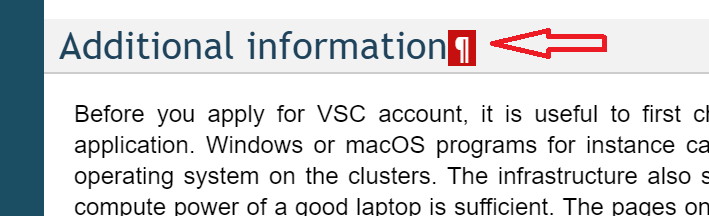

# VscDocumentation (pydata branch)

This branch contains the new re-design of the VSC documentation using the
modern [PyData theme](https://pydata-sphinx-theme.readthedocs.io).

## Goals of the re-design

1. Organize the existing documentation in 4 main sections: Access, Compute,
   Cloud and Data
2. All documents should be visible and reachable organically through
   navigation. Users should be able to figure out were to find information
   without search.
3. Site-specific information should be minimized. Disagreements between sites
   will be forwarded to a CUE meeting. Remaining site-specific information will
   be organized in tabs to avoid clutter.

### Main Tasks

1. Phase 1
   * ️✅ configure PyData theme
   * ️✅ define color scheme
   * ✅ adapt documentation to Sphinx_Design formatting elements
   * 🔄 organize documentation in 4 main sections
   * ✅ fix all formatting errors from RST files
   * 🔄 add all RST files to a TOC tree
   * ✅ disable automatic labels from section names
2. Phase 2
   * ⬜ re-structure separation between OS in Access
   * ⬜ review mixed use of TOCs and sections
   * ⬜ review sections with large differences between sites:
     * VNC
     * VPN
   * ⬜ seek outdated information in documentation
   * ⬜ add custom 404 page

## How to contribute?

1. Check the existing documentation
2. Does a generic document has some piece of information that is site-specific?
    1. Try to find a common solution that applies to all sites and correct the
       document
    2. If there are insurmountable disagreements, arrange site-specific
       information either in tabs or with color badges
    3. In case of doubt open a question in the next CUE meeting
3. Check for documents in the repo not reachable through navigation
    1. If the hidden document is useful, put it in a `toctree`
    2. If the hidden document is no useful, delete it
4. Feel free to improve the formatting
    * we use the [PyData Sphinx Theme](https://pydata-sphinx-theme.readthedocs.io)
    * use any format element from
      [sphinx-design](https://sphinx-design.readthedocs.io), such as cards,
      tabs or badges
    * use graphic symbols from [FontAwesome 6 free
      tier](https://fontawesome.com/icons?m=free), available in both the
      [PyData theme](https://pydata-sphinx-theme.readthedocs.io/en/stable/user_guide/fonts.html)
      and [sphinx-design](https://sphinx-design.readthedocs.io/en/latest/badges_buttons.html#fontawesome-icons)

Open your pull requests to the `pydata` branch in this repo. The `pydata`
branch is kept in sync with the `master` branch in a regular but non-daily
basis.

## Prerequisites

You will need to clone the repository, i.e.,
```bash
$ git clone git@github.com:hpcleuven/VscDocumentation.git
$ cd VscDocumentation
$ git fetch origin
$ git checkout pydata
```

Your life will be substantially easier if you can preview your changes locally. Install the required packages in a self-contained environment with a Python venv or Conda.

### Python venv

All required Python modules can be easily installed in a Python virtual environment using the `requirements.txt` file in this repo

```bash
$ python -m venv /path/to/new/venv
$ source /path/to/new/venv/bin/activate
$ cd VscDocumentation
$ git checkout pydata
$ python -m pip install -r requirements.txt
```

### Conda

A conda environment has be defined to install all the required software

Downloads and installation instructions for Miniconda can be found on [conda's website](https://docs.conda.io/en/latest/miniconda.html).

The YAML environment description file is [``sphinx.yml``](sphinx.yml).  The environment can be created using

```bash
$ conda env create -f environment.yml
```
The `sphinx` environment can be activated by
```bash
$ source activate sphinx
```

## What is the status of improvements/fixes?

Feel free to open issues to get fixes or improvements on the agenda.  To get an overview of work that is planned or in progress, check out the [project overview](https://github.com/hpcleuven/VscDocumentation/projects/1).

## Workflow

### Creating a feature branch

Do not make changes in the master or development branch directly, but create feature/bugfix branches as required, e.g.,
```bash
$ git checkout development
$ git checkout -b feature/new_stuff
```

Note that at any given time, we should be able to merge the development branch into the master branch, and rebuild the documentation, hence the development branch should always be in a sane state.

Exception on feature/bugfix branches: use common sense, to fix a simple typo, it is likely better to do that directly in the development branch, and merge that immediately into master.


### Running a local sphinx server

The repository contains a make file that has a target to run the sphinx server.  The latter will monitor the ``source`` directory for changes, and serve the documentation to a web browser that is opened automatically.
```bash
$ make web
```


### Edit content

You can now edit the content to your heart's content, making commits to your feature branch as you go.  You can push your feature branch to the Github repository whenever you like.
```bash
$ git push origin feature/new_stuff
```


### Pull request

When you are done, create a pull request on GitHub.  For consistency, do the pull request to the development branch, not the master branch.

For major changes, it is good practice to ask others to review your pull request.  Although this policy is encouraged, it is not enforced.

Once the pull request has been merged, the branch will be deleted from GitHub.  For your own convenience, it is probably easiest to pull the master and development branches from GitHub,
and remove the local feature branch, e.g.,
```bash
$ git checkout master
$ git pull
$ git checkout development
$ git pull origin development
$ git branch -d feature/new_stuff
```


## Repository structure

1. source: directory containing the source to be rendered into HTML (e.g., rST and PNG files).
1. images: directory containing source documents for images (e.g., ODG files).
1. Makefile & make.bat: make files to render the documentation, and run a local web server.
1. sphinx.yml: conda environment definition.

The other files and directories are part of the migration, and may be removed at some
later stage.


## Documentation usage

Note that ReadTheDocs has a very convenient feature.  It lets you copy an URL
to a (sub)section of the documentation to make it easy to refer via email.  Simply
copy the link represented by the paragraph icon that appears next to the (sub)section
 title when you hover near it.


