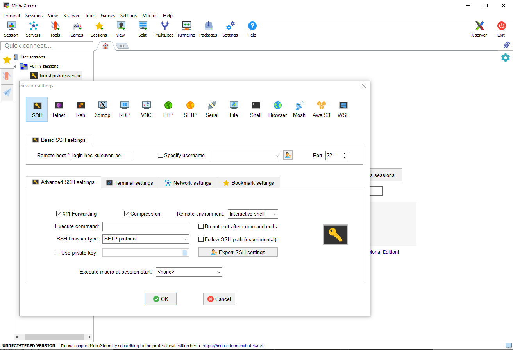

.. _access using mobaxterm:

Prerequisite
============

.. tab-set::

   .. tab-item:: KU Leuven

      You have an approved :ref:`VSC account <access>`.

   .. tab-item:: UHasselt, UGent, VUB, UAntwerpen

      You have already
      :ref:`generated a public/private key pair with PuTTY <generating keys putty>`,
      and have an approved :ref:`VSC account <access>` on the VSC clusters.

Download and setup MobaXterm
============================

Go to the `MobaXterm`_ website and download the free version. Make sure to
select the 'Portable edition' from the download page. Create a folder called
``MobaXterm`` in a known location in your computer and decompress the contents
of the downloaded zip file inside it.

Setup a shortcut for a remote session
-------------------------------------

#. Double click the ``MobaXterm_Personal`` executable file inside the
   ``MobaXterm`` folder.
   The MobaXterm main window will appear on your screen. It should be similar to this one:

   .. _mobaxterm-main-window:
   .. figure:: access_using_mobaxterm/mobaxterm_main_window.png
      :alt: mobaxterm main

#. Click on the `Session` icon in the top left corner.

#. The 'Session settings' configuration panel will open; click on the SSH icon in the top row
   and you should see a window like this:

   .. figure:: access_using_mobaxterm/mobaxterm_session_settings_ssh.png
      :alt: ssh settings window

#. In the 'Remote host' field introduce the cluster remote address of
   your :ref:`VSC cluster <hardware>`, which should be written in the form ``my-vsc-cluster.example.com``.
   Tick the 'Specify username' box and introduce your VSC account username.
   Click the 'Advanced SSH settings' tab for additional configurations.

   The next few steps depends on the choice of VSC site you are trying to connect to.

   .. _step-advanced-ssh-settings:

   .. tab-set::

      .. tab-item:: KU Leuven

         Make sure that the 'Use private key' option is disabled.
         You may additionally opt for enabling the 'X11-Forwarding' and the
         'Compression' options.

         .. figure:: access_using_mobaxterm/mobaxterm_adv_kul.png
            :alt: advanced ssh options for KUL/UHasselt users

         With this configuration, it is strongly recommended to setup your
         :ref:`SSH agent in MobaXterm <mobaxterm-ssh-agent>` which is
         described below.

         Upon successful connection attempt you will be prompted to copy/paste
         the firewall URL in your browser as part of the MFA login procedure:

         .. _vsc_firewall_certificate_authentication:
         .. figure:: access_using_mobaxterm/vsc_firewall_certificate_authentication.PNG
            :alt: vsc_firewall_certificate_authentication

         Confirm by clicking 'Yes'.
         Once the MFA has been completed you will be connected to a login node.

      .. tab-item:: UHasselt, UGent, VUB, UAntwerpen

         Tick the 'Use private key' box and click on the file icon in that field.
         A file browser will be opened; locate the private SSH key file you created
         when requesting your VSC account.
         Please keep in mind that these settings have to be updated if the location
         of the private SSH key ever changes. 
         Check that the 'SSH-browser type' is set to 'SFTP protocol'.

         .. figure:: access_using_mobaxterm/mobaxterm_advanced_ssh.png
            :alt: advanced ssh options

         .. _step-sftp-tab:

         Press the 'OK' button and you should be prompted for your passphrase.
         Enter here the passphrase you chose while creating your public/private key pair.
         The characters will be hidden and nothing at all will appear as you
         type (no circles, no symbols).
               
#. You should connect to the cluster and be greeted by a screen similar to this one:

   .. figure:: access_using_mobaxterm/mobaxterm_hydra_login.png
      :alt: hmem greeting

   On the left sidebar (in the 'Sftp' tab) there is a file browser of your
   home directory in the cluster. You will see by default many files whose
   names start with a dot ('.') symbol. These are hidden files of the
   Linux environment and you should neither delete nor move them. You can hide
   the hidden files by clicking on the right most button at the top of the file
   browser.

#. Once you disconnect from the cluster (by typing ``exit`` or closing the
   terminal tab) you will find on the left sidebar (in the 'Sessions' tab)
   a shortcut to the session you just setup. From now on, when you open
   MobaXterm, you can just double click that shortcut and you will start
   a remote session on the :ref:`VSC cluster <hardware>` that you used in previous steps.
   
   To create a direct shortcut on your desktop (optional),
   right click on the saved session name and choose
   'Create a desktop shortcut' (see image below). An icon will appear on your
   Desktop that will start MobaXterm and open a session in the corresponding cluster.
   
   .. figure:: access_using_mobaxterm/mobaxterm_session_shortcut.png
      :alt: session desktop shortcut

#. Now you can create connections to other :ref:`VSC clusters <hardware>`
   by repeating these steps and changing the address of the cluster.
   You will have then a shortcut on the Sessions tab of the left sidebar
   for each of them to connect to.

Import PuTTY sessions
---------------------

If you have already configured remote sessions within PuTTY, then MobaXterm
will automatically import them upon installation and they will appear on the
left-side pane.
To edit a session right-click on and click on 'Edit session'.
Ensure that all settings are correct under the 'SSH' tab and the 
'Advanced SSH settings' sub-tab:

.. _mobaxterm_putty_imported_sessions:

If the session has been properly imported you will see that all the necessary
fields are already filled in.
Click 'OK' to close the 'Edit session' window.

   .. _copying-files-mobaxterm:

Copying files to and from the cluster
-------------------------------------

Once you've setup the shortcut for connecting to a cluster, as we
noted in `step 6 <#step-sftp-tab>`_ of the previous section, you will see
on the left sidebar (in the 'Sftp' tab) a file browser on the cluster you are
connected to.

You can simply drag and drop files from your computer to that panel and they
will be copied to the cluster. You can also drag and drop files from the
cluster to your computer. Alternatively, you can use the file tools located at the
top of the file browser.

Remember to always press the ``Refresh current folder`` button after you
copied something or created/removed a file or folder on the cluster.

.. _mobaxterm-ssh-agent:

Setup an SSH agent to avoid typing the passphrase at each login
---------------------------------------------------------------

Once you've successfully setup the connection to your cluster, 
you will notice that you are prompted for the passphrase at
each connection you make to a cluster.
To avoid retyping it each time, you can setup an internal SSH agent in
MobaXterm that will take care of unlocking the private key when you
open the application. The SSH agent will save the passphrase after you have
introduced it once.

#. Open the MobaXterm program and go to the menu 'Settings ->
   Configuration'

#. You should see the `MobaXterm Configuration` panel. In the 'General' tab
   choose the 'MobaXterm passwords management' option; a new panel will be
   opened; make sure that 'Save sessions passwords' has the options
   'Always' and 'Save SSH keys passphrases as well' selected (as shown below)
   and click 'OK'.

   .. figure:: access_using_mobaxterm/mobaxterm_save_passwords.png
      :alt: mobaxterm save passwords option

#. Open  the 'SSH' tab in the same `MobaXterm Configuration` panel.
   Make sure that all the boxes below the 'SSH agents' section are
   ticked.

#. Press the '+' button in the 'Load following keys at MobAgent startup'
   field, look for your private key file and select it. At the end of the process, the panel should
   look like this (the location of your private SSH key may be different):

   .. figure:: access_using_mobaxterm/mobaxterm_ssh_agent.png
      :alt: mobaxterm ssh agent setup

   Please, keep in mind that these settings will have to be updated if the
   location of private key ever changes.
   
#. Press OK and when prompted for restarting MobaXterm, choose to do so.

#. Once MobaXterm restarts you will be asked for the private key passphrase at
   launch. This will occur only once and after you introduce it correctly it will stay saved for all
   following sessions. Double clicking on a shortcuts for a cluster
   should open the corresponding connection directly.

.. _troubleshoot_mobaxterm:

Troubleshooting MobaXterm connection issues
-------------------------------------------

If you have trouble accessing the infrastructure, the support staff will
likely ask you to provide a log.  After you have made a failed attempt to connect,
you can obtain the connection log by

#. ctrl-right-clicking in the MobaXterm terminal and selecting 'Event Log'.
#. In the dialog window that appears, click the 'Copy' button to copy the
   log messages.  They are copied as text and can be pasted in your message
   to support.

