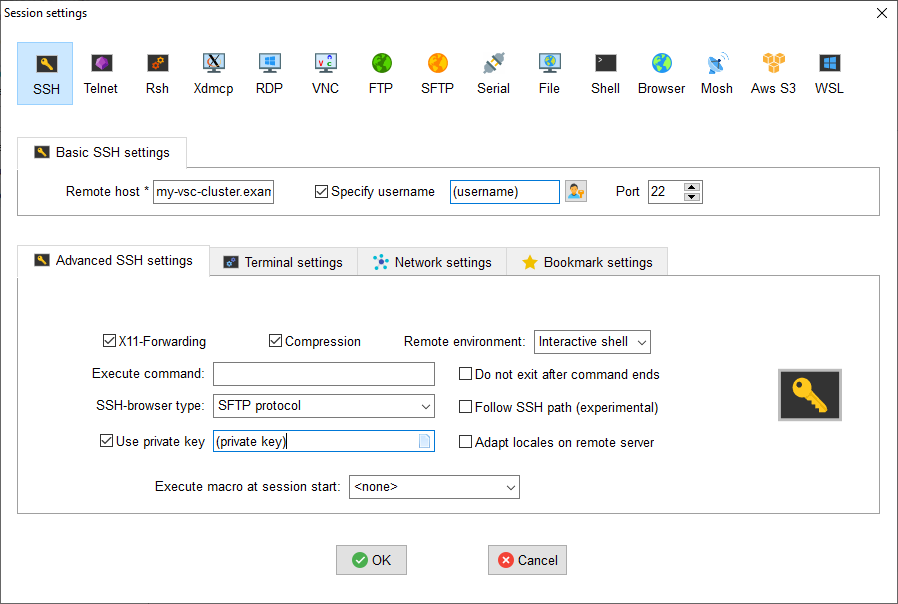

Tick the 'Specify username' box and introduce your VSC account username.

Click the 'Advanced SSH settings' tab for additional configurations:

* Check that the 'SSH-browser type' is set to 'SFTP protocol'
* Tick the 'Use private key' box and click on the file icon in that
  field. A file browser will open; locate the private SSH key file you
  created when requesting your VSC account. Please keep in mind that
  these settings have to be updated if the location of the private SSH
  key ever changes. 

Press the 'OK' button and you should be prompted for your passphrase.
Enter here the passphrase you chose while creating your public/private key pair.
The characters will be hidden and nothing at all will appear as you
type (no circles, no symbols).
