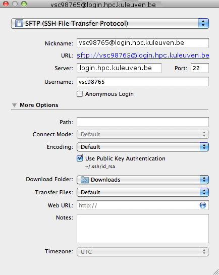
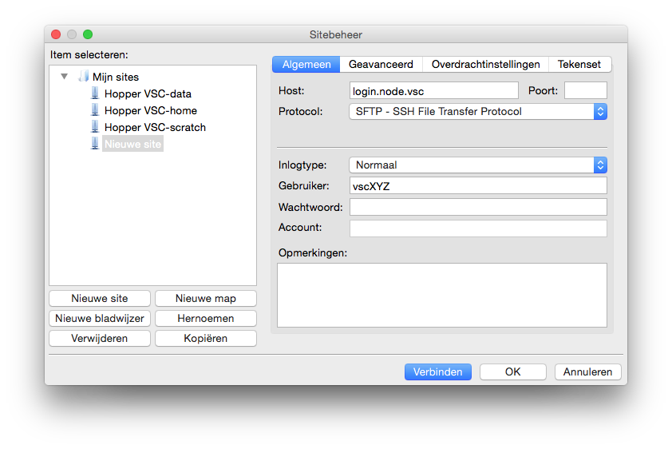
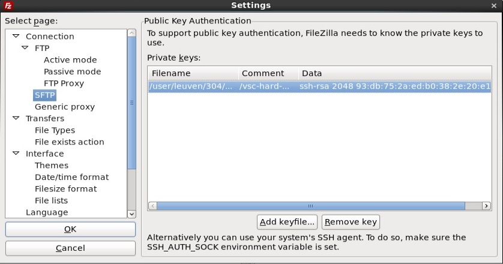

.. _data transfer:

Data transfer
=============

Prerequisite: OpenSSH, Cyberduck or FileZilla
---------------------------------------------

-  OS X comes with its own implementation of OpenSSH, so you don't need
   to install any third-party software to use it. Just open a Terminal
   window and jump in! Because of this, you can use the same :ref:`scp and
   sftp commands as in Linux <scp and sftp>` to
   access the cluster and transfer files.
-  We recommend `Cyberduck`_ as a
   graphical alternative to the scp command. This program is freely
   available (with a voluntary donation) from the `Cyberduck`_ web
   site and easy to use. Installation
   is easy: just drag the program's icon to the Application folder in
   the Finder, and you're done.
   The program can also be found in the App Store but at a price.
-  An alternative SFTP GUI is FileZilla. FileZilla for
   macOS is very similar to FileZilla for Windows (see also our :ref:`page
   about FileZilla in the Windows section <FileZilla>`). you can `download
   FileZilla`_.

Transferring files with Cyberduck
---------------------------------

Files can be easily transferred with Cyberduck. Setup is easy:

#. After starting Cyberduck, the Bookmark tab will show up. To add a new
   bookmark, click on the '+' sign on the bottom left of the window. A
   new window will open.
#. In the 'Server' field, type in <vsc-loginnode>. In the 'Username'
   field, type in your <vsc-account>.
#. Click on 'More Options', select 'Use Public Key Authentication' and
   point it to your private key (the filename will be shown underneath).
   Please keep in mind that Cybeduck works only with
   passphrase-protected private keys.
#. Finally, type in a name for the bookmark in the 'Nickname' field and
   close the window by pressing on the red circle in the top left corner
   of the window.

   |Cyberduck config|

#. To open the scp connection, click on the 'Bookmarks' icon (which
   resembles an open book) and double click on the bookmark you just
   created.

Transferring files with FileZilla
---------------------------------

To install FileZilla, follow these steps:

#. You can `download FileZilla`_ (take care to download the version for your
   operating system) for the `FileZilla project page`_.
#. The file you just downloaded is a compressed UNIX-style archive (with
   a name ending on .tar.bz2). Doubleclick on this file in Finder (most
   likely in the Downloads folder) and drag the FileZilla icon that
   appears to the Applications folder.
#. Depending on the settings of your machine, you may get notification
   that Filezilla.app cannot be opened because it is from an
   unidentified developer when you try to start it. Check out the macOS
   Gatekeeper on `this Apple support
   page <https://support.apple.com/en-gb/HT202491>`_.

FileZilla for macOS works in pretty much the same way as FileZilla for
Windows:

#. start FileZilla;
#. open the 'Site Manager' using the 'File' menu;
#. create a new site by clicking the New Site button;
#. in the tab marked General, enter the following values (all other
   fields remain blank):

   -  Host: *login.node.vsc* (replace with the name of the login node of
      your home cluster)
   -  Servertype: SFTP - SSH File Transfer Protocol
   -  Logon Type: Normal
   -  User: *your own* VSC user ID, e.g., vsc98765;

#. optionally, rename this setting to your liking by pressing the
   'Rename' button;
#. press 'Connect'. Enter your passphrase when requested. FileZilla will
   try to use the information in your macOS Keychain. See the page on
   ":ref:`Text-mode access using OpenSSH <OpenSSH access>`"
   to find out how to add your key to the keychain using ``ssh-add``.

|FileZilla config|

Note that recent versions of FileZilla have a screen in the settings to
manage private keys. The path to the private key must be provided in
options (Edit Tab -> options -> connection -> SFTP):

|FileZilla private keys|

After that you should be able to connect after being asked for
passphrase. As an alternative you can choose to use the built-in macOS
keychain system.

.. include:: links.rst
