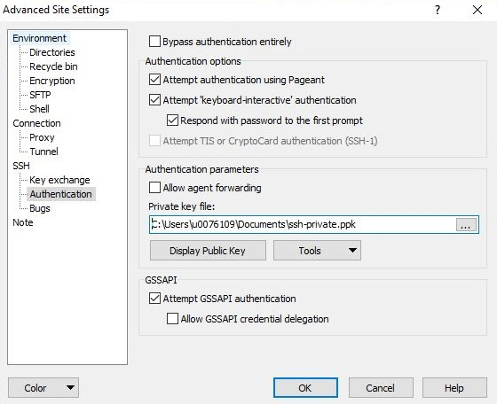
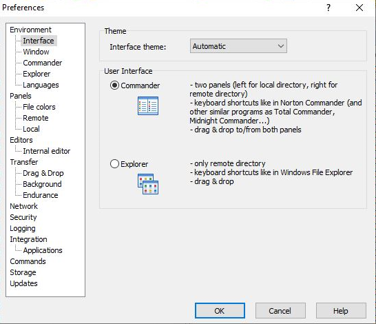
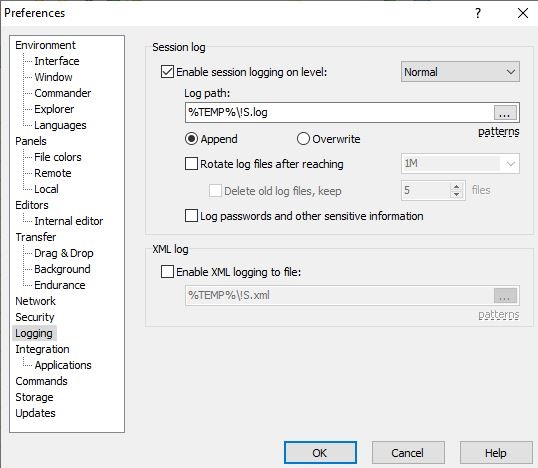
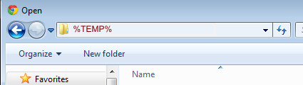

.. _WinSCP:

Data transfer using WinSCP
==========================

Prerequisite: WinSCP
--------------------

To transfer files to and from the cluster, we recommend the use of
`WinSCP`_, which is a
graphical ftp-style program (but than one that uses the ssh protocol to
communicate with the cluster rather then the less secure ftp) that is
also freely available. WinSCP can be downloaded both as an installation
package and as a standalone portable executable. When using the portable
version, you can copy WinSCP together with your private key on a USB
stick to have access to your files from any internet-connected Windows
PC.

WinSCP also works together well with the PuTTY suite of applications. It
uses the :ref:`keys generated with the PuTTY key generation
program <generating keys windows>`, can :ref:`launch terminal
sessions in PuTTY <text mode access using PuTTY>` and :ref:`use
ssh keys managed by pageant <using Pageant>`.

Transferring your files to and from the VSC clusters
----------------------------------------------------

The first time you make the connection, you will be asked to 'Continue
connecting and add host key to the cache'; select 'Yes'.

#. When you first install WinSCP it should open a new session dialog. If that does not happen - start WinSCP and go the "Session" tab. From there choose "New Session". Fill in the following
   information:

   |WinSCP config|

   #. Fill in the hostname of the VSC login node of your home
      institution. You can find this information in the :ref:`overview
      of available hardware on this site <hardware>`.
   #. Fill in your VSC username.
   #. Double check that the port number is 22.

#. If you are not using pageant to manage your ssh keys, you have to point WinSCP to the private key file (in PuTTY .ppk format) that should be used. You can do that using "Advanced" button and then choose "SSH" "Authentication" from the list. When using pageant, you can leave this field blank.

   |WinSCP config advanced|

#. If you want to store this data for later use, click the "Save"
   button and enter a name for the session. Next time
   you'll start WinSCP, you'll get a screen with stored sessions that
   you can open by selecting them and clicking the "Login" button.

   |WinSCP config save|

#. Click the "Login" button to start the session that you just
   created. You'll be asked for your passphrase if pageant is not
   running with a valid key loaded. The first time you make the
   connection, you will be asked to "Continue connecting and add host
   key to the cache"; select "Yes".

Some remarks
------------

Two interfaces
~~~~~~~~~~~~~~

|WinSCP interfaces|

WinSCP has two modes for the graphical user interface:

-  The "commander mode" where you get a window with two columns, with
   the local directory in the left column and the host directory (remote
   directory) in the right column. You can then transfer files by
   dragging them from one column to the other.
-  The "explorer mode" where you only see the remote directory. You
   can transfer files by dragging them to and from other folder windows
   or the desktop.

The default mode is "commander". You can always switch the modes  
by going to the "Options" tab, choosing "Preferences" and 
selecting the \\"Environment\\Interface\" category.

Enable logging
~~~~~~~~~~~~~~

When you experience trouble transferring files using WinSCP, the support
team may ask you to enable logging and mail the results.

#. To enable logging:

   |WinSCP logging|

   #. Go to the "Options" tab and choose "Preferences".
   #. Select the "Logging" category.
   #. Check the box next to "Enable session logging on level" and select
      the logging level requested by the user   support team. Often normal
      logging will be sufficient.
   #. Enter a name and directory for the log file. The default is
      ``%TEMP%\!S.log`` which will expand to a name that is
      system-dependent and depends on the name of your WinSCP
      session. ``%TEMP%`` is a Windows environment variable pointing
      to a directory for temporary files which on most systems is
      well hidden. ``!S`` will expand to the name of your
      session (for a stored session the name you used there). You
      can always change this to another directory and/or file
      name that is easier for you to work with.

#. Now just run WinSCP as you would do without logging.
#. To mail the result if you used the default log file name
   ``%TEMP%\!S.log``:

   #. Start a new mail in your favourite mail program (it could even be
      a web mail service).
   #. Click whatever button or menu choice you need to add an
      attachment.
   #. Many mail programs will now show you a standard Windows dialog
      window to select the file. In many mail programs, the left top of
      the window will look like this (a screen capture from a Windows 7
      computer):

      |WinSCP windows explorer|

      Click right of the text in the URL bar in the upper left of the
      window. The contents will now change to a regular Windows path
      name and will be selected. Just type ``%TEMP%`` and press enter and
      you will see that ``%TEMP%`` will expand to the name of the directory
      with the temporary files. *This trick may not work with all mail
      programs!*
   #. Finish the mail text and send the mail to user support.

.. |WinSCP config| image:: data_transfer_using_winscp/winscp_config-new.png

.. |WinSCP config save| image:: data_transfer_using_winscp/winscp_config-save-new.png

.. include: links.rst
