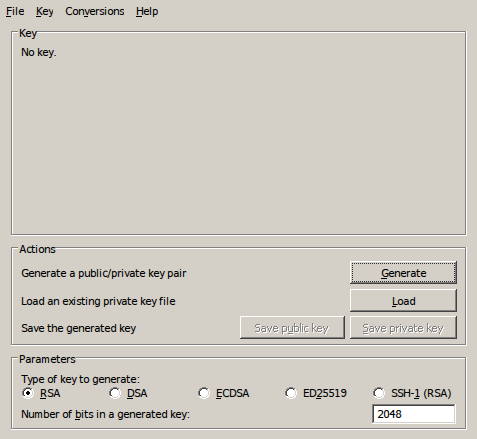
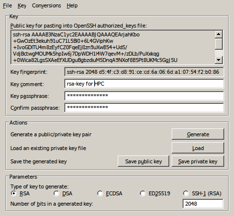

.. _generating keys putty:

##########################
Generating keys with PuTTY
##########################

Requirements:

* Windows operating system
* PuTTY

By default, there is no SSH client software available on Windows, so you
will typically have to install one yourself. We recommend to use `PuTTY`_,
which is freely available. You do not even need to install; just
download the executable and run it! Alternatively, an installation
package (MSI) is also available from the `PuTTY download site`_
that will install all other tools that you might need also.

You can copy the PuTTY executables together with your private key on a
USB stick to connect easily from other Windows computers.

Create a public/private key pair
--------------------------------

To generate a public/private key pair, you can use the PuTTYgen key
generator, which is available on the `PuTTY download site`_.
Start it and follow the following steps. Alternatively, you can follow a
`short video <https://hervsc.live.statik.be/assets/1189>`_
explaining step-by-step the process of generating a new key pair and
saving it in a format required by different VSC login nodes.

#. In 'Parameters' (at the bottom of the window), choose 'RSA' and
   set the number of bits in the key to 4096:

   |PuTTYgen initial|

#. Click on 'Generate'. To generate the key, you must move the mouse
   cursor over the PuTTYgen window (this generates some random data that
   PuTTYgen uses to generate the key pair). Once the key pair is
   generated, your public key is shown in the field 'Public key for
   pasting into OpenSSH authorized_keys file'.
#. Next, you should specify a passphrase in the 'Key passphrase' field
   and retype it in the 'Confirm passphrase' field. Remember, the
   passphrase protects the private key against unauthorized use, so it
   is best to choose one that is not too easy to guess. Additionally, it
   is adviced to fill in the 'Key comment' field to make it easier
   identifiable afterwards.
   
   |PuTTYgen filled|

#. Finally, save both the public and private keys in a secure place
   (i.e., a folder on your personal computer, or on your personal USB
   stick, ...) with the buttons 'Save public key' and 'Save private
   key'. We recommend to use the name ``id_rsa_vsc.pub`` for the public
   key, and ``id_rsa_vsc.ppk`` for the private key.

If you use another program to generate a key pair, please remember that
they need to be in the OpenSSH format to access the VSC clusters.

.. _converting PuTTY keys:

Converting PuTTY keys to OpenSSH format
---------------------------------------

OpenSSH is a very popular command-line SSH client originating from the
Linux world but now available on many operating systems. Therefore its
file format is a very popular one. Some applications, such as Eclipse's
SSH components, can not handle private keys generated with PuTTY, only
OpenSSH compliant private keys. However, PuTTY's key generator
'PuTTYgen' (that was used to generate the public/private key pair in the
first place) can be used to convert the PuTTY private key to one that
can be used by Eclipse.

#. Start PuTTYgen.
#. From the 'Conversions' menu, select 'Import key' and choose the file
   containing your PuTTY private key that is used to authenticate on the
   VSC cluster.
#. When prompted, enter the appropriate passphrase.
#. From the 'Conversions' menu, select 'Export OpenSSH key' and save it
   as ``id_rsa_vsc``.
   Remember the file name and its location, it will have to be specified
   in the configuration process of, e.g., Eclipse.
#. Exit PuTTYgen.

