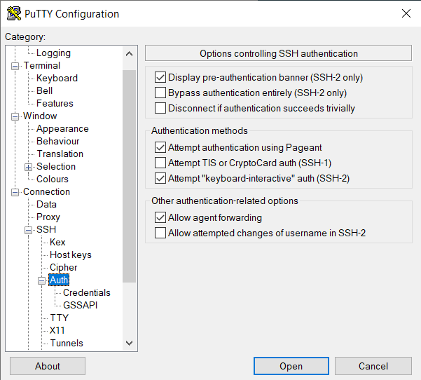

.. _text mode access using PuTTY:

Text-mode access using PuTTY
============================

Prerequisite: PuTTY and WinSCP
------------------------------

You've :ref:`generated a public/private key pair with PuTTY
<generating keys putty>` and have an approved account on the VSC clusters.

Connecting to the VSC clusters
------------------------------

When you start the PuTTY executable 'putty.exe', a configuration screen
pops up. Follow the steps below to setup the connection to (one of) the
VSC clusters.

.. warning::

   In the screenshots, we show the setup for user ``vsc98765`` to the
   genius cluster at KU Leuven via the login node ``login.hpc.kuleuven.be``.
   You will have to

   #. replace ``vsc98765`` with your own VSC user name, and
   #. find the name of the login node for the cluster you want
      to login in on in the sections on :ref:`the local VSC clusters
      <hardware>`, and replace ``login.hpc.kuleuven.be`` accordingly.

#. Within the category Session, in the field 'Host Name', type in
   <vsc-loginnode>, which is the name of the login node of the VSC
   cluster you want to connect to.

   |PuTTY config 1|

#. In the category Connection > Data, in the field 'Auto-login
   username', put in <vsc-account>, which is your VSC username that you
   have received by mail after your request was approved.
#. In the category Connection > SSH > Auth, click on 'Browse' and select
   the private key that you generated and saved above.

   |PuTTY config 2|

   Here, the private key was previously saved in the folder
   ``C:\Users\Me\Keys``. In older versions of Windows, you would have
   to use ``C:\Documents and Settings\Me\Keys``.
   
   You can also enable agent forwarding by ticking the 'Allow agent
   forwarding' checkbox.
#. In the category Connection > SSH > X11, click the Enable X11
   Forwarding checkbox:

   |PuTTY config 3|

#. Now go back to Session, and fill in a name in the 'Saved Sessions'
   field and press 'Save' to store the session information.
#. Now pressing 'Open' should start ask for you passphrase, and connect
   you to <vsc-loginnode>.

The first time you make a connection to the login node, a Security Alert
will appear and you will be asked to verify the authenticity of the
login node.

|PuTTY alert|

For future sessions, just select your saved session from the list and
press 'Open'.

Managing SSH keys with Pageant
------------------------------

:ref:`Pageant <using Pageant>` can be used to manage active keys for
PuTTY, :ref:`WinSCP<WinSCP>`, :ref:`FileZilla<FileZilla>` as well as
the :ref:`NX client for Windows<NX start guide>` so that you don't need
to enter the passphrase all the time.  Pageant is part of the `PuTTY`_
distribution.

.. toctree::

   using_pageant

Network tunnels to compute nodes
--------------------------------

To establish network communication between your local machine and a compute
node of a cluster you have to :ref:`create an SSH tunnel using PuTTY
<ssh tunnel using PuTTY>` .  This is also useful to run client software
on your Windows machine, e.g., ParaView or Jupyter notebooks that run on
a compute node.

.. toctree::

   creating_a_ssh_tunnel_using_putty

Troubleshooting PuTTY connection issues
---------------------------------------

If you have trouble accessing the infrastructure, the support staff will
likely ask you to provide a log.  After you have made a failed attempt to connect,
you can obtain the connection log by

#. right-clicking in PuTTY's title bar and selecting **Event Log**.
#. In the dialog window that appears, click the **Copy** button to copy the
   log messages.  They are copied as text and can be pasted in your message
   to support.

.. |PuTTY config 1| image:: text_mode_access_using_putty/text_mode_access_using_putty_01.png
   :width: 456
.. |PuTTY config 2| image:: text_mode_access_using_putty/text_mode_access_using_putty_02.png

.. |PuTTY alert| image:: text_mode_access_using_putty/text_mode_access_using_putty_04.png

