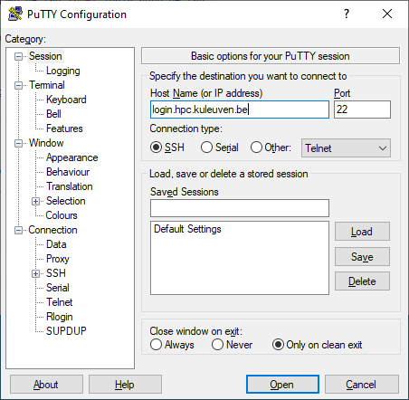

.. _text mode access using PuTTY:

Text-mode access using PuTTY
============================

Prerequisite: PuTTY and WinSCP
------------------------------

You've :ref:`generated a public/private key pair with PuTTY
<generating keys windows>` and have an approved account on the VSC clusters.

Connecting to the VSC clusters
------------------------------

When you start the PuTTY executable 'putty.exe', a configuration screen
pops up. Follow the steps below to setup the connection to (one of) the
VSC clusters.

In the screenshots, we show the setup for user vsc98765 to the ThinKing
cluster at KU Leuven via the login node login.hpc.kuleuven.be.

You can find the names and ip-addresses of the login nodes in the
sections of :ref:`the local VSC clusters <hardware>`.

| Alternatively, you can follow a `short
  video <https://www.vscentrum.be/assets/1191>`__ explaining
  step-by-step the process of making connection to VSC login nodes
  (example based on KU Leuven cluster).

#. Within the category Session, in the field 'Host Name', type in
   <vsc-loginnode>, which is the name of the login node of the VSC
   cluster you want to connect to.

   |PuTTY config 1|

#. In the category Connection > Data, in the field 'Auto-login
   username', put in <vsc-account>, which is your VSC username that you
   have received by mail after your request was approved.
#. In the category Connection > SSH > Auth, click on 'Browse' and select
   the private key that you generated and saved above.

   |PuTTY config 2|

   Here, the private key was previously saved in the folder
   "C:\\Documents and Settings\\Me\\Keys". In newer versions of Windows,
   "C:\\Users" is used instead of "C:\\Documents and Settings".
#. In the category Connection > SSH > X11, click the Enable X11
   Forwarding checkbox:

   |PuTTY config 3|

#. Now go back to Session, and fill in a name in the 'Saved Sessions'
   field and press 'Save' to store the session information.
#. Now pressing 'Open' should start ask for you passphrase, and connect
   you to <vsc-loginnode>.

The first time you make a connection to the login node, a Security Alert
will appear and you will be asked to verify the authenticity of the
login node.

|PuTTY alert|

For future sessions, just select your saved session from the list and
press 'Open'.

.. |PuTTY config 2| image:: text_mode_access_using_putty/text_mode_access_using_putty_02.png
.. |PuTTY config 3| image:: text_mode_access_using_putty/text_mode_access_using_putty_02.png
.. |PuTTY alert| image:: text_mode_access_using_putty/text_mode_access_using_putty_04.png
