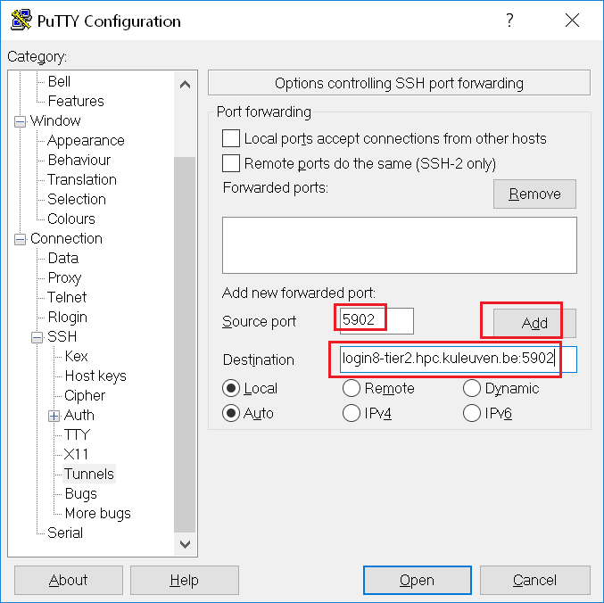
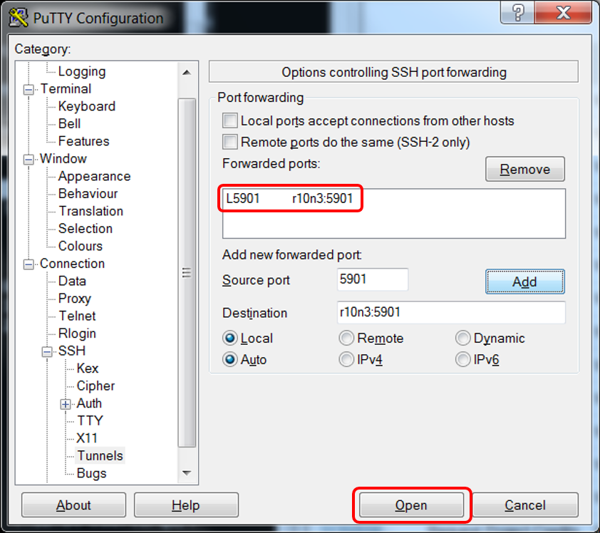
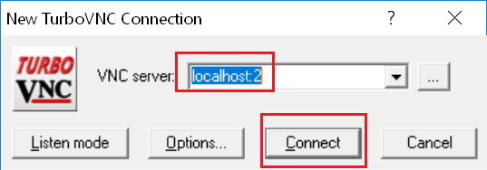
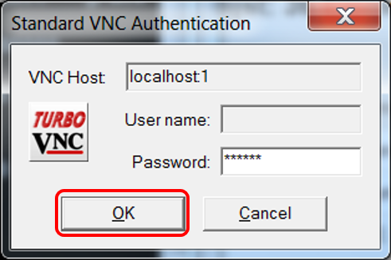
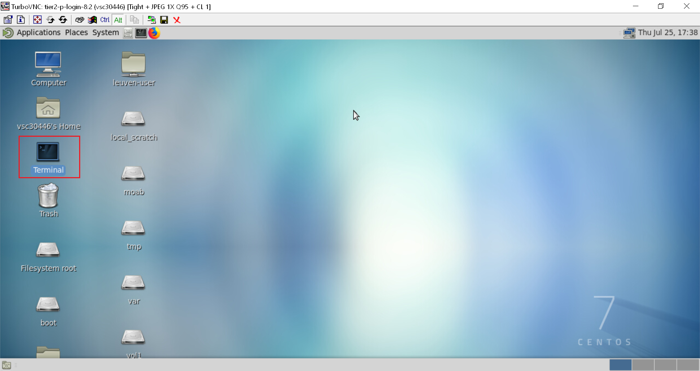
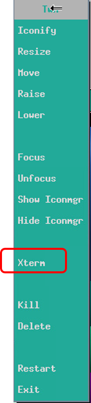

.. _TurboVNC start guide:

TurboVNC start guide
====================

TurboVNC is a good way to provide access to remote visualization
applications that works together with VirtualGL - a popular package for
remote visualization.

Installing TurboVNC client (viewer)
-----------------------------------

-  Download the most recent version of the client from the `TurboVNC
   download page`_ on SourceForge.
-  Continue with configuration of your client.

TurboVNC client Configuration & Start Guide
-------------------------------------------

Note: These instructions are for the KU Leuven visualization nodes
only. The nodes have been added as login nodes to the migrated ThinKing cluster. The visualisation ode is not in the queueing system anymore. The UAntwerp visualization node also uses TurboVNC, but the setup
is different and TurboVNC is also supported on the regular login
nodes (but without OpenGL support). Specific instructions for the use of
TurboVNC on the UAntwerp clusters can be found on the page
":ref:`remote visualization UAntwerp`".

#. login on one of the ThinKing visualisation nodes (login7 or login8)

#. Create password to authenticate your session:

   ::

      $ vncpasswd
          

   In case of problems with saving your password please create the
   appropriate path first:

   ::

      $ mkdir .vnc; touch .vnc/passwd; vncpasswd
          

#. Start VNC server on the visualization node (optionally with geometry
   settings - do not include brackets in the command):

   ::

      $ vncserver (-depth 24 -geometry 1600x1000)
          

   As a result you will get the information about the display <d> that
   you are using (tier2-p-login-8:2), e.g.for <d>=2

   ::

      Desktop 'TurboVNC: tier2-p-login-8:2 (vsc30000)' started on display tier2-p-login-8:2
          

#. | Establish the ssh tunnel connection:
   | In Linux/ Mac OS:

   ::

           $ ssh -L 590<d>:host:590<d> -N vsc30000@login8-tier2.hpc.kuleuven.be

   | e.g.,
     
   ::

      $ ssh -L 5901:r10n3:5901 -N vsc30000@login8-tier2.hpc.kuleuven.be

   | 
   | In Windows:
   | In putty go to Connection-SSH-Tunnels tab and add the source port
   | 590<d> (e.g., 5902) and destination host:590<d> (e.g., 5902).

   |TVNC 1|

   | Once the tunnel is added it will appear in the list of forwarded ports:

   |TVNC 2|

   | With that settings continue :ref:`login to the
     cluster <text mode access using PuTTY>`.

#. Start VNC viewer connection
   Start the client: VSC server as localhost:<d> (where <d> is display
   number), e.g., localhost:2

   |TVNC 3|

   Authenticate with your password

   |TVNC 4|

#. After your work is done do not forget to close your connection:

   ::

           $ vncserver -kill :<d>; exit

   e.g.,
  
   ::
   
     $ vncserver -kill :2; exit
          

How to start using visualization node?
--------------------------------------

#. TurboVNC works with the Mate Desktop Environment 
   
   |TVNC 5|

#. To start a new terminal click on the deskop or banner item or use right click of the mouse and choose 'Open in terminal'

   |TVNC 6|

#. Load the appropriate visualization module (Paraview, VisIt, VMD,
   Avizo, e.g.

   ::

      $ module load Paraview
          

#. Start the application. In general the application has to be started
   using VirtualGL package, e.g.

   ::

      $ vglrun –d :0 paraview
          

   but to make it easier we created scripts (starting with capital
   letters: Paraview, Visit, VMD) that can execute the necessary
   commands and start the application, e.g.

   ::

      $ Paraview
          

#. For checking how much GPUs are involved in your visalization you may
   execute gpuwatch in the new terminal:

   ::

      $ gpuwatch
          

Attached documents
------------------

Download: :download:`Slides from the lunchbox session <turbovnc_start_guide/turbovnc.pdf>`

.. include:: links.rst
