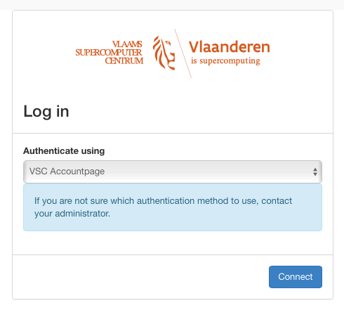

# Access to the VSC Cloud

Access to the VSC Cloud is linked to the central VSC account system
([account.vscentrum.be](https://account.vscentrum.be)), so you do not
need a separate login or password. In order to use the cloud services,

-   you need an active VSC account and

-   your account must be a member of one or more Opennebula groups.

New users can obtain an account by following [the procedure described
here](/accounts/vsc_account.rst).
Once you have an account, contact us if you want to start a new OpenStack
project, or join an existing one.

You can interact with the VSC Cloud using the Opennebula Dashboard, a web
interface, or the "one" command line interface, which you can use
from any system, and which is installed for you on the UGent login node
**login.hpc.ugent.be**. You can log in to the Dashboard using the VSC
accountpage, as illustrated in the next section. To get access from the
command line interface, you'll need to obtain a login token,
as explained in section [Login Token](#login-token).

These restrictions do not apply to someone who simply wishes to access
an existing VM running in the cloud. VSC Cloud projects can decide
themselves who gets access to their VM's, and how.

## Dashboard Login

You can access the Opennebula web interface, or Dashboard, via
[cloudpr4.vscentrum.be](https://cloudpr4.vscentrum.be).

To log in, choose the (default) authentication method **VSC Accountpage**
and click .

From here on, follow the standard procedure to log in to your VSC
account, using your home institution's single sign-on system.
The following chapters explain how to accomplish basic tasks using the
Dashboard.

## Login Token

If you want to use the opennebula CLI (one), or interact with it's API (with [OpenTofu](./opentofu.md), for example) you need a "Login token".
To obtain a login token, follow these steps:

1) Log in on [cloud.vscentrum.be](https://cloud.vscentrum.be)
2) Click on your username in the top right corner
3) Click "settings"
4) In this new screen, click "Security".
5) Scroll to the bottom, to the "Login Token" section.
6) Fill in an expiration time in seconds, and select the group for which this token should apply
7) Click "Get a new Token"

The token will now appear on this page until it has expired.
