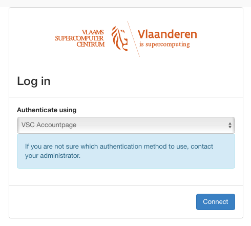

# Access to the VSC Cloud

Access to the VSC Cloud is linked to the central VSC account system
([account.vscentrum.be](https://account.vscentrum.be)), so you do not
need a separate login or password.

In order to use the cloud services:

- you need an active VSC account and
- you must accept the invitation to the Tier-1 Cloud project in VSC hub and
- your account must be a member of one or more OpenNebula groups

New users can obtain a VSC account by following [the procedure described
here](/accounts/vsc_account.rst).

Once you have a VSC account, contact us via <cloud@vscentrum.be> if you want to start a new
 OpenNebula project, or join an existing one.

## Components of the VSC Cloud

The VSC Cloud consists of three components:

### VSC hub

VSC Hub ([https://hub.vscentrum.be](https://hub.vscentrum.be)) is used for:

- viewing VSC Tier-1 Cloud projects
- viewing allocated VSC Tier-1 Cloud resources
- managing project membership (project managers only)

### VSC Cloud Dashboard

The VSC Cloud Dashboard ([https://cloudpr4.ugent.be](https://cloudpr4.ugent.be)) is the web interface to the OpenNebula cloud platform.
It is used to:

- view Tier-1 Cloud resources
- manage virtual machines
- manage networking and storage resources
- generate login tokens for OpenTofu and OpenNebula

### OpenTofu and the OpenNebula CLI

[OpenNebula](https://opennebula.io/) is the cloud platform that provides and manages the virtual machines, networking and storage resources used by the VSC Tier-1 Cloud.

[OpenTofu](https://opentofu.org/) (a fork of [Terraform](https://developer.hashicorp.com/terraform)) is the recommended way to deploy and manage cloud resources in the new OpenNebla cloud platform.

Both OpenTofu and the OpenNebula CLI use authentication tokens generated from the VSC Cloud Dashboard.

## Changes for existing Tier-1 Cloud users

If you previously used the Tier-1 Cloud OpenStack environment, there are some important changes in the new OpenNebula-based platform.

### New project identifiers

To provide a clean transition to the new platform, all projects receive a new identifier.

For example:

| Previous platform | New platform |
|-------------------|--------------|
| VSC_2026_001 | Tier-1 Cloud - project 10001 |
| gpr_cloud_2026_001 | gpr_cloud_10001 |

The new project identifier should be used in future communication with the Tier-1 Cloud support team.

### Membership management

Project membership is now managed through the VSC Hub for projects on the new OpenNebula-based 
Tier-1 Cloud platform.

For existing **OpenStack** projects, the corresponding VSC accountpage groups remain active 
and can continue to be used to manage access to OpenStack resources for as long as those 
projects remain operational.

For projects on the new **OpenNebula** platform, project membership is managed
exclusively through the VSC hub. Adding or removing members in the VSC
accountpage will not affect access to OpenNebula resources.

In summary:
 
- OpenStack projects: manage membership via the existing VSC accountpage
groups
- OpenNebula projects: manage membership via the VSC Hub

### IP addresses

In the previous OpenStack environment, public IPs (and optionally also VSC IPs) were
assigned to projects in advance.

In the OpenNebula environment, projects receive an IP quota instead.
IP addresses are assigned only when resources are deployed.

As a result, migrated projects will receive new IP addresses.
You can read more in the section on [Networking](networking.md).

## Accessing the VSC Cloud

You can interact with the VSC Cloud in several ways:

- via the VSC hub for project and membership management
- via the VSC Cloud Dashboard, a web interface based on OpenNebula
- via the OpenNebula command line interface (`one`)
- via OpenTofu

You can log in to the VSC hub, as well as the VSC Cloud Dashboard using your VSC account using your home institution’s single sign-on system.

To access the OpenNebula CLI or to use OpenTofu, you will need a login token, as explained in the [login token](#login-token).
Such a login token is only required for users who need to manage cloud resources. 
Users who simply need access to an existing virtual machine do not need to interact with OpenNebula or OpenTofu themselves.

The OpenTofu CLI can be installed locally (recommended) but is also available on the HPC-UGent Tier-2 login nodes at `login.hpc.ugent.be`. More details can be found in the [section on OpenTofu](opentofu.md).

**Optional**: Advanced users can also interact directly with OpenNebula using the `one` command line interface (CLI), which needs to be installed locally. More information can be found in the section on [Creating VMs](opentofu.md#basic-vm-configuration).

### Managing project membership

When you are added to a Tier-1 Cloud project, you will receive an automatically generated invitation email 
from the VSC hub.

:::{note}
Invitation emails from the VSC hub originate from **eurocc@etais.ee**. If you do not see 
the invitation, please check your spam folder.
:::

After accepting the invitation, always log in to the [VSC hub](https://hub.vscentrum.be) using your VSC account.

The **Project manager** can add other users to the project via the VSC hub.

1. Log in to the [VSC hub](https://hub.vscentrum.be/) with your VSC account.
2. Open your project and go to its **Team** tab.
3. Click Add and select either **Member** (if the user has already logged in to the VSC hub before) or **Invite by email** (if the user has never logged in there yet).
4. Choose a Role for the new member. A **Project member** can only consult the project's resources whereas a **Project managers** can also invite additional members to the project.

:::{note}
The VSC Hub interface contains a **Support** button, but this currently redirects to a different support system. For all Tier-1 Cloud questions during the pilot phase, please continue to contact: <cloud@vscentrum.be>.
:::

### VSC Cloud Dashboard login

You can access the VSC Cloud Dashboard via [cloudpr4.ugent.be](https://cloudpr4.ugent.be).

To log in, choose the (default) authentication method **VSC Accountpage**
and click "Connect".

From here on, follow the standard procedure to log in to your VSC
account, using your home institution's single sign-on system.

:::{warning}
Only users with an active Tier-1 Cloud project in the VSC Hub, and a corresponding
group in OpenNebula, will be able to log into the VSC Cloud Dashboard.
:::

The following chapters explain how to accomplish basic tasks using the
VSC Cloud Dashboard.

### Login token

If you want to use the OpenNebula CLI (one), or interact with its API (with [OpenTofu](./opentofu.md), for example) you need a "Login token".
To obtain a Login token, follow these steps:

1) Log in on [cloudpr4.ugent.be](https://cloudpr4.ugent.be/)
2) Click on your username in the bottom lef corner
3) Click "Profile Settings"
4) In this new screen, click "Security".
5) Scroll to the bottom, to the "Login Token" section.
6) Fill in an expiration time in seconds, and select the group for which this token should apply
7) Click "Get a new Token"

The token will now appear on this page until it has expired. Proceed with [instructions on where to store the token](./opentofu.md#create-credentials-for-opentofu).
