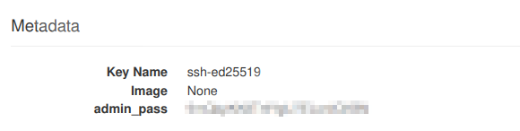
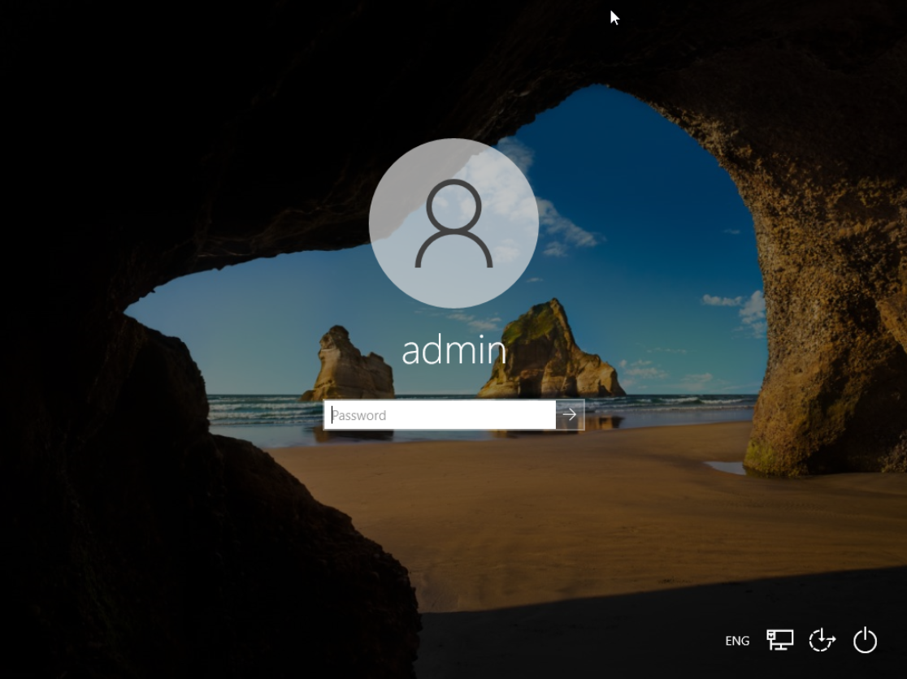

# Running Windows VMs

It is possible to deploy Windows VMs in VSC Tier-1 Cloud infrastructure.
VSC [Terraform modules](terraform.md#terraform-modules) 
provides a terraform module with an option for Windows. Simply use the `Windows10` image. Please read our
[Terraform section](terraform.md#terraform-modules) first to know how to use and modify
Terraform modules.

:::{note}
At this moment VSC Tier-1 Cloud only provides a Windows 10 public image.
Windows 11 will be available soon.
:::

## Deploy Windows VM with Terraform

Windows VMs also require some extra steps after the Terraform deployment. After running:

```shell
terraform apply
```
It will take around 7 minutes or more to deploy the new Windows VM (the system
should resize the disk and Windows NTFS partition). Wait until it is done.

## Retrieve Windows admin password

Windows Terraform template generates a random password to login the first time
as Admin user in your Windows VM. You can retrieve the password from
[VSC Tier-1 Cloud dashboard](https://cloud.vscentrum.be), just login with your
VSC account and go to `Compute->Instances` and click on your Windows `Instance Name`
(by default `MyVM-windows` if you didn't change the name).
Click or select the `Overview` tab, you will see the Windows admin password
(`admin_pass`) from Metadata section below:



You should use this password to login the first time in your Windows machine.
(You must reset the admin password to connect via Remote Desktop).

## Reset Windows admin password

Click on `Console` tab to get access to your Windows machine via VNC. If you see a black
screen just click and drag with your mouse to unlock the screen.
You will see a Windows login screen similar to this:



You should type the same password displayed from the Metadata in the previous section.
Windows will ask you to reset the admin password, type a new password twice to verify
that is correct.

:::{tip}
Usually you have to reset the password after the first boot or if you change
the VM's flavor. In that case just use the original password provided
by the metadata and reset the password again.
:::

At this point you can use Windows Remote Desktop (RDP) with your new admin user and password
to connect to your VM.
Make sure you use the correct port to connect to your Windows Remote Desktop,
(please see [Terraform section](terraform.md) for more details).

:::{note}
Take into account you should upgrade your Windows OS after the first boot.
You should activate your Windows machine with a valid key as well.
:::
