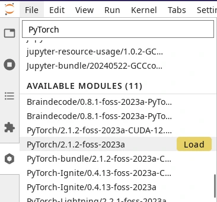
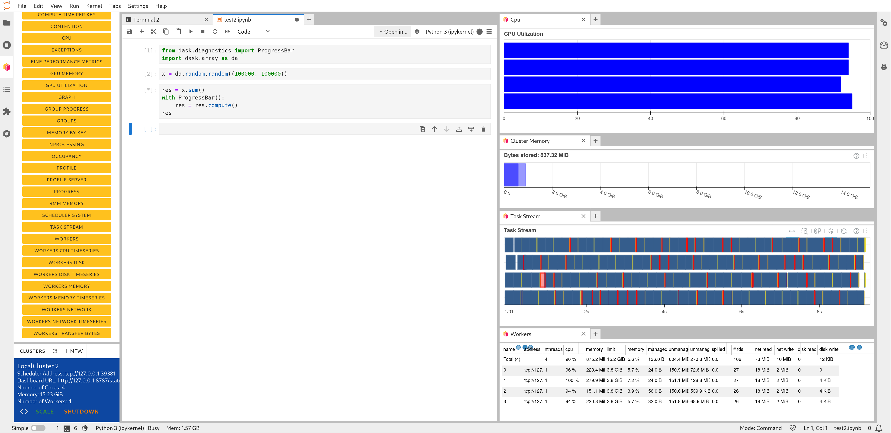

JupyterLab
==========

With this app you can write and run `Jupyter notebooks <official JupyterLab
documentation_>`_ containing annotated Python, R or Julia code (among other
languages). IPython consoles are available as well. One of the benefits of
JupyterLab is that it supports different types of user-defined environments, as
will become clear below.

.. tab-set::

   .. tab-item:: KU Leuven/UHasselt

      The top-level notebook directory is by default ``$VSC_DATA``.

   .. tab-item:: VUB

      The top-level notebook directory is the selected 'Working directory' in
      the resources form. Note however, if you have set ``c.ServerApp.root_dir``
      in your `Jupyter configuration file
      <https://jupyter-server.readthedocs.io/en/stable/other/full-config.html>`_
      (default = ``~/.jupyter/jupyter_server_config.py``), this config will take
      priority over your 'Working directory' in the resources form.

.. _jupyterlab_pure_module_env:

Pure module environment
~~~~~~~~~~~~~~~~~~~~~~~

In the resources form, besides the :ref:`shared resources <shared_resources>`,
you can also choose between different 'Toolchain and Python versions' from a
drop-down menu.  An example would be '2023a and
``Python/3.11.3-GCCcore-12.3.0``'.  Based on that choice, the corresponding
JupyterLab module will be loaded together with its dependencies (such as the
listed Python module).

Furthermore, you may choose to tick one of the checkboxes to load popular
modules from the same toolchain, such as ``SciPy-bundle`` (for widely used
packages like ``scipy``, ``numpy``, ``pandas`` and more) and/or ``matplotlib``.

Once you launch a JupyterLab session, a default kernel called ``Python 3
(ipykernel)`` is already available in your session.  This kernel, in addition to
the Python standard library, would enable using extra packages from
``SciPy-bundle`` and/or ``matplotlib``, if you selected them in the resource
form.

If the selected modules do not provide all Python packages that you need, you
can load extra modules with Python packages via ``module load`` commands in the
'Pre-run Scriptlet' of the resources form.

.. warning::

   If you use JupyterLab in the pure module environment, remember to be
   consistent in your choice of toolchain version as this determines the
   versions of Python and Python packages that will be used.

Jupyter kernels
---------------

The following table shows the kernels available in JupyterLab and the
corresponding modules that have to be loaded to enable them:

.. list-table:: Jupyter kernels provided by software modules
   :header-rows: 1
   :align: left

   * - Kernel
     - Software Module
   * - Python
     - *(loaded by default)*
   * - R
     - ``IRkernel``
   * - Julia
     - ``IJulia``

The default lab environment only loads the Python kernel upon launch. You can
activate any other kernel by loading its corresponding :ref:`software module
<software_modules_extension>`. Once a module providing a new kernel is loaded, a
new icon will automatically appear on your lab launcher page to start a notebook
with that kernel.

.. _jupyter-user-kernel:

User-defined kernels
~~~~~~~~~~~~~~~~~~~~

If the available modules in the pure module environment do not provide all
Python packages that you need, then you can locally install these extra
packages, followed by installing the corresponding Jupyter kernel either from a
:ref:`Python Conda environment<py-conda-kernel>`, or from a :ref:`Python virtual
environment<py-venv-kernel>`.  For R, you may create your customized environment
using :ref:`Conda environments for R<r-conda-kernel>`.

.. note::

   User kernels are stored by default in ``${VSC_HOME}/.local/share/jupyter/kernels``.
   To override this and store your kernel specifications in a non-default location,
   you may drop the following line in your ``${VSC_HOME}/.bashrc``::

      export XDG_DATA_HOME=${VSC_DATA}/.local/share

   When the ``${XDG_DATA_HOME}`` variable is set, subsequent kernel installations
   (for both Python and R) will reside in ``${XDG_DATA_HOME}/jupyter/kernels``.
   To remove a kernel, find and delete the corresponding folder inside the ``kernels``
   subdirectory.
   We strongly advice against modifying the contents of this folder, unless you
   are aware of the consequences.

.. _py-conda-kernel:

Conda environments for Python
~~~~~~~~~~~~~~~~~~~~~~~~~~~~~

Assuming you have created a Conda environment for Python, the corresponding
kernel needs to be installed for use with JupyterLab.

.. tab-set::

   .. tab-item:: KU Leuven/UHasselt

      If you have not installed Conda in your account yet, please refer to the
      :ref:`install Miniconda <install_miniconda_python>` page.

      Please also refer to the docs on :ref:`creating a Conda environment for
      Python <create_python_conda_env>`.

      First activate the Conda environment:

      .. code-block:: bash

         source activate <env_name>

   .. tab-item:: VUB

      Please refer to the docs on `creating a Conda environment for Python
      <https://hpc.vub.be/docs/software/additional_software/#installing-additional-packages-with-conda>`_.

      First activate the Conda environment:

      .. code-block:: bash

         module load Mamba
         source $EBROOTMAMBA/etc/profile.d/conda.sh
         conda activate <env_name>

Next, install the ``ipykernel`` package and the kernel itself:

.. code-block:: bash

   conda install ipykernel
   python -m ipykernel install --user --env PYTHONPATH "" --name <env_name> --display-name <kernel_name>

These commands should be executed from a shell (e.g. using 'Login (Server) Shell Access'),
and only need to be done once for a given environment.
When launching a new JupyterLab session, this kernel should then show up in the overview
of available kernels, and as a new tile under the 'Notebook' section when opening a new launcher.

.. admonition:: Notes

   - The minimum supported Python version is Python 3.7.
   - The minimum supported ipykernel version is ipykernel 6.19.2.

.. tip::

   In case you encounter issues such as freezing or crashing JupyterLab sessions with a previously
   existing kernel, then reinstalling that kernel may help.

.. _py-venv-kernel:

Virtual environments for Python
~~~~~~~~~~~~~~~~~~~~~~~~~~~~~~~

You can use :ref:`Python virtual environments <venv_python>` to generate custom kernels for your
notebooks. Virtual environments provide a layer of isolation allowing users to
install additional Python packages on top of the software modules without
conflicts.

Before using a virtual environment from the lab interface, consider the
following requirements:

- The chosen Python module needs to be in the list of 'Toolchain and
  Python versions' of the JupyterLab form (e.g. ``2023a and
  Python/3.11.3-GCCcore-12.3.0``).

- When using a virtual environment, the same software modules must be
  loaded as those that were loaded when creating it.

- A virtual environment is only guaranteed to work in the same :ref:`CPU
  micro-architecture <tier2 hardware>` as the one it was created on.

  |KUL| We recommend to consider the suggestions in the :ref:`wICE advanced
  guide <wice_compilation>`.

#. Open the *Terminal* from your lab interface, ensuring that the requirements
   listed above are met.

#. Follow the instructions in :ref:`venv_python` to create a new virtual
   environment and install any Python packages in it. Keep in mind that loading
   the Python module is not necessary as that is already done by the JupyterLab
   session. This new virtual environment can be placed anywhere you like in the
   storage of the cluster.

   .. code-block:: shell
      :caption: Example sequence of commands to create a new virtual
                environment in the directory ``venv-zen4``

      $ python3 -m venv venv-zen4 --system-site-packages
      $ source venv-zen4/bin/activate
      (venv-zen4) $ python3 -m pip install --upgrade pip
      (venv-zen4) $ python3 -m pip install <insert_cool_package>

#. Add your new virtual environment as a new Jupyter kernel (from the same
   terminal shell)

   .. code-block:: shell

      $ python3 -m ipykernel install --user --name=venv-zen4

#. A new launcher will appear in the lab interface to start notebooks using
   this new virtual environment

   .. figure:: img/jupyterlab-custom-launcher.png

      Launchers for default Python kernel and custom Python kernel from
      virtual environment

To verify your setup, you can execute ``import sys; sys.executable`` in the new
kernel notebook, and the resulting path should point to the location of your
virtual environment.

.. _r-conda-kernel:

Conda environments for R
~~~~~~~~~~~~~~~~~~~~~~~~

For R, you need both the ``jupyter_client`` and the ``irkernel`` Conda packages installed.
With the following command you can create the kernel::

      Rscript -e 'IRkernel::installspec(name="<env_name>", displayname="<kernel_name>")'

Once the kernel is created, you will see it in the 'Launcher' menu.
You can now start working in your own customized environment.

For more general information, please refer to the `official JupyterLab documentation`_.

.. _official JupyterLab documentation: https://jupyterlab.readthedocs.io

JupyterLab extensions
---------------------

JupyterLab extensions enhance or customize your JupyterLab session.  You can
find the list of available extensions in the extension tab on the left panel
(*puzzle piece icon*) and you can enable or disable any of them.

.. note::

   The JupyterLab extensions store is disabled because the available extensions
   in the store are not reviewed and may contain malicious or malfunctioning
   software. If you need any JupyterLab extension that is not yet available,
   please contact the site admins.

.. _software_modules_extension:

Software modules Lab extension
~~~~~~~~~~~~~~~~~~~~~~~~~~~~~~

The 'Software Modules' JupyterLab extension allows you to load additional
software modules within JupyterLab without relaunching your JupyterLab session.
This provides a more flexible alternative to loading modules via the 'Pre-run
Scriptlet' in the resources form.

VSC clusters that support the 'Software Modules' Lab extension:

.. grid:: 3
    :gutter: 4

    .. grid-item-card:: |VUB|
       :columns: 12 4 4 4

       * Tier-2 :ref:`Anansi <Anansi cluster>`
       * Tier-2 :ref:`Hydra <Hydra cluster>`

The 'Software Modules' Lab extension is enabled by default in your JupyterLab
session.  You can load software modules from the tab with a *hexagon* icon on
the left panel of JupyterLab. This tab shows a long list of modules: the loaded
modules at the top, and below that, a list of available modules.

.. figure:: img/jupyterlab-lmod-tab-2023a.webp

   Software Modules Lab extension

Upon launch, the list of loaded modules will already show some modules that have
been loaded by JupyterLab itself. For example, you will always see a Python
module loaded, which determines the Python version of the kernel used by your
Python notebooks on this session.

.. warning::

   Modules already loaded when your JupyterLab environment starts are necessary
   for the correct function of the lab and notebooks. They should not be unloaded.

Below the loaded modules, you will find the list of available modules that can
be loaded on-demand. Move your mouse pointer to the right of the module name and a
*Load* button will appear (see screenshot on the right).

   Loading a module in the Software Modules Lab extension

.. note::

   Any change to the list of loaded modules requires rebooting the kernel of
   your open notebooks. After loading/unloading modules, click the kernel at the
   top-right of the notebook toolbar, (default = ``Python 3 (ipykernel)``) in the
   screenshot below, and re-select your notebook kernel from the menu.

.. figure:: img/jupyterlab-kernel-reload.png

   Notebook toolbar with default Python kernel

.. _matplotlib_lab_extension:

Matplotlib Lab extension
~~~~~~~~~~~~~~~~~~~~~~~~

The `matplotlib JupyterLab extension <https://matplotlib.org/ipympl/>`_
(``ipympl``) enables the interactive features of matplotlib in your JupyterLab
session.

VSC clusters that support the matplotlib Lab extension:

.. grid:: 3
    :gutter: 4

    .. grid-item-card:: |VUB|
       :columns: 12 4 4 4

       * Tier-2 :ref:`Anansi <Anansi cluster>`
       * Tier-2 :ref:`Hydra <Hydra cluster>`

To enable the Lab extension, use the ``%matplotlib ipympl`` or ``%matplotlib
widget`` magic command. To ensure your plot is always shown, make sure to
generate a figure object before plotting, e.g. with ``plt.figure()`` or
``plt.subplots()``.

.. figure:: img/jupyterlab-matplotlib.png

   matplotlib Lab extension example

Dask Lab extension
~~~~~~~~~~~~~~~~~~

The `Dask JupyterLab extension
<https://github.com/dask/dask-labextension/blob/main/README.md>`_
(dask-labextension) provides tools to manage Dask clusters and embed Dask’s
dashboard plots directly into your JupyterLab session.

VSC clusters that support the Dask Lab extension:

.. grid:: 3
    :gutter: 4

    .. grid-item-card:: |VUB|
       :columns: 12 4 4 4

       * Tier-2 :ref:`Anansi <Anansi cluster>`
       * Tier-2 :ref:`Hydra <Hydra cluster>`

#. In the resources form, tick the 'Load the dask module' checkbox to make sure
   the Dask Lab extension is loaded before starting JupyterLab.

#. In your new JupyterLab session, open a Jupyter notebook or start a new one.

#. In the 'Settings' menu, select 'Auto-Start Dask'.

#. Click the *Dask* icon on the left side of the JupyterLab window.

#. In the 'Clusters' pane of the 'Dask' tab, click the '+New' button to fire up
   a Dask cluster and connect your notebook to it. The default cluster is a
   *LocalCluster*, which is suited for single-node calculations.

You can now click any of the yellow-colored bars to open the corresponding Dask
dashboard. Once opened, you can drag-and-drop it anywhere you want, and you can
open multiple dashboards in the same session. Some useful Dask dashboards
include 'Cpu', 'Cluster Memory', 'Task Stream', and 'Workers'.

   Dask Lab extension in action
