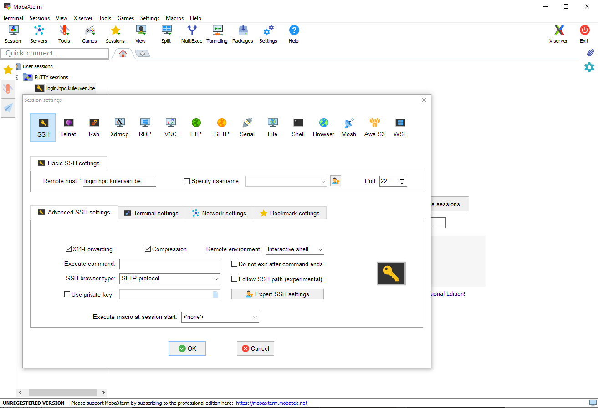

.. _terminal mobaxterm:

########################
Terminal using MobaXterm
########################

Prerequisites
=============

.. tab-set::
   :sync-group: vsc-sites

   .. tab-item:: KU Leuven/UHasselt
      :sync: kuluh

      To access KU Leuven clusters, only an approved
      :ref:`VSC account<access>` is needed.

   .. tab-item:: UAntwerpen
      :sync: ua

      To access clusters hosted at these sites, you need a
      :ref:`public/private key pair <create key pair>` of which the public key
      needs to be :ref:`uploaded via the VSC account page <upload public key>`.

      Since you will be using MobaXterm, it is probably the easiest to
      :ref:`generate your keys with MobaXterm <generating keys mobaxterm>` as
      well.

   .. tab-item:: UGent
      :sync: ug

      To access clusters hosted at these sites, you need a
      :ref:`public/private key pair <create key pair>` of which the public key
      needs to be :ref:`uploaded via the VSC account page <upload public key>`.

      Since you will be using MobaXterm, it is probably the easiest to
      :ref:`generate your keys with MobaXterm <generating keys mobaxterm>` as
      well.

   .. tab-item:: VUB
      :sync: vub

      To access clusters hosted at these sites, you need a
      :ref:`public/private key pair <create key pair>` of which the public key
      needs to be :ref:`uploaded via the VSC account page <upload public key>`.

      Since you will be using MobaXterm, it is probably the easiest to
      :ref:`generate your keys with MobaXterm <generating keys mobaxterm>` as
      well.

.. _mobaxterm install:

Installation
============

Go to the `MobaXterm`_ website and download the free version. Make sure to
select the **Portable edition** from the download page. Create a folder
called ``MobaXterm`` in a known location on your computer and decompress the
contents of the downloaded zip file inside it.

.. _mobaxterm setup:

Setup a remote session
======================

#. Double click the ``MobaXterm_Personal`` executable file inside the
   ``MobaXterm`` folder. The MobaXterm main window will appear on your screen.
   It should be similar to this one:

   .. _mobaxterm-main-window:
   .. figure:: mobaxterm_access/mobaxterm_main_window.png
      :alt: mobaxterm main

#. Click on the `Session` icon in the top left corner.

#. The 'Session settings' configuration panel will open; click on the SSH icon in the top row
   and you should see a window like this:

   .. figure:: mobaxterm_access/mobaxterm_session_settings_ssh.png
      :alt: ssh settings window

#. The next few steps depends on the VSC site you are trying to connect to.

   .. tab-set::
      :sync-group: vsc-sites

      .. tab-item:: KU Leuven/UHasselt
         :sync: kuluh

         In the 'Remote host' field introduce the cluster remote address:
         ``login.hpc.kuleuven.be``.

         Tick the 'Specify username' box and introduce your VSC account username.

         Click the 'Advanced SSH settings' tab for additional configurations:

         * Check that the 'SSH-browser type' is set to 'SFTP protocol'
         * Make sure that the 'Use private key' option is disabled

         .. figure:: mobaxterm_access/mobaxterm_adv_kul.png
            :alt: advanced SSH options for KU Leuven clusters

         With this configuration, it is strongly recommended to setup your
         :ref:`SSH agent in MobaXterm <mobaxterm ssh agent>` which is
         described below.

         Upon successful connection attempt you will be prompted to copy/paste
         the firewall URL in your browser as part of the MFA login procedure:

         .. figure:: mobaxterm_access/vsc_firewall_certificate_authentication.png
            :alt: vsc_firewall_certificate_authentication

         Confirm by clicking 'Yes'. Once the MFA has been completed you will be
         connected to the login node.

      .. tab-item:: UAntwerpen
         :sync: ua

         In the 'Remote host' field introduce the cluster remote address:
         ``login.hpc.uantwerpen.be``

         .. include:: mobaxterm_access_ssh_keys.rst

      .. tab-item:: UGent
         :sync: ug

         In the 'Remote host' field introduce the cluster remote address:
         ``login.hpc.ugent.be``

         .. include:: mobaxterm_access_ssh_keys.rst

      .. tab-item:: VUB
         :sync: vub

         In the 'Remote host' field introduce the cluster remote address:
         ``login.hpc.vub.be``

         .. include:: mobaxterm_access_ssh_keys.rst

#. |Optional| You may additionally enable 'X11-Forwarding' and 'Compression' options on the 'Session settings':

   .. _mobaxterm advanced options:

   * *X11-Forwarding*: allows the use of graphical applications over the SSH connection
   * *Compression*: is useful on situations with limited network bandwidth

#. You should connect to the cluster and be greeted by a screen similar to this one:

   .. figure:: mobaxterm_access/mobaxterm_hydra_login.png
      :alt: hmem greeting

   On the left sidebar (in the 'Sftp' tab) there is a file browser of your
   home directory in the cluster. You will see by default many files whose
   names start with a dot ('.') symbol. These are hidden files of the
   Linux environment and you should neither delete nor move them. You can hide
   the hidden files by clicking on the right most button at the top of the file
   browser.

#. Once you disconnect from the cluster (by typing ``exit`` or closing the
   terminal tab) you will find on the left sidebar (in the 'Sessions' tab)
   a shortcut to the session you just setup. From now on, when you open
   MobaXterm, you can just double click that shortcut and you will start
   a remote session on the VSC cluster that you used in previous steps.
   
   To create a direct shortcut on your desktop (optional),
   right click on the saved session name and choose
   'Create a desktop shortcut' (see image below). An icon will appear on your
   Desktop that will start MobaXterm and open a session in the corresponding cluster.
   
   .. figure:: mobaxterm_access/mobaxterm_session_shortcut.png
      :alt: session desktop shortcut

Now you can create connections to any :ref:`Tier-1<tier1 hardware>` or
:ref:`Tier-2<tier2 hardware>` VSC cluster by repeating these steps and changing
the address of the cluster. You will then have a shortcut on the Sessions tab
of the left sidebar for each of them to connect to.

Import PuTTY sessions
=====================

If you have already configured remote sessions within PuTTY, then MobaXterm
will automatically import them upon installation and they will appear on the
left-side pane.
To edit a session, right-click on the session and then choose 'Edit session'.
Ensure that all settings are correct under the 'SSH' tab and the 
'Advanced SSH settings' sub-tab:

.. _mobaxterm_putty_imported_sessions:

If the session has been properly imported you will see that all the necessary
fields are already filled in.
Click 'OK' to close the 'Edit session' window.

.. _copying-files-mobaxterm:

Copying files to/from the cluster
=================================

Once you've setup the shortcut for connecting to a cluster, as we
noted in `step 6 <#step-sftp-tab>`_ of the previous section, you will see
on the left sidebar (in the 'Sftp' tab) a file browser on the cluster you are
connected to.

You can simply drag and drop files from your computer to that panel and they
will be copied to the cluster. You can also drag and drop files from the
cluster to your computer. Alternatively, you can use the file tools located at the
top of the file browser.

Remember to always press the ``Refresh current folder`` button after you
copied something or created/removed a file or folder on the cluster.

Setup an SSH agent
==================

Once you've successfully setup the connection to your cluster, you will notice
that you are prompted for the passphrase at each connection you make to a
cluster. You can avoid the need to re-type it by setting up an SSH agent on MobaXterm.

Check the documentation in: :ref:`mobaxterm ssh agent`

.. _troubleshoot_mobaxterm:

Troubleshooting MobaXterm connection issues
===========================================

If you have trouble accessing the infrastructure, the support staff will
likely ask you to provide a log.  After you have made a failed attempt to connect,
you can obtain the connection log by

#. ctrl-right-clicking in the MobaXterm terminal and selecting 'Event Log'.
#. In the dialog window that appears, click the 'Copy' button to copy the
   log messages.  They are copied as text and can be pasted in your message
   to support.

