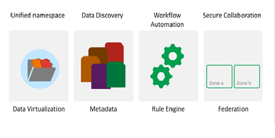

.. _Introduction_to_irods:

Introduction to iRODS
=====================

The integrated Rule-Oriented Data System (iRODS) is open source data management software middleware that manages a highly controlled collection of distributed digital objects (various data), while enforcing user/institution-defined Management Policies across multiple storage locations. 
Furthermore its technical structure and usage is quite collaborative with High Performance Computing (HPC) systems.

It enables users to access, manage and share data across different storage systems as well as exercising precise control over their data with rules while maintaining security and user friendly approaches.

iRODS gives users four core competencies:

- **Virtualization**, which means it provides a logical representation of files stored in physical storage locations. Regardless of differences of storage assets, the virtualization of iRODS present a unified namespace with the classical files and folders format.

- **Data Discovery** is ensured through the use of descriptive, user-defined metadata in addition to traditional system metadata, such as filename, file size and creation date.

- **Workflow Automation** is a workflow that is done with rules and microservices. This is typically an event-triggered background process or a  client initiated action.

- **Secure Collaboration**, meaning a facility to share data between users and user groups.

Other features that make iRODS a unique data management platform can be found on the next pages.

