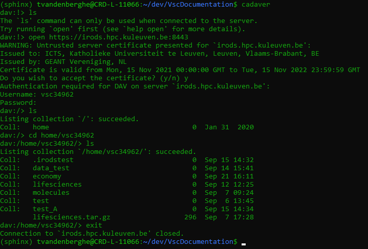

.. _cadaver_client_access:

Cadaver Client Access
=====================

Cadaver is a command-line client for WebDAV and is available on UNIX-like operating systems such as Linux (native and Windows WSL) and MacOS. It supports file upload, download, on-screen display, namespace operations (move/copy), collection creation and deletion, and locking operations. After connecting to a WebDAV endpoint a session opens.

As WebDAV is an extension on HTTP, a WebDAV server supports the basic HTTP request methods such as GET, PUT and DELETE. WebDAV extends these i.a. with MKCOL, MOVE and COPY. It is therefore possible to use cURL to do file and collection operations. Please note Cadaver is more user friendly and wraps all these operations in a Unix-like session. 

Using cURL with iRODS
---------------------
To use cURL (and cadaver), first go to https://irods.hpc.kuleuven.be and note your user account, temporary (4h) password and the Davrods client url (https://irods.hpc.kuleuven.be:8443).  

Before continuing with cURL (not cadaver) you should install the SSL certificate provided by https://irods.hpc.kuleuven.be:8443. In most browsers certificates can be downloaded by clicking the lock icon next to the url bar and following through to the certificate. On Chrome and Edge on Windows this opens a standard certificate viewer offering a .cer file, on Firefox it's a .pem file. For further instructions converting and installing certificates on Ubuntu, please follow the instructions at https://ubuntu.com/server/docs/security-trust-store. You can skip installing the certificate by providing the -k switch to curl; however this is insecure as it bypasses SSL security. As it is better to use cadaver we only show the most basic capabilities.

To show an overview of your collections, you can use the following command. It only displays an html response.

:: 

    $ curl https://irods.hpc.kuleuven.be:8443/home/vscXXXXX/ --user vscXXXXX:password

To create a new Collection 'collection1':

:: 

    $ curl https://irods.hpc.kuleuven.be:8443/home/vscXXXXX/ --user vscXXXXX:password -X MKCOL 'https://irods.hpc.kuleuven.be:8443/home/vscXXXXX/collection1/'

To upload a file to your 'collection1' Collection:

:: 

    $ curl https://irods.hpc.kuleuven.be:8443/home/vscXXXXX/collection1/ --user vscXXXXX:password -T test.txt

Using cadaver with iRODS
------------------------

Installation on Debian/Ubuntu is as follows:
::

    $ sudo apt-get update
    sudo apt-get install cadaver

To use cadaver, first go to https://irods.hpc.kuleuven.be and note your user account, temporary (4h) password and the Davrods client url (https://irods.hpc.kuleuven.be:8443).  

Start a cadaver session by executing  ``cadaver``. You can also connect to your iRODS root collection in one command as follows:

::

    cadaver https://irods.hpc.kuleuven.be:8443/home/vscXXXXX
 

If not yet the case, connect to the Tier 1 zone by executing:

:: 

    dav:!> open https://irods.hpc.kuleuven.be:8443

The first time you connect, it will warn you with 'Untrusted server certificate presented for irods.hpc.kuleuven.be' and then prompt you to install the certificate. Proceed.

Then complete your username and password. You are now connected and can perform the WebDAV operations.

Type ``help`` to discover all commands. 

To create a Collection, you can use either ``mkcol`` or ``mkdir``:

::

    dav:!> mkcol cadaver_test

Now you can upload data objects to this new collection by first specifying the local absolute path to the file, and then the remote relative or absolute path:

::

    dav:!> put /home/user/test.txt /home/vscXXXXX/cadaver_test

To leave the session and close cadaver, type ``exit``.

It is also possible to run cadaver as a oneliner from the shell by providing it a list of instructions. 

Make a ~/davscript file with the following contents:

::

    put /home/user/test.txt /home/vscXXXXX/cadaver_test
    exit

You can also provide the client address next to an ``open`` command inside the script.

Now you can execute these commands on the fly:

::  

    $ cadaver -r ~/davscript https://irods.hpc.kuleuven.be:8443
