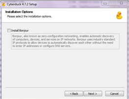

.. _cyberduck_access_irods.rst:

Using Cyberduck for Accessing to iRODS
======================================

Cyberduck_ is a free cross-platform, high-throughput and parallel data transfer open source file transfer program that supports multiple transfer protocols (FTP, SFTP, WebDAV, Cloud files, Amazon S3, etc.). 
This allows users to transfer large files, depending on the user's available bandwidth and network settings. Cyberduck can also be used to rename files and browse other shared or public Data Store locations.

Installing and First Time Configuration of Cyberduck
----------------------------------------------------

- Visit https://cyberduck.io/ and select the download compatible with your operating system.

.. image:: cyberduck/cduck1.png

- Open the Cyberduck.exe file and click "run", install in accordance with your institution’s application install policy.

.. image:: cyberduck/cduck2.png

- It is not necessary to click this checkbox in the Installation Options, click next.

- Click the following profile configuration link to download the VSC-Tier1_Data Cyberduck profile file on your local machine.

:download:`VSC-Tier1_Data Cyberduck profile <cyberduck/vsc_Tier1_Data.cyberduckprofile>`.

- After you download the profile, save it on your computer.

.. image:: cyberduck/cduck4.png

- Double-click on the **VSC-Tier1Data** file that has Cyberduck extension.

- This will launch the Cyberduck that you installed earlier.

.. image:: cyberduck/cduck5.png

- After you double click on the profile it will launch Cyberduck and auto populate relevant access data as you see on the screen above.

- Enter your username and the password you obtained earlier. If your password is expired you should get a new one at: https://vsc-passwd.icts.kuleuven.be following the same procedure you may have done here_ before.

**Note:** You can use Cyberduck for other remote connections to do a file transfer etc. Just save your connection as bookmark.

Upload from local computer to iRODS using Cyberduck
---------------------------------------------------

.. warning:: When uploading your data to the iRODS you should not upload files/folders with names containing spaces (e.g. test1 for iRODS.txt) or name that contain special characters (e.g. ~ ` ! @ # $ % ^ & * ( ) + = { } [ ] | : ; ” ‘ < > , ? /). The command line side will/may typically not tolerate these characters. For long file/folder names the use of underscores (e.g. test1_for_iRODS.txt) is the recommended practice.

- Double-click on the “irods.hpc.kuleuven.be – IRODS” bookmark (that was done automatically by profile file connection) to connect to the iRODS.

.. image:: cyberduck/cduck6.png

- Enter your vsc account in username and click “login”.

.. image:: cyberduck/cduck7.png

.. note:: Note: Unless your passwords has not been expired or you have not deleted your “irods.hpc.kuleuven.be – IRODS” bookmark on Cyberduck, you don’t have to do above two steps.

- Open the Cyberduck and double-click “irods.hpc.kuleuven.be – IRODS”  bookmark.

To be able to upload data from your local machine to iRODS, you can select file(s)/folder(s) from your local machine and drag them into the Cyberduck window. (You may drag directly into an existing folder or from the Cyberduck ‘File’ menu, create a new folder). 
Or you can click upload button on Cyberduck and chose data location in upcoming menu.

Download from iRODS to local computer using Cyberduck
-----------------------------------------------------

You can download from iRODS to your local machine doing same procedure as you have done in uploading

You can select data object(s)/collection(s) in iRODS (Cyberduck window) and drag them to a location on your local computer.

.. image:: cyberduck/cduck8.png

A ‘Transfers’ window will appear. Monitor the download to completion. You can also do “synchronization” which means it will check the both sides and will update your local folder that you can create/choose based on the data in iRODS.

