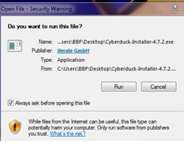
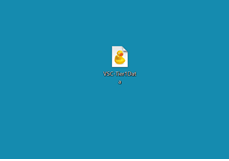
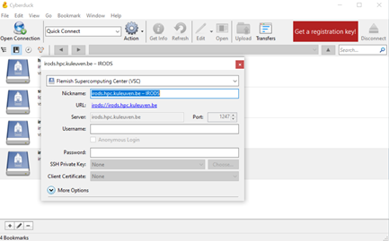
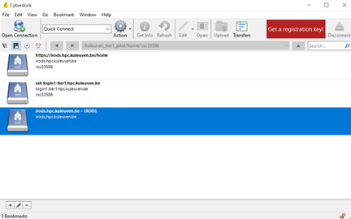
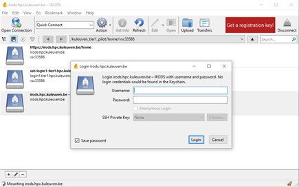
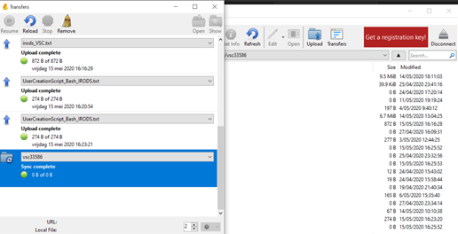

.. _cyberduck_access_irods.rst:

Using Cyberduck for Accessing iRODS
===================================

Cyberduck is a free cross-platform, high-throughput and parallel data transfer open source file transfer program that supports multiple transfer protocols (FTP, SFTP, WebDAV, Cloud files, Amazon S3, etc.). 
This allows users to transfer large files, depending on the user's available bandwidth and network settings. Cyberduck can also be used to rename files and browse other shared or public Data Store locations.

Installation and first time configuration
-----------------------------------------

- Visit https://cyberduck.io/ and select the download compatible with your operating system.

.. image:: cyberduck/cduck1.png

- Open the Cyberduck.exe file and click "run", install in accordance with your institution's application install policy.

- Click the following link to download the VSC-Tier1_Data Cyberduck profile configuration file on your local machine.

:download:`VSC-Tier1_Data Cyberduck profile <cyberduck/vsc_Tier1_Data.cyberduckprofile>`.

- After you download the profile, save it to your computer.

- Double-click on the vsc_Tier1_Data.cyberduckprofile file. 

- This will launch Cyberduck.

- Thanks to this file relevant access information is auto-populated as you can see on the screen above.

- Enter your username and temporary password obtained from https://irods.hpc.kuleuven.be/ following the same procedure you may have done using WinSCP.

.. note:: You can use Cyberduck for other remote connections to do file transfers etc. Just save your connection as a bookmark.

Upload from your local computer to iRODS
----------------------------------------

.. warning:: When uploading your data to iRODS you should not upload files/folders with names containing spaces (e.g. test1 for iRODS.txt) or name that contain special characters (e.g. ~ ` ! @ # $ % ^ & * ( ) + = { } [ ] | : ; ” ‘ < > , ? /). The command line side will/may typically not tolerate these characters. For long file/folder names the use of underscores (e.g. test1_for_iRODS.txt) is the recommended practice.

- Double-click the “irods.hpc.kuleuven.be – IRODS” bookmark to connect to iRODS. This bookmark was created thanks to importing the profile configuration file.

- Enter your vsc-account in username and click “login”.

.. note:: Cyberduck logs in automatically if there is only one bookmark. You don’t have to do the above two steps unless your password has not expired or you have not deleted your “irods.hpc.kuleuven.be – IRODS” bookmark. If you have more than one bookmark, open the Cyberduck application and double-click the “irods.hpc.kuleuven.be – IRODS” bookmark.

To upload data from your local machine to iRODS, you can select file(s) or folder(s) from your local machine's File Explorer or Finder and drag them into the Cyberduck window to the destination folder/collection. You can also create a new folder under File>New Folder.
Or you can click the 'Upload' button on the ribbon and select one or more files to the current directory.

Download from iRODS to local computer using Cyberduck
-----------------------------------------------------

You can download from iRODS to your local machine similar to data upload: select the data object(s)/collection(s) from the Cyberduck window and drag them to a location on your local computer.

A ‘Transfers’ window will appear that can be used to monitor the download to completion. You can also do “synchronization” which means it will check both sides and will update your local folder that you can create/choose based on the data in iRODS.