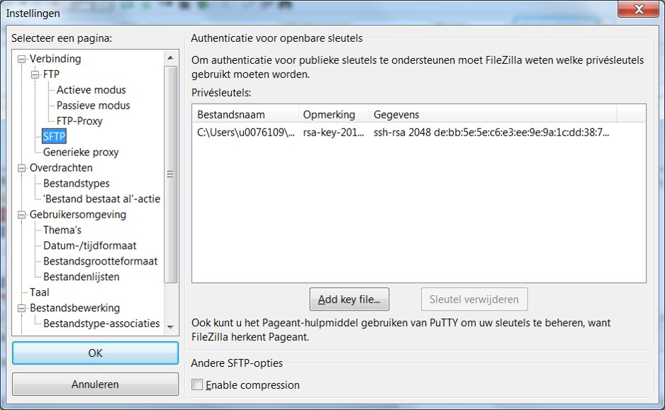

.. _FileZilla:

Data transfer with FileZilla
============================

FileZilla is an easy-to-use freely available ftp-style program to
transfer files to and from your account on the clusters.

You can also put FileZilla with your private key on a USB stick to
access your files from any internet-connected PC.

You can `download FileZilla`_ from the `FileZilla project page`_.

Configuration of FileZilla to connect to a login node
-----------------------------------------------------

Note: Pageant should be running and your private key should be loaded
first (more info on our ":ref:`using Pageant`" page).

#. Start FileZilla;
#. Open the Site Manager using the 'File' menu;
#. Create a new site by clicking the New Site button;
#. In the tab marked General, enter the following values (all other
   fields remain blank):

   -  Host: fill in the hostname of the VSC login node of your home
      institution. You can find this information in the :ref:`overview
      of available hardware on this site <hardware>`.
   -  Servertype: SFTP - SSH File Transfer Protocol
   -  Logontype: Normal
   -  User: *your own* VSC user ID, e.g., vsc98765;

#. Optionally, rename this setting to your liking by pressing the
   'Rename' button;
#. Press 'Connect' and enter your passphrase when requested.

|site manager|

Note that recent versions of FileZilla have a screen in the settings to
manage private keys. The path to the private key must be provided in
options (Edit Tab -> options -> connection -> SFTP):

|site manager populated|

After that you should be able to connect after being asked for
passphrase. As an alternative you can choose to use putty pageant.

.. |site manager| image:: data_transfer_with_filezilla/site_manager.png
   :width: 600
   :alt: FileZilla's site manager

