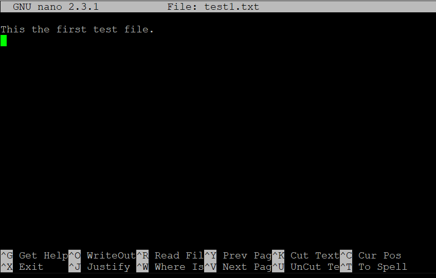
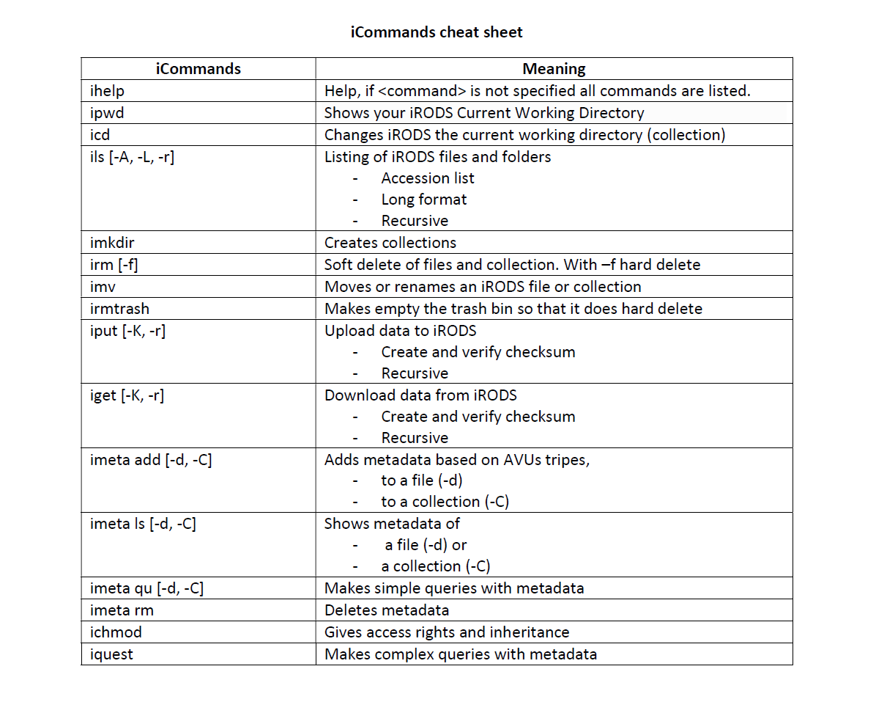

.. _iCommands:

iCommands
===============

iCommands is one of the client-side communication with iRODS server to provide users with data management and metadata management functions to do any data-related actions. In short, iCommands is an Unix utility that gives users a command-line interface.
There are more than 50 iCommands. A regular user however may use only a few of them for his/her daily needs. iRODS offers other user interfaces but the underlying point is that iCommands is the most powerful and easy to use interface to iRODS.

All iCommands accept standard common line options (e.g., -a for all, -h for help) that gives more capabilities to the commands. To see a subset of these options and to know the details of any iCommand, you can follow the below specified options:

- You can visit the `iCommands documentation <https://docs.irods.org/4.2.6/icommands/user/>`__
 
- You can use the ``–h`` option with the command (e.g., ``iput –h``)
  
- You can use the ``ihelp`` command with the argument that you would like to learn more about (e.g., ``ihelp iput``).
  
Please keep in mind some iCommands don't work with tab press auto-complete. Also remember that folders in iRODS are called 'Collections' and files are called 'Objects' or 'Data Objects'.

The following sections illustrate the usage of some iCommands organized on the following categories: "Informative commands", "Working with Collections", "Data upload and download", "Structuring data", "Access Control" and "Handling metadata".

Installing iCommands locally
----------------------------
iCommands is installed on the KU Leuven Tier-1 and some of the Tier-2 clusters. As it is a client to any iRODS system, it can also be used from any local computer after installing it there.

On a Linux OS you can use a package manager to install iCommands in the terminal. For the time being, you should install version 4.2.10. Instructions for configuring via the appropriate package manager can be found at the link https://packages.irods.org/. 

For CentOS:
::
    $ sudo yum install irods-runtime=4.2.10
    sudo yum install irods-icommands=4.2.10

For Debian/Ubuntu:
::
    $ sudo apt update
    sudo apt install irods-runtime=4.2.10
    sudo apt install irods-icommands=4.2.10

.. note::
   Depending on your linux distribution and version, the installation procedure may vary.
   - The most recent version of iCommands is 4.3.0.
   - However, the KU Leuven Tier-1 iRODS instance still runs on iRODS 4.2.10.
   - In case you have a Linux version (e.g. Ubuntu 20) for which iCommands 4.2.10 is not available, please contact rdm-icts@kuleuven.be for the procedure.

Informative iRODS Commands
--------------------------

These commands help us find and understand some required information that we may need while implementing a data related task.

The most important command that will print out all commands will be::

$ ihelp

If you would like to know the settings details you can run::

$ ienv

To know about the detailed information of an user you can run the below command following with an user account. This command will show for example to which groups a user belongs::

$ iuserinfo vscXXXXX

To be able to learn what an error code stands for, you can then use the command below with a code number::

$ ierror 826000

If you want to log out from iRODS you can run ``iexit full`` , but take into account that then you will need to log on again by executing ``ssh irods.hpc.kuleuven.be | bash`` if you want to use iRODS again.

Working With Collections
------------------------

The iCommands that will be used in this part completely emulate standard Unix commands such as ``cd``, ``ls``, and ``pwd``.

To identify the current working collection you can use the ``ipwd`` command. The current working collection is the default location for data to be read or written. Basically this command tells you where you are in iRODS.

::

    $ ipwd
    kuleuven_tier1_pilot/home/vsc33586 

To change the collection to the one you want, you would use ``icd`` with an absolute path or a relative path. In other words, to navigate around folder(s), do::

$ icd testCollection

In order to see the content of any collection (directory), we can use ``ils``. With this command, we can check whether there is data in our iRODS-home directory.

::

    $ ils
    /kuleuven_tier1_pilot/home/vscXXXXX:

What we get here is “kuleuven_tier1_pilot”: the name of the iRODS zone and “/home/<user>”: your default working directory. Because in our iRODS-home directory we don't have any data or collections yet there is no file listed.
In what follows we will show more arguments for the ``ils`` command to gather more details about data or collections. 

Data upload and download
------------------------

In this part we cover how we can ingest datafiles into iRODS. We will also find out where iRODS places the files. To upload data to iRODS and to download data from iRODS to a local file system, the ``iput`` and  ``iget`` commands are used.

**Create data:**

Create/open a file with a text editor (nano, vi,..) on the linux filesystem (i.e., $VSC_DATA). You can also download a data file externally (i.e., ``wget [url]``).::

$ nano test1.txt

With the linux command ``ls`` you can check that the file has been created and is accessible on the User Interface machine.

::

    $ ls
    test1.txt

**Upload data:**

We now upload the data to iRODS::

$ iput -K test1.txt

The flag ``-K`` triggers iRODS to create a checksum and store this checksum in the iCAT metadata catalogue.

We can safely remove the original file from our linux directory to see what happens::

$ rm test1.txt

Check your local directory with ``ls`` and see you don't have your ``test1.txt`` file.

To check that the file is now only available on the iRODS server:

::

    $ ils
    /kuleuven_tier1_pilot/home/vsc33586/test1.txt

**Connection between logical and physical namespace:**

iRODS provides an abstraction from the physical location of the files. ``/kuleuven_tier1_pilot/home/vsc33586/test1.txt`` is the logical path which only iRODS knows. But how can we know where is the file actually on the server that hosts iRODS?

::

    $ ils –L
    /kuleuven_tier1_pilot/home/vsc33586:
    vsc33586          0 default;tier1-p-irods-2020-pilot;tier1-p-irods-2020-pilot-replication;tier1-p-irods-posix;tier1-p-irods-posix-1-4;tier1-p-irods-posix-3-a-4-a;tier1-p-irods-posix-3-a-weight;tier1-p-irods-posix-3-a           26 2020-05-11.10:26 & test1.txt
        sha2:fB8VYoW+cGLd5z/dvrekiLPTuMvhkQKJW2c99/+WNls=    generic    /irods/a/home/vsc33586/test1.txt
    vsc33586          1 default;tier1-p-irods-2020-pilot;tier1-p-irods-2020-pilot-replication;tier1-p-irods-posix;tier1-p-irods-posix-1-4;tier1-p-irods-posix-3-a-4-a;tier1-p-irods-posix-4-a-weight;tier1-p-irods-posix-4-a           26 2020-05-11.10:26 & test1.txt
        sha2:fB8VYoW+cGLd5z/dvrekiLPTuMvhkQKJW2c99/+WNls=    generic    /irods/a/home/vsc33586/test1.txt

The result looks a bit confusing in the beginning, let us look at what these mean:

- ``/kuleuven_tier1_pilot/home/vsc33586``: Logical path to the file as iRODS exposes it to the user
- vsc33586: owner of the file
- 0, 1: Index of replica of that file in the iRODS system, the Tier-1 Data is configured to ensure that by default 2 copies of each file are created (copy 0 and copy 1) in two different data centers.
- default: the name of the physical data resource, e.g. a unix folder
- 26: File size in KB
- Creation date & name of the file
- Checksum
- ``/irods/a/home/vsc33586/test1.txt``: Physical path on the server that hosts iRODS, only the linux user "vsc33586" who runs iRODS has access to that path.

All the information above is stored in the iCAT metadata catalogue and can also be retrieved in sql-like queries (you will see this under the structuring data section).

**Download data:**

To download or to restore the file (=copying it from iRODS to your linux home) you can do::

$ iget -K test1.txt test1-restore.txt

We store the iRODS file ``test.txt`` in a new file called ``test1-restore.txt`` in our linux home directory. Here the flag ``-K`` triggers iRODS to verify the checksum. Checksums are used to verify data integrity upon data moving.

Note: The ``iput`` and ``iget`` commands also work for directories and collections, simply use the ``-r`` (for recursive) flag.

Structuring data
----------------

As you create folder structures to organize your data, you can do same by creating collections in iRODS. Let's create a test collection (folder)::

$ imkdir dataExample

Let us move our ``test1.txt`` file to the this collection::

$ imv test.txt dataExample

We can change our current working collection to the newly created directory.

::

    $ icd dataExample
    $ ipwd

The ``ils`` command will by default give you the content of ``dataExample`` collection.

If you want to go back to your home collection, you can do one of the options below:

::

    $ icd /kuleuven_tier1_pilot/home/<user>/
    $ icd ..
    $ iexit

With the following ``–r`` argument of ``ils``,

::

    $ ils -r

you can list all collections and subcollections in iRODS recursively.

If we want to delete/remove a data object, we simply use the ``irm`` command.

::

    $ irm text1.txt

When we inspect what happens, we will not see ``text1.txt`` in our current working collection. As we won't find the file, it seems to be deleted. However, an inspection of the trash folder shows us that only the file's physical and logical path was changed. This is called a *soft delete*.

::

    $ ils -L  /kuleuven_tier1_pilot/trash/home/vsc33586

        /kuleuven_tier1_pilot/trash/home/vsc33586/dataExample:
            vsc33586          0 default;tier1-p-irods-2020-pilot;tier1-p-irods-2020-pilot-replication;tier1-p-irods-posix;tier1-p-irods-posix-1-4;tier1-p-irods-posix-3-a-4-a;tier1-p-irods-posix-3-a-weight;tier1-p-irods-posix-3-a           26 2020-05-11.14:13 & test1.txt
                generic    /irods/a/trash/home/vsc33586/dataExample/test1.txt
            vsc33586          1 default;tier1-p-irods-2020-pilot;tier1-p-irods-2020-pilot-replication;tier1-p-irods-posix;tier1-p-irods-posix-1-4;tier1-p-irods-posix-3-a-4-a;tier1-p-irods-posix-4-a-weight;tier1-p-irods-posix-4-a           26 2020-05-11.14:13 & test1.txt

That means you can restore the file with the following commands.::

$ imv /kuleuven_tier1_pilot/trash/home/vsc33586/dataExample/test1.txt /kuleuven_tier1_pilot/home/vsc33586/dataExample

To remove the file completely from the system, you need to execute either;

:: 

    $ irmtrash

Or::

$ irm –f test1.txt

This is called a *hard delete*. Now the file is removed from the system and from the iCAT catalogue.

.. note:: The ``irmtrash`` command empties the trash folder completely.

The ``istream`` command with the ``read`` option prints the contents of a data object in iRODs like the ``cat`` command in CLI shells. 

:: 

    $ istream read test.txt

Access Control
--------------

With the option ``ils -A`` we can list the access control list of files and collections. Let us check the ``dataExample`` collection:

::

    $ ils –A dataExample
    /kuleuven_tier1_pilot/trash/home/vsc33586/dataExample:
            ACL - vsc33586#kuleuven_tier1_pilot:own
            Inheritance - Disabled
    test1.txt
            ACL - vsc33586#kuleuven_tier1_pilot:own

We can understand from this that the ``dataExample`` collection and the ``test1.txt`` object are only visible to the user ``vsc33586``.
Collections have a flag "Inheritance". If this flag is set to 'true', all the content of the folder will inherit the access rights from the folder.

Let's change the access right of the “dataExample” collection and choose another user who we want to give read access (for instance someone from our research group)::

$ ichmod inherit dataExample
$ ichmod read vsc33585 dataExample

To summarize, with ``ichmod`` we can set “read”, “write” and “own” permissions and we can also set the inheritance for collections.

if we want to check the result of our change:

::

    $ ils –A dataExample
    /kuleuven_tier1_pilot/trash/home/vsc33586/dataExample:
            ACL - vsc33586#kuleuven_tier1_pilot:own   vsc33585#kuleuven_tier1_pilot:read object
            Inheritance - Enabled
    test1.txt
            ACL - vsc33586#kuleuven_tier1_pilot:own

So we can see here that inheritance is enabled for the dataExample collection and user vsc33585 has now the right to read the data object.

Handling metadata
-----------------

Creating Attribute, Value, Unit triples
^^^^^^^^^^^^^^^^^^^^^^^^^^^^^^^^^^^^^^^

iRODS provides the user with the possibility to create Attribute-Value-Unit (AVU) triples for any iRODS entity (Data Objects, Collections, Resources or Users). The triples are stored in the iCAT catalogue (in the database), which can be queried to identify and retrieve the correct objects when needed.

This enables us to ask the iRODS system to provide all data (files and collections) based on the matching query criteria.

First we will explore how to create these AVU triples for which we can search later.

- Annotate a data file::

    $ imeta add -d test1.txt weight 2 kg

    $ imeta add -d test1.txt 'author' 'Jan Ooghe' 'ICTS'

    $ imeta add -d test1.txt 'shareable' yes

In the last one we left the 'Unit' part empty. That means unit is not mandatory to write if there is no relevant element for that. 

.. note:: Please note that apostrophes are not mandatory but are needed to store Values containing spaces.

- Annotate a collection::

    $ imeta add -C dataExample 'type' 'collection'
    
    $ imeta add -C dataExample 'book' 'chemistry' 'KULeuven'

List metadata
^^^^^^^^^^^^^

In order to list metadata of a file we do::

$ imeta ls -d test1.txt

and to list a collection's metadata::

$ imeta ls -C dataExample

Querying data
^^^^^^^^^^^^^

It is also possible to find all entities matching certain attribute values. The imeta command allows users to define simple queries::

$ imeta qu -d weight = 2

A more sophisticated search can be done using ``iquest``: this uses sql-like queries to find entities by AVUs and by information not stored in AVUs. For instance searching by name, id, size, checksum, owner,...

With the following command we can fetch the data file, that has the attribute 'author' completed::

    $ iquest "select COLL_NAME, DATA_NAME, META_DATA_ATTR_VALUE where META_DATA_ATTR_NAME like 'author'" 

We can filter for a specific attribute values and use wildcards ('%' and '_'):::

    $ iquest "select COLL_NAME, DATA_NAME where \
    META_DATA_ATTR_NAME like 'author' and META_DATA_ATTR_VALUE like 'Jan%'"

We can find our text1.txt file by estimating its size in bytes:::

    $ iquest "select DATA_NAME,DATA_SIZE where DATA_SIZE BETWEEN '20' '30'"

        DATA_NAME = test1-restore.txt
        DATA_SIZE = 26
        ---------------------------------------
        DATA_NAME = test1.txt
        DATA_SIZE = 26
        ---------------------------------------

To see all searchable attributes, use 
::

    $ iquest attrs 

Cheat sheet of basic iCommands
------------------------------

A list of commands that is required for basic data operations is provided below. 

.. include:: links.rst