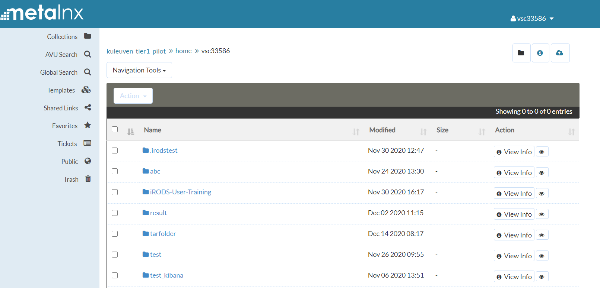
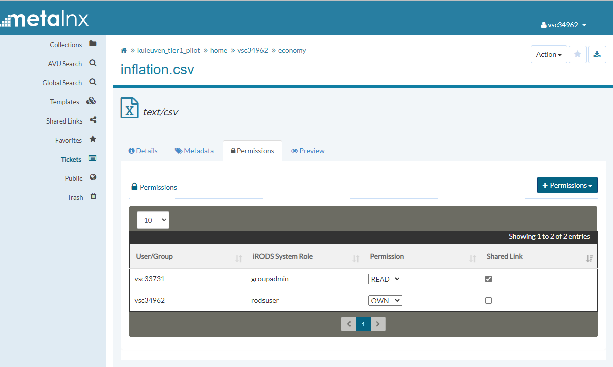

.. _metalnx:

Metalnx Portal
==============

Metalnx is a graphical user interface and serves as a client to iRODS. It helps to simplify most administration, collection management, and metadata management tasks removing the need to memorize the long list of iCommands. It allows users to manage content and metadata associated with content.

You can reach the Metalnx portal here: `<https://irods.hpc.kuleuven.be/metalnx/>`_.

You will need to authenticate with your institutional account and then you automatically login on the interface with your VSC account. Users from some institutions might encounter a second login page, but the credentials should already be filled in.

The Metalnx portal is mainly composed of two panes. The left pane shows tabs of the main functionalities and the right pane provides  the selected tab's functionalities.

**Collections**: Under this tab, we can perform all data object and collection-related activities. This tab and its functionalities are among the most used in Metalnx.  
 
- Inspect and browse through the logical path 
- Creating collections, by clicking the folder icon
- View info, by clicking the 'i' icon
- Upload files, by clicking the cloud icon
- Under the Action dropdown menu, after ticking a check box:
 - Move data objects/collections 
 - Copy fidata objectsles/collections 
 - Rename data objects/collections 
 - Apply metadata templates
 - Download data objects
 - Delete data objects and collections

To the right of any collection or file, you can press 'View info' for the following:

- Show the full logical path of the collection/file
- Under 'Action': Renaming/deleting files/collections
- Adding files/collections to your favorites, by clicking the star icon
- Download collections as a zip, or collections, by clicking the download icon
- View system-generated properties, under the tab 'Details'
- Add metadata to files/collections, under the tab 'Metadata'
- Set permissions to files/collections, under the tab 'Permissions'
- Show file previews (txt and csv), under the tab 'Preview'

.. image:: metalnx/metalnx_view_info.png

All Access Control functionality provided by iCommands is also offered by Metalnx. A user or group of users can be given Read/Write/Own rights on a specific file or collection. Rights can also be revoked by setting them to 'None'. To provide access rights to a certain file or collection for a certain user/group, one should apply the same or higher access rights to the parent collection as well. This is standard Unix permissions logic but this is not always apparent when working with a GUI application such as Metalnx. When applying rights to a collection it is possible to propagate ('Inheritance' in iRODS) them to child collections and files by selecting 'Apply to subcollections and files'. 

So this is one of the ways to share files/collections with other users. However, it may be hard for users to keep track of all shared files. For this reason, you can tag them as shared, by ticking the 'Shared Link' checkbox when adding user/group rights to a file. They will then appear in the 'Shared links' tab on the left hand tabs.

**AVU Search**: Under this tab you can search either based on AVU metadata or system-generated properties. However, this search functionality is currently not available due to a bug in the software that should be fixed soon.

**Templates**: Here we can create our own metadata templates or import an external template in json format. A template provides any number of predefined AVUs. When applying such a template to files or collections, it prompts to complete or modify the predefined AVU. When defining the template, only the attribute name is required, and this can be used to ensure that users make use of the same attribute to store the same type of information. The same attribute can occur multiple times in the schema and the AVUs. By adding a value and unit in the template, you help users in selecting a single default value or provide a list of options. 

**Shared Links**: Here you can see the links to data objects and collections shared by other users to you (as explained in the 'Permissions' tab).

**Favorites**: Here you can see your bookmarked collections and files. You can mark a favorite on the top right of the View info page.

**Public**: Here you reach the public area collections. These are stored in the /kuleuven_tier1_pilot/home/public/ Collection. However, this area should not be used. If you want to share data with colleagues, it is better to use your group collection for this. This collection can be found at /<zone_name>/home/<group_name>

**Trash**: Here you can see the files and collections moved to the trash bin after either a soft delete (without -f flag) with an iRODS iCommand/PRC function or via the delete functionality of Metalnx.