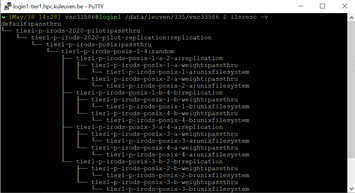
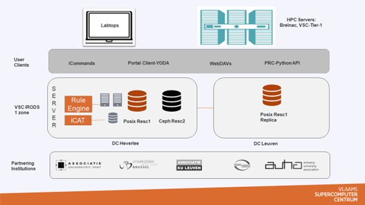

.. _tier1_data_architecture:

Tier-1 Data Platform Architecture
=========================================

VSC, as an integrated high-performance research computing environment, provides services to government, industry, and researchers. For this purpose it has developed a differentiated infrastructure (Tier-1 and Tier-2 level) that is available to use. On top of the Tier-1 a Data component (iRODS) has been initialized to manage research data.

An iRODS zone represent the deployment of the system. In the architecture of the current deployment “kuleuven_tier1_pilot” is the only zone that serves for VSC. Inside the zone there are two physical locations as well as replicas of logical representation. We have tier1-p-irods-posix-{1,3} in Heverlee for main storage and we have tier1-p-irods-posix-{2,4} in Leuven for replicas.

As part of the kuleuven_tier1_pilot zone, to manage the research data there are rule engine packages and iRODS metadata catalog-iCAT. When a user accesses iRODS, a communication inside the irods happens. The user’s any request is forwarded to the appropriate iRODS Server. 

A user can access iRODS from a local computer and/or the VSC Tier-1 and Tier-2 systems using different types of user clients.  At this moment they are available:  iCommands, a portal client , WebDAV clients and a Python Client.

iCommands is an utility that give users a command-line interface to operate on data in iRODS. 

The portal client-YODA is a user friendly web based application to provide researchers and their partners with a workspace and an archive that enables them to collaborate, deposit and preserve research data.

With the aid of WebDAV protocol, a Drag and Drop Access to iRODS is ensured by means of some apps/tools (e.g. WebDAV mapping, Cyberduck and WinSCP) that enable data transfer.

PRC is a Python Client API to establish a secure connection to iRODS an be able to interoperate with iRODS from python programs.

A general overview of kuleuven_tier1_pilot is simulated with the diagram at the picture above. 
