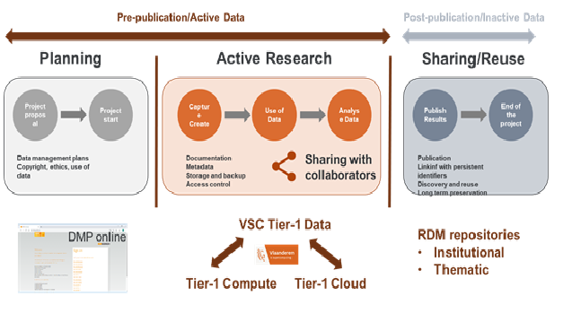

.. _tier1_data_service:

Tier-1 Data Service
===================

The Tier-1 supercomputing infrastructure in Flanders had until 2018 mainly been targeted at users with serious calculation issues (typical HPC/HTC workloads). Although this platform in its current form is already very successful, the current focus on compute no longer meets all the needs of many researchers. There is also a strong demand for more data storage capacity, data processing solutions and customized user environments. 

Therefore, VSC decided in 2018 to offer a new Tier-1 model: Supercomputing as a Service. In this model three infrastructure components (Compute, Data and Cloud) are tightly coupled to allow easy and fast transfers of data between the three systems and to offer a higher level of service to the VSC users.

The Tier-1 Data component aims to offer the VSC users the required tools and infrastructure as well as human resources to help them to manage research data. 

Importance of Tier-1 Data Service
---------------------------------

More and more users have computational work that makes intensive use of large data sets. Migrating this data to and from the compute infrastructure whenever it is to be used for a calculation is very inefficient because of the scale. It is therefore necessary to add a data component where large data sets can be stored for a longer period of time and from there also be processed efficiently.

This service has as primary goal to offer the users a platform to easy manage research data and help them to apply the **FAIR** principles to their research data from the very beginning of their projects. This should make it easier to transfer their research data at the end of the project to institutional or domain specific repositories for publication and preservation and when applicable ensure they are made publicly available (open access).

The Tier-1 Data component would provide a service to allow users to store research data during the active phase of the research data life cycle (that is, data that is being collected and analyzed and has not yet being published). This service for now is restricted to data of research projects that are using the VSC Tier-1 Compute infrastructure.

This platform should also help the researchers to run their scientific workflows more efficiently by providing tools to automate data collection, data quality control and stage in a and stage out data from and to Tier-1 Compute system. 

This Tier-1 Data service is based on the Open Source software iRODS (`www.irods.org`_).

.. include:: links.rst