.. _mango-portal:

############
ManGO Portal
############

The `ManGO portal`_ is a graphical web interface for Tier-1 Data.
It allows users to manage their data in an intuitive way, without any installations,
with a strong focus on managing :ref:`metadata<metadata>`.

When logging in, you will be redirected to the login page of your institution. 
This takes you to an overview with one or multiple zones with at least one of the following options:

- Select 'Enter portal' to enter that zone via the `ManGO portal`_.
- Select 'How to Connect' to get credentials for logging in to other clients, like :ref:`iCommands` or the :ref:`the PRC<python-client>`.
- Selecting the downward arrow opens an overview of all projects you are member of in that zone. Clicking on the project name sends you to the project management page. 

If you select the first option, you will be sent to the `ManGO portal`_ home page:

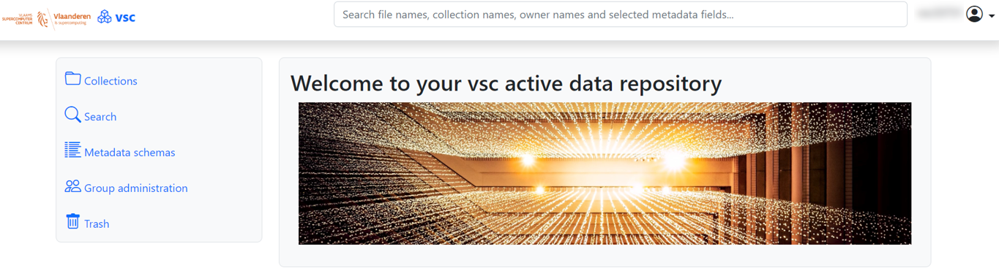

This main page has four main tabs:

- **Collections**, where you can manage the data in your collections.
- **Search**, where you can search for data objects and collections based on different criteria.
- **Trash**, where you can inspect and manage your :ref:`trash collection <trash>`.
- **Metadata schemas**, where you can view and mana metadata schemas.

*************************************
Managing collections and data objects
*************************************

The Collections tab provides an overview of the collections you have access to and lets you browse through them.
Clicking on the name of a subcollection shows you its contents under the "Content" tab: both subcollections and data objects.
If you click on a data object instead, you go to its page, which does not have such a "Content" tab.

Above the name of the current collection or data object, a breadcrumb menu allows you to go back to a collection on top of it. 
Next to the name, clicking on the pencil icon allows you to rename the active collection or data object.

The page of a collection also includes buttons to create a new collection and upload files,
which are only available if you have the right :ref:`permissions<collaboration>`.
Also depending on your permissions you may see a dropdown menu of bulk actions, allowing you to move, copy or delete one or more
collections or data objects at a time.
To do so, click on the checkbox next to the names of the collections or data objects, select your desired action and click on "apply".
When copying or moving, a list of collections will appear where you can browse to select a destination.
Notice that only data objects, not collections, can be copied.

Data objects do not have a "Content" tab, as they cannot contain any objects. 
Instead, they have a "System properties" tab, which contains some basic information about the object.
They also provide a "Preview" tab in which you can see a preview of the contents of your data object.
Previews are currently possible for the following filetypes:

* JPG
* JPEG
* PNG
* PDF 
* TIF
* TIFF
* GIF

Next to these specific tabs, both collections and data objects have a :ref:`"Metadata" <edit-metadata>` and :ref:`"Permissions" <edit-permissions>` tab
for inspection and management of metadata and permissions respectively.

******************************
Uploading and downloading data
******************************

Uploading and downloading files
================================

Clicking on 'Upload files...' opens a white box, where you can put one or multiple files to be uploaded to the current collection:

- By dragging files from your local pc into the white box.
- By clicking inside the white box, which opens your file explorer, where you can select your files. 

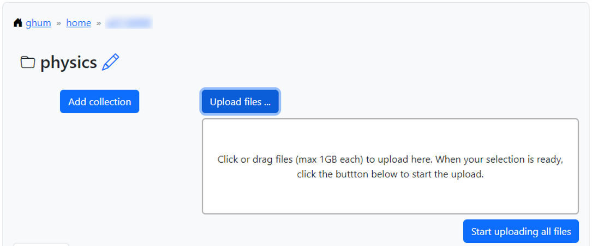

If you made a mistake, you can click on 'Remove file' under the file in question. 
When you are ready, click on 'Start uploading files' to upload your selection. 

To download a single data object, you can click on the download-icon next to it:

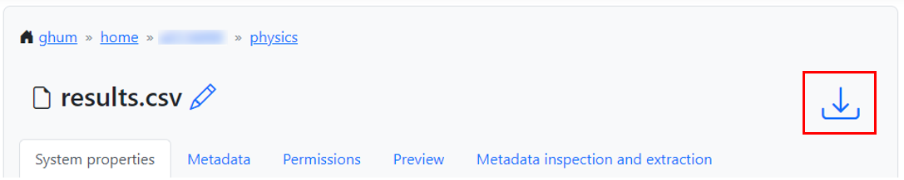

   *Downloading from the page of the data object*

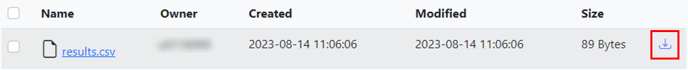

   *Downloading from the page of the parent collection*

You can also download multiple data objects at once, as long as they are part of the same collection.
To do so, go to the page of the collection and select the checkbox next to each data object you want to download.
Next, select 'Download' in the dropdown and click on 'apply':

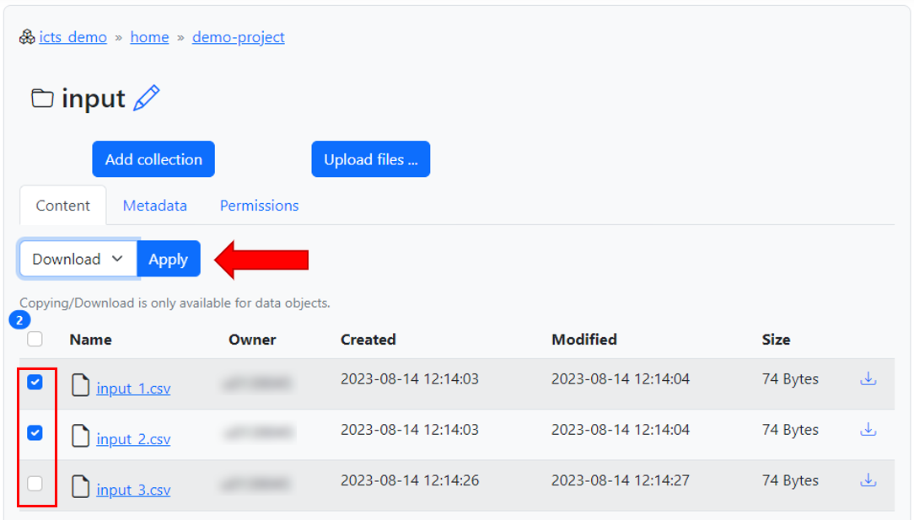

The data objects will be downloaded together as a tar file.
A tar file is similar to a Zip folder, and can be extracted with a program like `7-Zip <https://www.7-zip.org/>`_ on Windows, or with the command `tar -xf <filename>` on Linux.

Uploads and downloads via the ManGO portal are limited to 5GB and 50GB per file respectively.
If you want to transfer larger amounts of data via a graphical interface, you can use the :ref:`globus platform`.

Uploading and downloading folders
==================================

It is possible to upload a folder and its contents, including sub-folders, from you local device to ManGO. To start the process, navigate to where you want to upload the folder and click on 'Upload folder...' button.

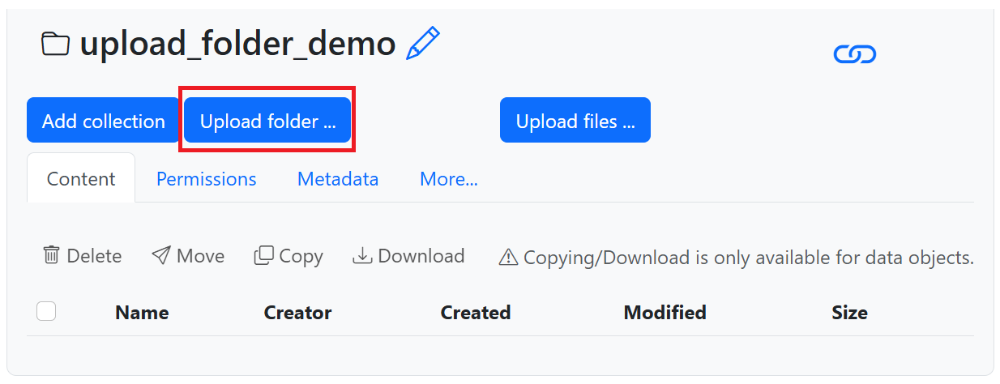

This opens a pop-up that allows you to choose a folder and monitor the upload process. By clicking on 'Choose files' you can 
choose a folder on your local device.

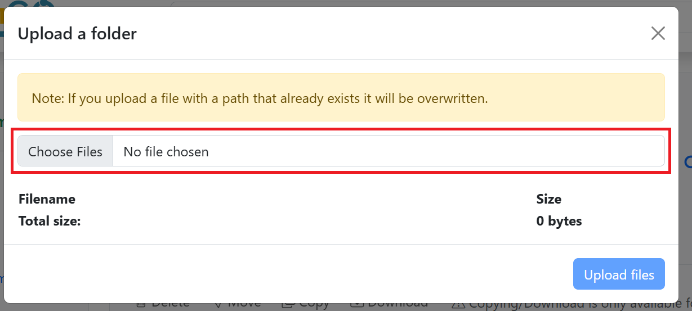

Navigate to the folder you want to upload and click on upload. The contents of the folder will be listed in the pop-up. 
This also includes all the sub-folders of the folder you have selected. The structure of the folder will be replicated in ManGO. 
Consider the following folder structure: 

.. code-block::

      example_folder
      ├── sub_folder_1
      │   ├── sub_folder_2
      │   │   ├── file5.txt
      │   │   └── file6.txt
      │   ├── file3.txt
      │   └── file4.txt
      ├── file1.txt
      └── file2.txt

This will be displayed in the pop-up follows:

.. code-block::

      example_folder/file1.txt
      example_folder/file2.txt
      example_folder/sub_folder_1
      example_folder/sub_folder_1/file3.txt
      example_folder/sub_folder_1/file4.txt
      example_folder/sub_folder_1/sub_folder_2/file5.txt
      example_folder/sub_folder_1/sub_folder_2/file6.txt

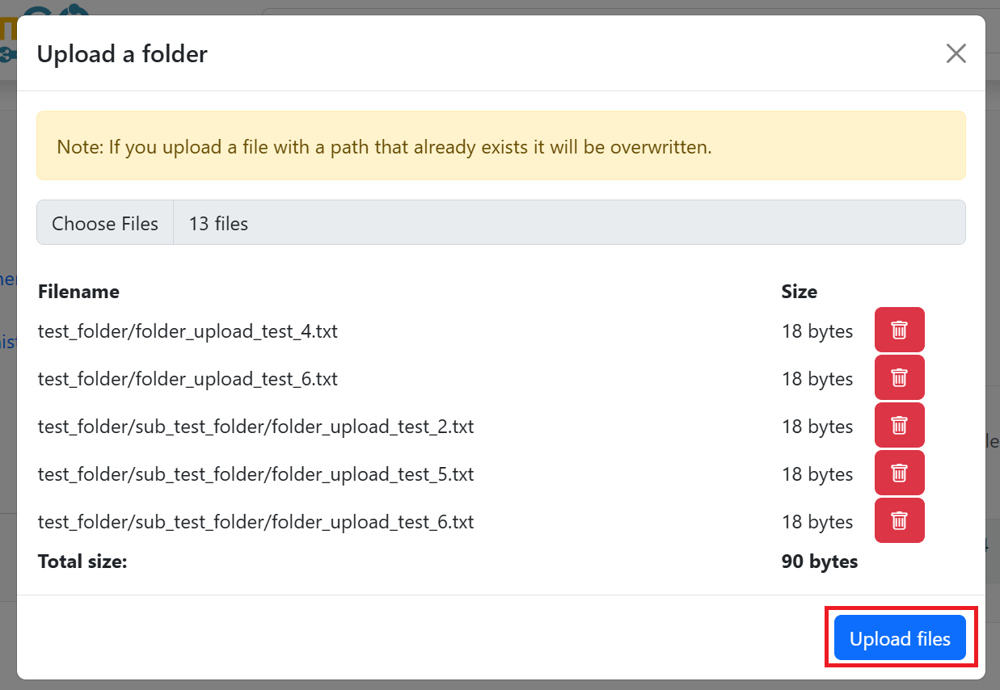

You now have an overview of the files you want to upload. Before uploading you can inspect a number of parameters and make necessary changes:

- The number of files is indicated at the top
- You can remove individual files from the list by pressing the red trash-button next to the file. 
- The sum of all the file sizes is indicated at the bottom of the pop-up 

If you are satisfied with the selection click 'Upload files' to start the upload process. Remember that if you upload a path that already exists 
this will overwrite, and effectively remove, the pre-existing file.  

Before uploading please consider the following file size limitations:

- Maximum size individual file: 500MB
- Maximum size all files: 5GB

Files that exceed 500MB will be automatically skipped. A list of the skipped files is provided at the top of the pop-up.  
If you want to transfer larger amounts of data via a graphical interface, we recommend :ref:`globus platform`.

For a large number of files and/or bigger files, the upload may take a while. Do not close the page in the meantime or the upload will be interrupted.

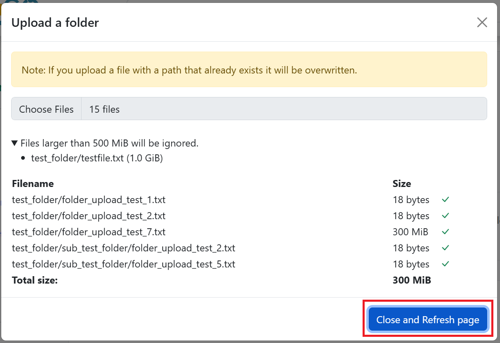

If a file is uploaded successfully a green checkmark is shown, if something went wrong a red cross is shown. Once all the files have been uploaded successfully you can click on 
the 'Close and Refresh page' button. The folder should now be visible. You can also use the 'X' button at the top of the page but then you still need to refresh the page manually before the uploaded folder is visible.

Besides the file limits mentioned there are two general exceptions that should be taken into account when using the folder upload: 

- Hidden files: hidden files will be uploaded as well. They will be listed in the pop-up. Files that are not listed in the pop-up are not uploaded.
- Symbolic links (symlinks): symbolic links are not suitable for uploading. 

Downloading a folder and it contents is for the moment not possible using the ManGO Portal. This is possible using other clients such as  :ref:`iron<iron-CLI>` or :ref:`icommands<icommands>`. 

.. _edit-permissions:

***********
Permissions
***********

To view the :ref:`permissions<collaboration>` on a collection or data object, click on it and then go to the tab 'Permissions'. 

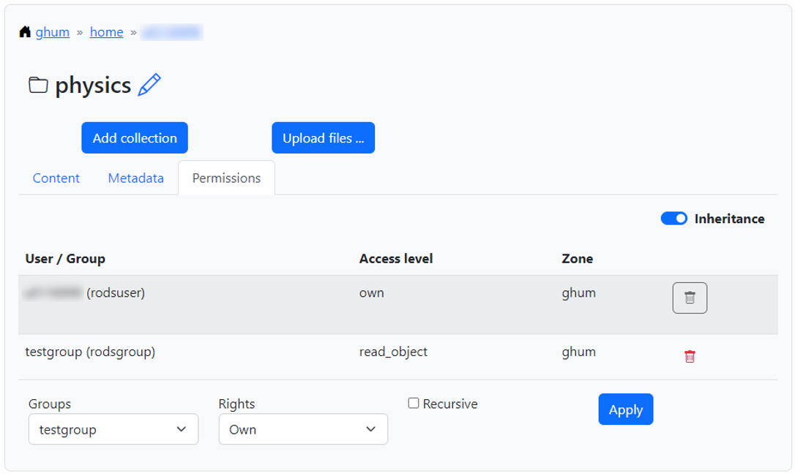

If you have 'own' permissions yourself, you can add new permissions at the bottom of the page, remove permissions by clicking on the trash bin icon,
and switch on/off the inheritance for collection permissions.

You can give permissions to any group that you are member of. 
To do so, select the group and the rights you want to give from their respective dropdown menus and click on 'apply.'
If you are applying permissions to a collection, you can also indicate whether to apply the permissions recursively.

.. _edit-metadata:

**************
Metadata
**************

Every collection or data object has its own :ref:`metadata<metadata>` tab.
When you click on this tab, you can see all metadata which is added to the object. 

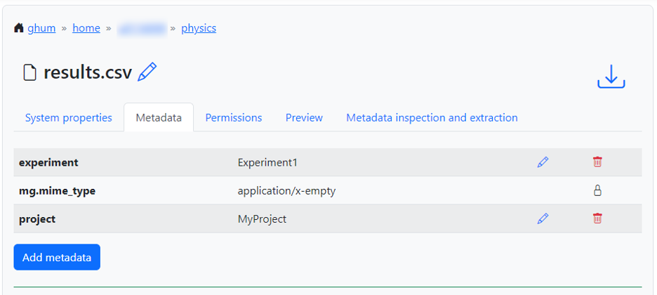

If only manual metadata is added, you get one overview of all the metadata.
However, if the metadata comes from multiple sources, the overview is split into tabs:

- Metadata added via schemas can be found in the tab with the name of the respective schema     
- Metadata added via automatic extraction can be found in the tab 'analysis'  
- Manually added metadata can be found in the tab 'other'   

On the right ride of each AVU, you may see the icons of a blue pencil and a red trashbin.
Clicking on the former allows you to overwrite the AVU, while the latter allows you to delete it.
If you do not have rights to edit/delete this metadata, these buttons may be absent.   

Adding metadata manually
========================

To add metadata manually, click on 'Add metadata' under the list of existing AVUs.  
This creates a window where you can freely add any AVU you want. 

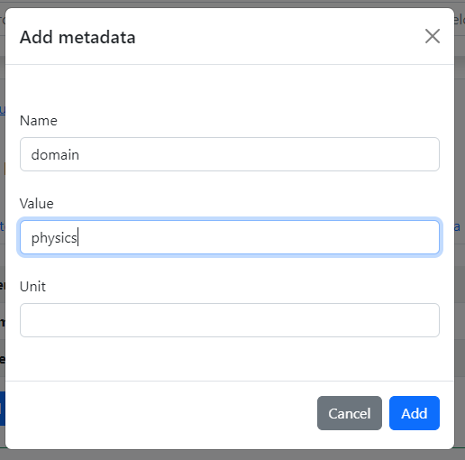

Adding metadata via schemas
===========================

If you or one of your colleagues has created and published a metadata schema, you can apply it to a collection or data object.
To do so, select the schema name from the dropdown under the metadata overview, and click on 'apply schema'.

For more information about creating schemas, see the section on :ref:`metadata schemas<schemas>`

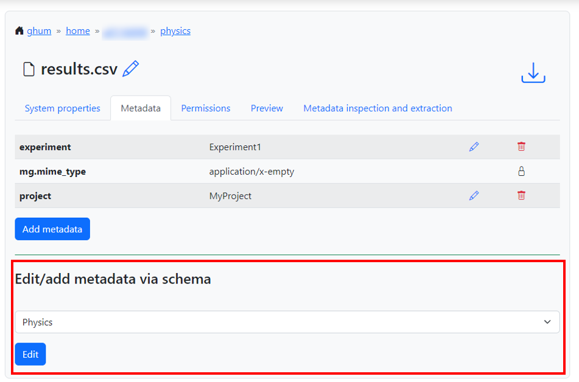

This will open a form where you can fill in the metadata that the creator specified.

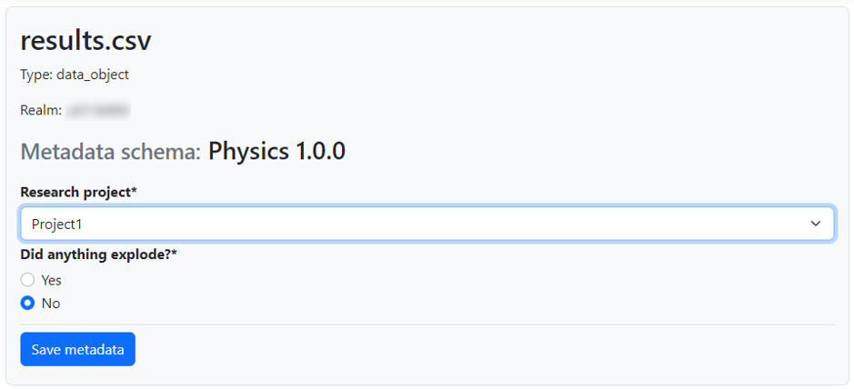

Metadata extraction
===================

To extract metadata from inside a data object, go to the tab 'Metadata inspection and extraction' of that object.  
When you click on 'Inspect with Tika', you will get an overview of all metadata which Apache Tika could find inside.

To actually add this information as metadata to the object, click on the checkbox behind the elements you are interested in, and click on 'Add selected metadata items as regular metadata'.  
Now this information will appear in the metadata overview, and will also be searcheable.
Note that you cannot edit metadata added via metadata extraction: you can only delete it.

Analysis by Apache Tika may also give an OCR (Optical Character Recognition) reading, which is an overview of all text recognized in e.g. an image.
This feature is a proof of concept, and this information can currently not be added as metadata. 

Downloading metadata
====================

It is possible to download metadata attached to a collection or data object as an interoperable JSON file and use outside of Tier-1 Data. 
To download metadata go to the tab 'Metadata' and click on the 'Download metadata' button on the right. 
This will prompt a pop-up box showing the contents of the JSON file to download.
You can adjust the document by filtering based on schema metadata (Schemas), manual metadata (Other metadata) or automatically extracted metadata (Automatic extraction). 
Once you are satisfied with your selection you can click 'Download' to download the metadata as a JSON document. 
To learn more about how the JSON is created you can have a look at the `documentation of our Python module <https://github.com/kuleuven/mango-mdconverter#mango-specific-conversion>`_. 

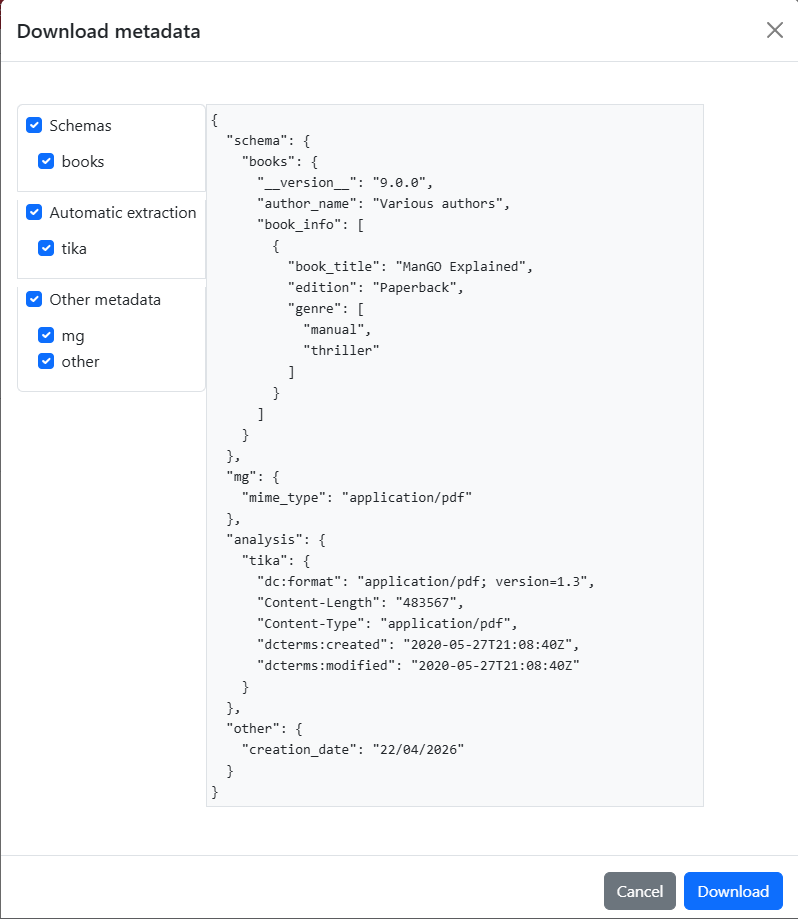

Searching
=========

The ManGO portal contains both a quick search bar and an advanced search form. 

The quick search bar is located on top of the webpage.   
You can easily find data objects and collections with it that match any of the following criteria:

- Name of the object
- Owner of the object
- Metadata fields containing the keyword 'name', 'title', 'description', 'comment' or 'summary'

To search, just type your search term in the search bar and press the key 'enter'.
You will get a list with links to the matching data objects/collections.

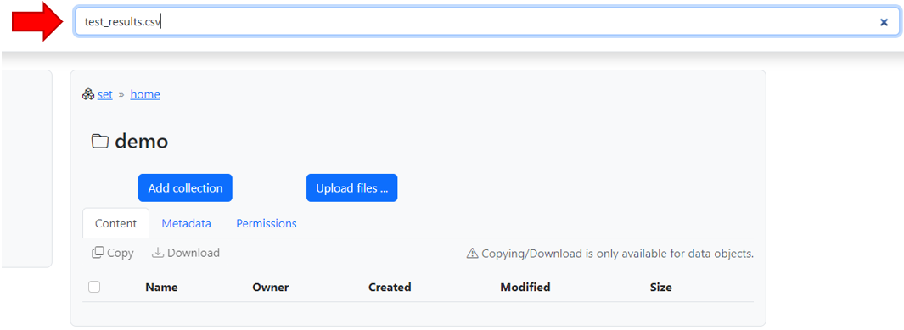

The advanced search tab is located on the left side of the screen.
This brings you to a form where you can search for data objects and collection based on several criteria.
You can also search based on any metadata fields.

If you want to search based on schema metadata, you will need to use the following convention:

- Attribute name: ``mgs.<schema_id>.<field_id>``
- Attribute value: ``<value>``

For example, if you want to search based on the field 'instrument' from the schema 'chemistry', you will need to search for attribute name 'mgs.chemistry.instrument'.

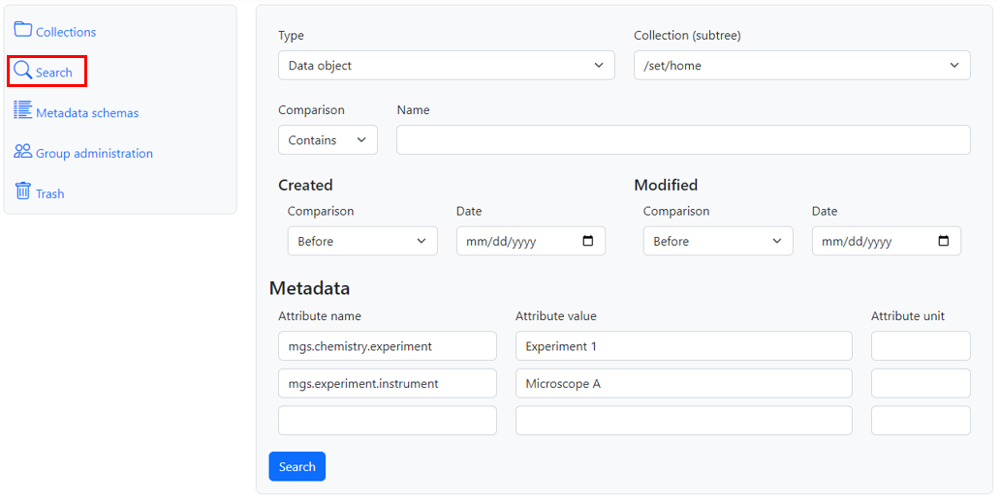
