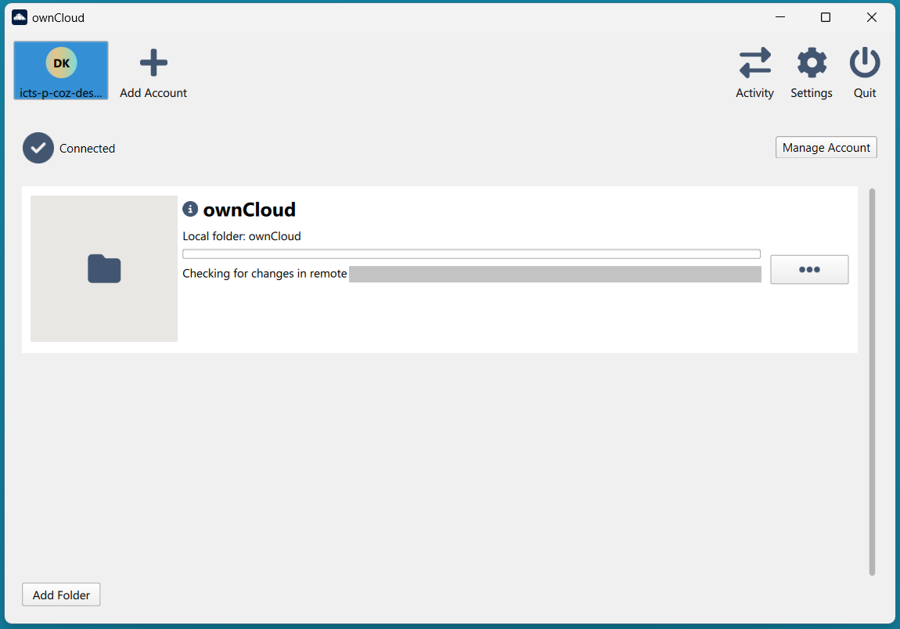
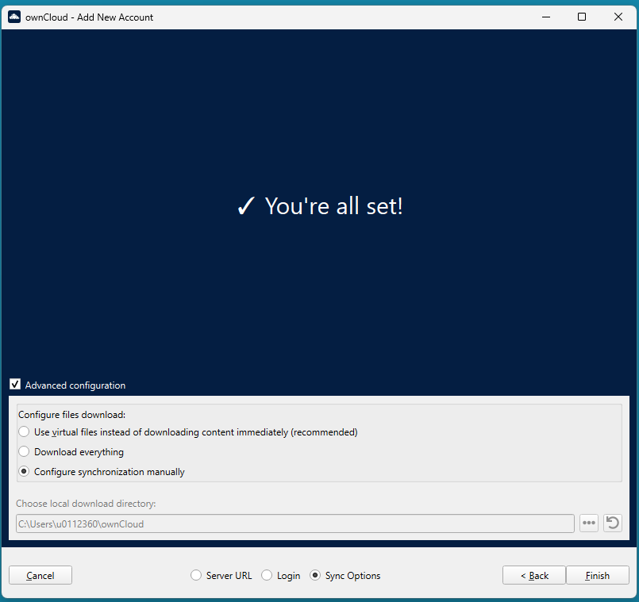
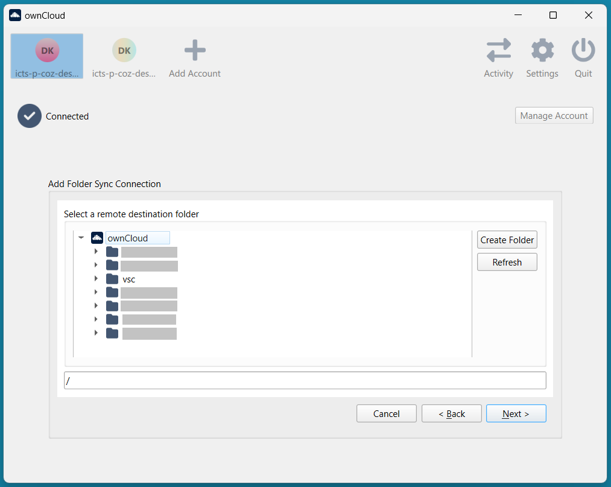

.. _ownCloud:

ownCloud desktop
================

ownCloud is a desktop application that lets users sync virtual files instead of full ones,
downloading a full file on-demand, uploading in the background when modified,
and seamlessly releasing space from the device.
ownCloud allows users to interact with Tier-1 Data via the file explorer or finder,
and is most suitable for those looking for user experience similar to OneDrive.

Files are available when online, unless they are kept locally on the device,
e.g. if they are first created on the local device or opened since the last free-up of space.
Opening a file via the app is equal to downloading the file and the file takes up space on your disk.
Modifying a file and then saving it or creating a new file will trigger an upload.

The **status** of the file or folder is visualized with an icon under a dedicated "Status" column in the file explorer.
Files can be either: only available in Tier-1 Data,
only locally available when offline, in both locations,
or pending sync when updates in Tier-1 Data are not yet completed.

It is possible to **free up space** using the ownCloud option at a file or (root) folder level.
By selecting "free up space" for the configured ownCloud folder,
all downloaded data is removed from the device and remains available only virtually.
This action does not remove any data from Tier-1 Data.

.. warning::
  Real-time collaboration with colleagues is not possible.
  Avoid modifying the same file simultaneously from different devices.

Installation
------------

The ownCloud application is available via the Software Center, for **KU Leuven managed devices**.
Search for the application, click on "Install" and follow the instructions.

Users of **Mac**, **Linux**, and **non-KU Leuven devices**, can install the application via `the ownCloud page <https://download.owncloud.com/desktop/ownCloud/stable/6.0.3.18040/>`_ (version 6.0.3).
Please note that the virtual files feature is not yet supported for macOS and Linux in the version we offer for Tier-1 Data.
The latest ownCloud version (7.1.0) cannot be used.
Users who have already installed version 7.1.0 may contact the support staff for help reverting to the recommended version.

Upon successful installation, open the ownCloud application and proceed with additional configuration.

Configuration
-------------

ownCloud can be configured for the whole Tier-1 Data project or for specific collections.

.. warning::
   For large Tier-1 Data projects and number of files, configuring the application for specific collections is highly recommended.

ownCloud allows the configuration of more than one accounts (e.g. one for a Tier-1 Data and one for ManGO)
and multiple folders per account (e.g. sub-collections of a Tier-1 Data project).

For the configuration of one account and one folder:

1. Open the ownCloud application. On the box to provide your server's address, enter the
following URL: https://icts-p-coz-desktop-sync-reva-vsc.cloud.icts.kuleuven.be/. Click "Next".
Note that if you configure more than one account, you are directed to this step by clicking on "Add account".

2. Click on "Open web browser" to log in to ownCloud. To grant privileges to ownCloud click on "Agree and
continue to the application". After you get a "Login Successful", you can close the browser window.

3. At the ownCloud application, the message "You're all set!" is displayed.
If you have one Tier-1 Data project with limited number of files (e.g. few thousands) and you wish to sync all files via ownCloud,
click on "Finish". Alternatively, opt for additional configuration via the next steps.

If you already clicked on "Finish" but prefer to carry on with additional configuration,
remove the folder from the application by clicking on the three dots next to the folder in your account view,
and selecting "Remove folder sync connection". Then add a folder using the "Add folder" button down left, under the same account.

4. Check the "Advanced configuration" box. Additional options will show up.
Select "Configure synchronization manually" to select the Tier-1 Data collection to sync.
Then, click on "Finish" to go to the next steps.

5. Pick a local folder on your computer to sync.
For the first time, this defaults to the ownCloud folder created under your user account, e.g. C:\\Users\\<account>\\ownCloud.
For additional configured connections, a suffix (2), (3), etc is added by default.
To choose another name for the folder, first create an empty folder under your user account,
then select the existing folder. Click "Finish".

6. Select a remote collection in Tier-1 Data. Expand the zone e.g. vsc,
expand **home**, navigate to a Tier-1 Data Project and select the collection you want to sync.
You may need to wait 1-2 seconds for the Tier-1 Data tree structure to load, then
choose the Tier-1 Data sub-collection you want to sync via ownCloud by clicking on it.
The chosen collection path, e.g. "/vsc/home/datateam_vsc" is displayed in the box below
the tree structure. Click "Next".

7. You can filter out Tier-1 Data sub-collections. To exclude specific remote collections from synchronization,
first disable the "Use virtual files instead of downloading content immediately" option.
Uncheck the Tier-1 Data sub-collections you do not wish to sync,
then re-enable the "Use virtual files instead of downloading content immediately" setting.

8. Make sure the setting to "Use virtual files instead of downloading content immediately" is enabled
and click on "Add Sync connection". You are directed to your user account view, where you can follow the progress.
When the progress bar disappears and the remote folder is marked with a tick, you are set.

Under the account view in ownCloud, you now see a folder icon for each connection you created.
The name of the local folder you selected is also displayed.
In your file explorer or finder, the connection is also listed as ownCloud - <user\@serverURL> - <Tier-1 Data path>
when you use more than one account.
If you use one account the connection is listed as ownCloud - <Tier-1 Data path>.
The number of ownCloud folders in the file explorer or finder is equal to the configured sync connections.
Note that the name of the connection is not modifiable via the file explorer or finder.

Logging-in
----------

By default, the application automatically logs in upon startup if an active session exists.
Active sessions are currently valid for up to six months.
This option is modifiable under "Settings", checkbox "Start on Login".
We recommend keeping the setting "Start on Login" enabled.

When logged out, an ownCloud notification pops up.
Pop-up notifications are also enabled by default, via "Settings" and the checkbox "Show Desktop Notifications".
The notifications are used for other announcements as well, such as new uploads from other users on shared collections.

Limitations
-----------

ownCloud does not support viewing or managing Tier-1 Data metadata or permissions.
To use these core Tier-1 Data features, other clients are more suitable, e.g. :ref:`ManGO portal<mango-portal>`.

For copying large datasets within Tier-1 Data, using a different client (like iron, iCommands, sftp or PRC)
is more efficient and less resource-intensive than performing the operation through ownCloud.
Note that copying data via ownCloud will trigger a download of the original data to the local device,
and then an upload of the copied data, while both original and copy will be kept on device.
Likewise, for uploading large datasets for the first time, other clients, such as Globus, are more suitable.

In terms of filename length, limits of the operating system apply for files created via the file explorer or finder,
(e.g. 260 characters in Windows).
It is possible to sync and download Tier-1 Data data objects with longer names.
However, it is best to avoid names that are too long. Refer to RDM guidance on naming practices,
e.g. `at this page <https://www.kuleuven.be/rdm/en/guidance/data-standards/file-organisation#naming>`_.

Syncing a very large number of files (e.g. one million) may impact your device performance.
Before configuring ownCloud, consider the amount of files in your Tier-1 Data project
and whether ownCloud provides effective interaction for the entire Tier-1 Data project.

For macOS and Linux, the version of ownCloud we currently offer does not support virtual files.
As a result, the ownCloud client attempts to download the entire file tree the user selected to synchronize to local storage on the user's device.
Virtual file support for macOS and Linux is available as experimental feature in version 7.1.0. However, this version is not yet supported by our server implementation.

Troubleshooting
---------------

The "Activity" tab lists successful and unsuccessful sync actions.
Inspect the tab for any persistent errors and use the error message when communicating with the support staff.
