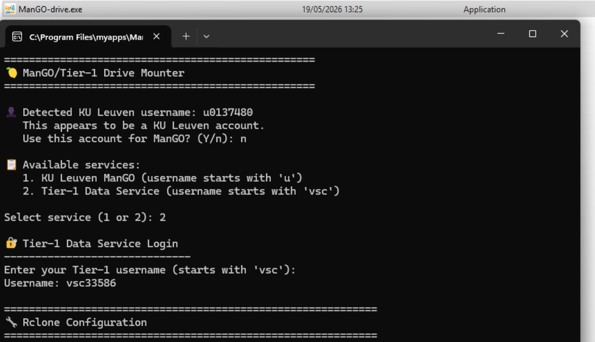
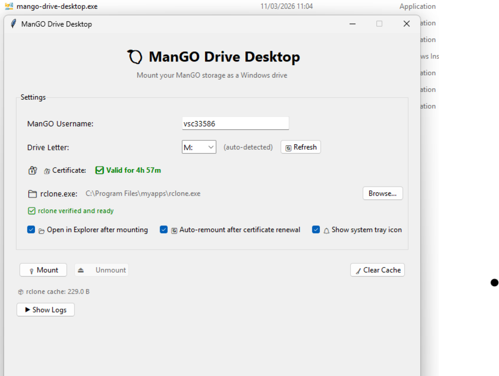

.. _sftp_clients:

#############################
SFTP clients for Tier-1 Data
#############################

SFTP stands for Secure (SSH) File Transfer Protocol, which is a network
protocol for securely accessing, transferring and managing large files
and sensitive data. It runs over the SSH protocol. Therefore SSH
certificates are used for authentication.

SFTP needs an SFTP client and server. It uses SSH to transfer files
and requires that the client be authenticated by the server. An STFP
client is software that lets users connect to the Tier-1 Data service through
the STFP server.

With SFTP, users can transfer files stored in the Tier-1 Data service
directly to and from their local files. In other words, users can access
their project collections in the Tier-1 Data service from their local
computers using any SFTP-enabled client applications such as OS built-in
command-line tool, Cyberduck, WinSCP, and FileZilla. Moreover, some SFTP
clients allow to mount the Tier-1 Data service as a virtual folder to their
Windows machines.

****************
SSH Certificate
****************

SSH certificates are required to authenticate SFTP connections to the Tier-1 Data service. For each new connection, the SSH client must present a user certificate signed by VSCentrum. 

To obtain your SSH certificate, please follow the instructions from the following `link <https://docs.vscentrum.be/accounts/mfa_login.html#connecting-with-an-ssh-agent>`__.

If you encounter any issues or have questions, please contact us at data@vscentrum.be.

**************************************
Connections to Tier-1 Data Using CLI
**************************************

Both Windows and Linux users can connect to a remote server (the Tier-1 Data service) through SFTP commands on a default terminal installed (Windows
Command Prompt, PowerShell, xterm etc.)

You can establish an SFTP session by issuing the following command.

.. code:: sh

   sftp yourUserName@rdmsftp.icts.kuleuven.be

This will connect the Tier-1 Data service and your prompt will change to an
SFTP prompt. Most of the SFTP commands are similar or identical to the
Linux shell commands. To get a list of all available SFTP commands, type
``help`` or ``?``.

As an alternative client you can also use ``lftp``. It is a
sophisticated file transfer program that allows users to launch several
commands in parallel in background and to reconnect and continue
transfers in the event of a disconnection. You should first install
``lftp`` on your operating system to be able to use it.

-  On Ubuntu:

.. code:: sh

   sudo apt install lftp

-  On RHEL/CentOS Stream:

.. code:: sh

   sudo yum install lftp

-  Windows users can contact us if they want to use ``lftp`` as a CLI
   tool since the Chocolatey package manager is needed to install it.

-  On macOS:

.. code:: sh

   brew install lftp

Once you have ``lftp`` installed, execute the command below to get a
SFPT session in the Tier-1 Data service.

.. code:: sh

   lftp -u yourUserName, sftp://rdmsftp.icts.kuleuven.be

You will be presented with the lftp prompt. You can type ``help`` to get
list of available commands and their usage.

*************************************
Connections to Tier-1 Data Using GUI
*************************************

There are several GUI programs that users can use to interact with the
Tier-1 Data service through the SFTP protocol.

FileZilla
=========

**FileZilla** is a free, open-source client that allows you to transfer
files between a local computer and a remote server. It is available for
Windows, Linux, and macOS.

Getting Started:

1. If you use a KU Leuven-managed device, download and install FileZilla
   from the Software Center. 

.. warning::
   On a non KU Leuven-managed deviced, FileZilla can be downloaded from
   `the extended list on the official website <https://filezilla-project.org/download.php?show_all=1>`__.
   Do not try to download it from `the homepage <https://filezilla-project.org/>`__,
   or click on the big green "Download FileZilla Client" button,
   since it will download malware instead.

2. Open the installed FileZilla, and click 'Site Manager'

3. Select ``SFTP - SSH File Transfer Protocol`` in the field of Protocol

4. Enter ``rdmsftp.icts.kuleuven.be`` in the field of Host and ``22`` in
   the field Port

5. Input your ``Tier-1 Data username`` in the field Username

6. Leave the field Password empty and set Authentication type to
   ``Interactive``

Once you have logged in, you will see a file browser on the left side of
the window. This is the file browser for your local computer. On the
right side of the window, you will see a file browser for the remote
server.

Transferring Files:

1. To transfer files from your local computer to the remote server,
   simply select the file or folder you wish to transfer, and drag and
   drop it into the remote file browser

2. To transfer files from the remote server to your local computer,
   simply select the file or folder you wish to transfer, and drag and
   drop it into the local file browser

3. You can also transfer files by right-clicking on the file or folder,
   and selecting 'Upload" or 'Download'

Managing Files:

1. To rename a file or folder, right-click on the file or folder, and
   select 'Rename'

2. To delete a file or folder, right-click on the file or folder, and
   select 'Delete'

3. To create a new folder, right-click on the file browser, and select
   'Create Directory'

4. To edit a file, right-click on the file, and select 'View/Edit'

---------

Cyberduck
=========

**Cyberduck** is a free, open-source file transfer program for Windows,
Mac, and Linux. It is designed to make transferring files to and from
remote servers via various protocols.

Getting Started:

1. Download and install the `Cyberduck <https://cyberduck.io/>`__
   program

2. Open the program and and click 'Open Connection'

3. Select ``SFTP (SSH File Transfer Protocol)`` in the top drop-down
   field

4. Enter ``rdmsftp.icts.kuleuven.be`` in the field of Server and ``22``
   in the field Port

5. Input your ``Tier-1 Data username`` in the field Username

6. Leave the field Password empty

7. Click the 'Connect' button

Using Cyberduck:

1. To transfer files, drag and drop them from the local directory to the
   remote directory

2. To delete files, select them and click the 'Delete' button

3. To create a new directory, click the New Directory/Collection button
   and enter a name

4. To rename a file or directory, select it and click the 'Rename'
   button

5. To edit a file, select it and click the 'Edit With' button

6. To disconnect from the server, click the 'Disconnect' button

------

WinSCP
======

**WinSCP** is a free and open-source file transfer client for Windows
OS. It allows you to securely transfer files between your local computer
and a remote server using various protocols.

Getting Started:

1. Download and install `WinSCP <https://winscp.net/eng/index.php>`__

2. Launch WinSCP and click 'New Session'

3. Select the 'New Site' button

4. Select ``SFTP`` in the 'File protocol' drop-down field

5. Enter ``rdmsftp.icts.kuleuven.be`` in the field of Host name and
   ``22`` in the field Port number

6. Input your ``Tier-1 Data username`` in the field User name

7. Leave the field Password empty

8. Select the 'Login' button to connect to the remote server

Using WinSCP:

1. To transfer a file, simply drag and drop it from one side to the
   other

2. When you're done transferring files, select the 'Disconnect' button
   to end the connection.

********
Mounting
********

Mounting a file system attaches that file system to a directory (mount
point) and makes it available to the system. While there are
some advantages, there are also some important drawbacks to consider in
addition to generic disadvantages of having chances of wasting more disk
space, using more resource, etc.:

-  The metadata management, a core feature of our data management
   platform is bypassed.
-  Permissions cannot be changed via this client.
-  Our SFTP service is fully optimized for standard, direct file transfers. While mounting a folder/directory provides a highly user-friendly experience, it masks the complex network processes running in the background, which may lead to reduced speed and stability. We kindly remind you to verify that your files have completely and successfully transferred.

-----------------

Mounting on Linux
=================

Transferring files over an SSH connection by using either ``SFTP`` or
``lftp`` is a way of moving small amounts of data between remote and
local or vice versa. In some cases, however, it may be necessary to
share entire directories, or entire filesystems, between two
environments. To this end the ``sshfs`` command is used. It is a client
tool for using SSHFS (SSH Filesystem) to mount a remote file system (the
Tier-1 Data system) locally on your machine.

First of all ``sshfs`` needs to be installed if it does not already exist
in your machine. You can check this by runnig ``sshfs --version``. The
sshfs tool is available from most distributions' standard repositories
and is most easily installed using that distribution's package manager.

Once sshfs is installed, mounting a remote file system safely over SSH
is as follows.

First, specify an existing mount point or create a new one.

.. code:: sh

   mkdir myMountPoint

Then, execute the following command to initiate the mount.

.. code:: sh

   sshfs yourUserName@rdmsftp.icts.kuleuven.be:/ myMountPoint

You can now list your mount point to see the existing objects in your
remote - the ManGO platform - locally.

-------------------

Mounting on Windows
===================

It is also possible to mount your Tier-1 Data directories as a network drive
using SFTP. However you need to install some auxiliary packages.

First of all, you will need to install WinFsp and SSHFS-win. There are two ways of installing these packages:

If you want to install them via CLI:

-  Open your CMD or PowerShell
-  Run
   ``winget install WinFsp.WinFsp; winget install SSHFS-Win.SSHFS-Win``

If you want to install them via installation wizard:

-  Download `WinFsp <https://github.com/winfsp/winfsp/releases/download/v2.0/winfsp-2.0.23075.msi>`__ and `sshfs-win <https://github.com/winfsp/sshfs-win/releases/download/v3.7.21011/sshfs-win-3.7.21011-x64.msi>`__
-  Move these files to a location which is compatible with your group
   domain policy
- Double-click the installer files to begin installation  

Only perform the following two steps if you are unable to install the MSI files using the standard Windows wizard:  

-  Open Powershell in admin mode
-  For each of the two .msi files, run the following command: ``msiexec /i <path_to_the_msi>`` 

In order to mount the Tier-1 Data system, you need to download either ``ManGO-drive.exe`` or ``ManGO-drive-desktop.exe``
which are a wrapper on Rclone. They will make a
configuration file that is needed for Rclone and run commands required
to make Tier-1 Data available as drive via an user interface. 

The main distinction between these two executables is that ``ManGO-drive.exe`` needs you to keep the terminal window open while it's running. On the other hand, ``ManGO-drive-desktop.exe`` functions as a GUI application that operates independently of the shell and includes advanced features such as certificate validity tracking, automatic rclone detection, connection logging, and various user configuration options.

Instructions for using ManGO-drive:
-  Download ManGO-drive.zip via :download:`this link <../binaries/ManGO-drive.zip>` and extract its content.
-  Download the version of `rclone.exe` compatible with your system specifications from the official website at https://rclone.org/downloads/.
-  Relocate the extracted ``ManGO-drive.exe`` and ``rclone.exe`` files to a directory where your group domain policy permits the execution of .exe files.
-  Launch ``ManGO-drive.exe`` by double-clicking the file.
-  Follow the prompts to complete the configuration process.

Instructions for using ManGO-drive-desktop:
-  Download ManGO-drive-desktop.zip via :download:`this link <../binaries/ManGO-drive-desktop.zip>` and extract its content.
-  Download the version of `rclone.exe` compatible with your system specifications from the official website at https://rclone.org/downloads/.
-  Relocate the extracted ``ManGO-drive-desktop.exe`` and ``rclone.exe`` files to a directory where your group domain policy permits the execution of .exe files.
-  Double-click ``ManGO-drive-desktop.exe`` to launch GUI.
-  Make the necessary selections in the interface and click "Mount".

You can now start adding, editing, deleting files in this directory with
the same comfort of your Windows computer.

You don't have to follow all these steps every time when you want to
mount your Tier-1 Data: to remount you only need to double-click
``ManGO-drive.exe`` or ``ManGO-drive-desktop.exe`` again.

-----------------

Mounting on Mac
=================

To mount your Tier-1 Data directories as a network drive using SFTP, you must first install the required dependency packages.

1. Install macFUSE (macOS 12 and later)

If your MacBook is running macOS 12 or a later version, you must first install macFUSE.

To install it via the command line:

- Open your terminal.

- Check if your Mac has the Homebrew package manager installed. If not, install it with:

.. code:: sh
   
   /bin/bash -c "$(curl -fsSL https://raw.githubusercontent.com/Homebrew/install/HEAD/install.sh)"

- Install macFUSE using the command:

.. code:: sh
   
   brew install --cask macfuse

- For older macOS versions:

Please contact us at rdm-icts@kuleuven.be for assistance.

2. Download Rclone

After successfully installing macFUSE, download the rclone utility from its official site: https://rclone.org/downloads/.

3. Configure and Mount Your Tier-1 Data as Drive

Follow these steps to mount the drive (except for the last command, these steps are only required once):

- Move the Executable: Place the downloaded rclone program in the directory from which you want to run it.

- Verify Installation: Check that the program works by running:

.. code:: sh

   ./rclone --help

- If it does not run, you may need to remove the macOS quarantine attribute:

.. code:: sh

   xattr -r -d com.apple.quarantine /path/to/your/rclone

- Create Configuration: Run the configuration wizard:

.. code:: sh

   ./rclone config

- Follow the prompts:

Use the default values for all steps (press Enter) except for the first three steps.

Step 1: Enter a name for your drive (e.g., mango_drive).

Step 2: Choose the number corresponding to SSH/SFTP.

Step 3: Enter the hostname, which you can find in the "How to connect" tab of the ManGO portal.

- Create Mount Point: Create a local directory that will serve as the mount point.

.. code:: sh

   mkdir mount_point

- Mount the Drive: Run the following command to mount your Tier-1 Data storage locally:

.. code:: sh

   rclone mount mango_drive: /path/to/your/mount_point --vfs-cache-mode full --allow-non-empty

- To verify the connection was successful, open 'Finder' and look for the Tier-1 Data service mounted as a network drive under the name 'mango_drive'.