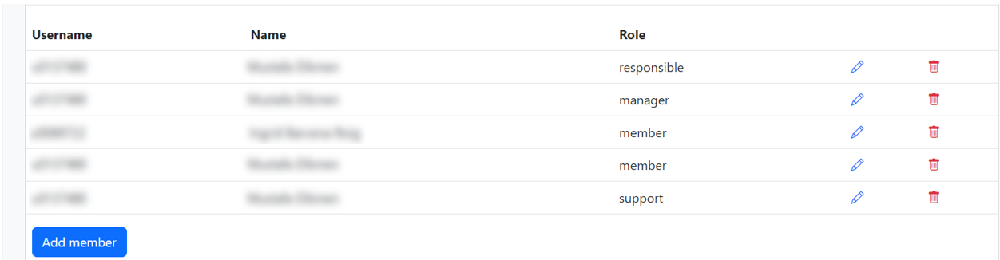
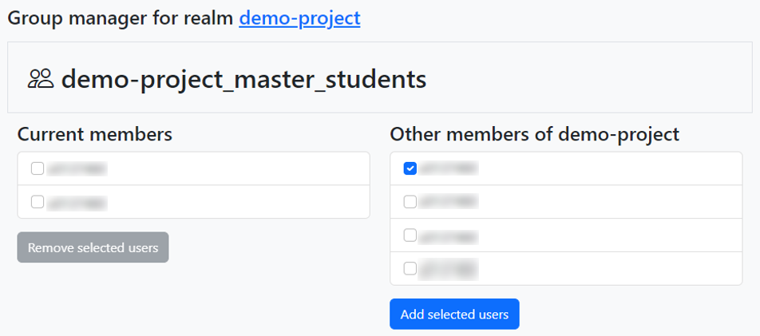

.. _group-administration:

####################
Group administration
####################

As mentioned in the section on :ref:`collaboration`, you can use Tier-1 Data to work with your colleagues on the same data. 
In this section, you will learn how to add and remove project members, and how to create subgroups for structuring permissions.

******************
Managing a project
******************

A project is an administrative unit in Tier-1 Data.  
For more info on how research groups can request a project, see (:ref:`user_access`).  
When their application is approved, they get a project collection in Tier-1 Data, located at /<zone>/home/<project_name>.
They also get a group with all their members, with the same name as their project.
By default, this group has access to everything in the project collection.

Anyone with a VSC-account can be added to a project.
Moreover, there is no limit on the number of members in a project, and costs do not increase by adding extra members.

Within a project, we can distinguish multiple roles:

- Responsible
- Manager
- Member
- Support

The **responsible**, as the name suggest, is the primary responsible for the project. They are the primary point of contact for the support staff in administrative issues.
The **manager(s)** has the power to add and remove project members and to modify subgroups (see later).

The support role is meant for support staff from the VSC. 
They might temporarily join projects when they are actively involved, or for debugging purposes.

To manage project members, reponsibles/managers need to go to the web page of their project, 
by going to https://mango.vscentrum.be/, clicking on their zone to expand the list of projects they are, and clicking on their project name.
Alternatively, they can go straight to *https://mango.vscentrum.be/data-platform/project/<project_name>*.

On this page, you get an overview of all members in the project:

- To add a new member to the project, click on 'add member' and search them by their name or account number. Next, click on 'Add'.

- To change the role of a member, click on the blue pencil icon next to their name. Select their new role on the dropdown, and click on 'Update'.

- To remove a member from the project, click on the red trashcan icon next to their name. In the menu that pops up, click on 'Delete'.

After making one or multiple of these changes, a button 'apply changes in iRODS' will appear.
Click on this button to finalize your changes. 

******************
Managing subgroups
******************

Subgroups are used to gives permissions to a specific group of members from your project.
Managers can create and manage subgroups by going to the Group Administration tab of the ManGO portal.

After selecting your project, you will see an overview of all subgroups. 
If they have a lock sign next to them, these are managed by the platform and can be viewed, but not edited.
Examples include:

- The main group of your project  
- The 'managers' group  
- ...

Other groups, which you can create yourself, are called 'custom groups'.
For example, you could create a custom group for staff and one for master students. 
To do so, click on 'Add group' and give a name.
Custom groups will always get your project name as prefix. For example, if your project is called 'demo-project' and you enter 'master_students', the custom group will be called 'demo-project_master_students'.

When you create a new group, or where you click on one, you will get an overview of the group members on the left side.
On the right side, you will see the members of the project who are not yet part of this group.  

To add a member to the group, select their checkbox and click on 'Add selected users'.

Likewise, to remove users from the group, select their checkbox and click on 'Remove selected users'.

**Note:** You may need to log out and login again before you see changes you made in groups reflected when editing permissions. 

Help! I want to collaborate with an external researcher
-------------------------------------------------------

As demonstrated earlier, you can add collaborators to your group if they have a VSC account
If you want to work together with someone who doesn't have a VSC account, there are two options:

1) Applying for a VSC account

You can let your collaborators apply for a VSC account.
This is the best solution if you have a small group of close collaborators.
When they have a VSC-account, externals can get access to all functionalities of Tier-1 Data.

For more information about requesting a VSC account, see :ref:`apply for account`.

2) Sharing data via Globus

:ref:`Globus<globus platform>` is a tool which allows you to transfer large datasets and share them with externals.
To log in to Globus, users just need one of the following:

- an institutional account from any institute that is connected to Globus
- an ORCID ID 
- a Gmail account

Via a so-called guest collection, you can share data from different storage systems -including Tier-1 Data- with externals.
You can give users or groups of users either read or write access on your data.
However, there are some caveats:

- Users will only be able to download or upload data via the Globus interface, and not via any of the other Tier-1 Data clients.
- Globus is filesystem agnostic, and users miss out on a lot of features from Tier-1 Data, most notably the :ref:`metadata<metadata>`.
- When you give users write access, they will write to Tier-1 Data in your name. You should only give access to users you really trust. 

We suggest giving users access based on their institutional login if possible. ORCID ID is a plan B, and we only suggest sharing with a Gmail account if no other option is available.

To read more about using Globus to share data, see :ref:`Globus documentation on sharing data<globus-sharing>`.