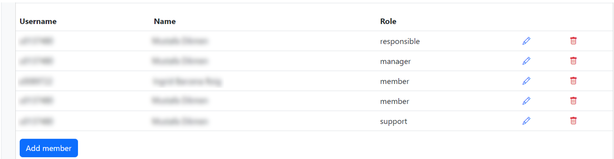
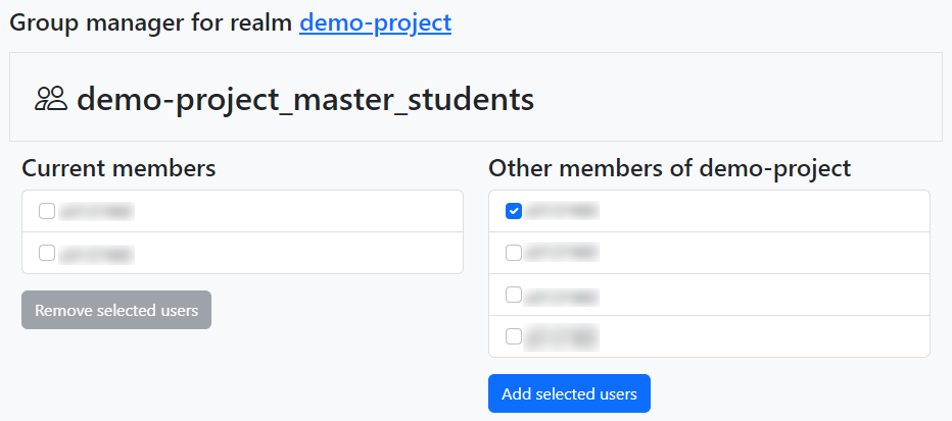
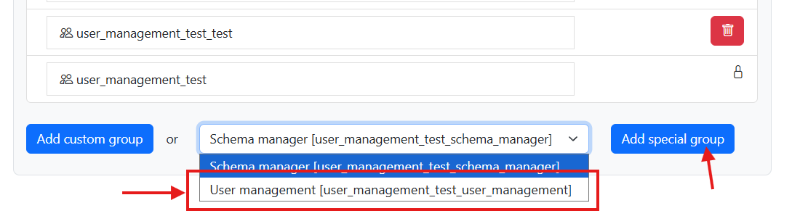
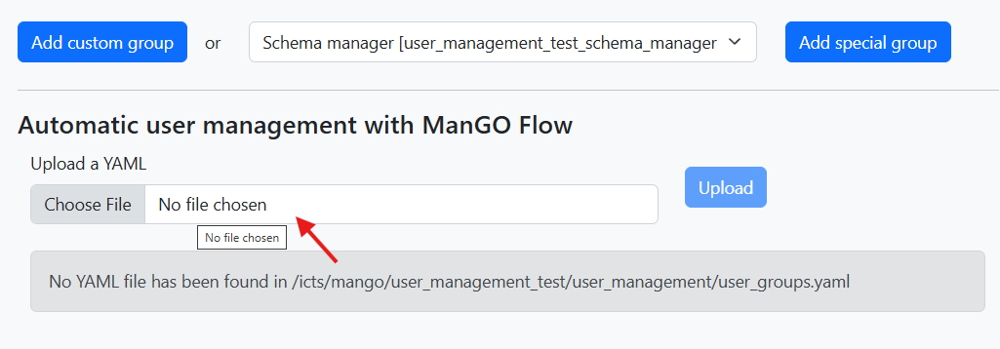
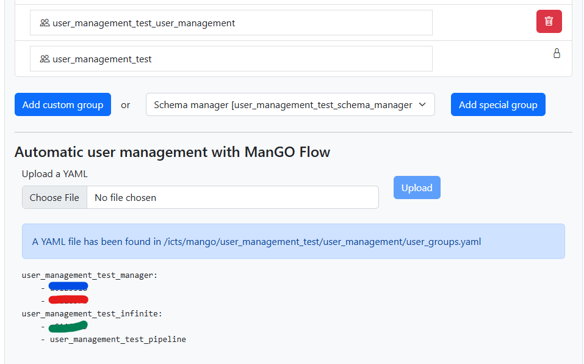

.. _group-administration:

####################
Group administration
####################

As mentioned in the section on :ref:`collaboration`, you can use Tier-1 Data to work with your colleagues on the same data. 
In this section, you will learn how to add and remove project members, and how to create subgroups for structuring permissions.

******************
Managing a project
******************

A project is an administrative unit in Tier-1 Data.  
For more info on how research groups can request a project, see (:ref:`user_access`).  
When their application is approved, they get a project collection in Tier-1 Data, located at /<zone>/home/<project_name>.
They also get a group with all their members, with the same name as their project.
By default, this group has access to everything in the project collection.

Anyone with a VSC-account can be added to a project.
Moreover, there is no limit on the number of members in a project, and costs do not increase by adding extra members.

Within a project, we can distinguish multiple roles:

Responsible
    Primary responsible for the project. They are the primary point of contact for the support staff in administrative issues.

Manager
    Role with the power to add and remove project members and to modify subgroups (see later).
    
Member
    Regular role without any special permissions.
    
Support
     Support staff from the VSC who might temporarily join projects when they are actively involved, or for debugging purposes.

The support role is meant for support staff from the VSC. 
They might temporarily join projects when they are actively involved, or for debugging purposes.

To manage project members, reponsibles/managers need to go to the web page of their project, 
by going to the `ManGO portal`_, clicking on their zone to expand the list of projects they are member of, and clicking on their project name.
Alternatively, they can go straight to ``https://mango.vscentrum.be/data-platform/project/<project_name>``.

On this page, you get an overview of all members in the project:

- To add a new member to the project, click on *add member* and search them by their name or account number. Next, click on *Add*.

- To change the role of a member, click on the blue pencil icon next to their name. Select their new role on the dropdown, and click on *Update*.

- To remove a member from the project, click on the red trashcan icon next to their name. In the menu that pops up, click on *Delete*.

After making one or multiple of these changes, a button *apply changes in iRODS* will appear.
Click on this button to finalize your changes. 

.. _portal-group-administration:

******************
Managing subgroups
******************

Subgroups are used to give permissions to a specific group of members from your project.
Managers can create and manage subgroups by going to the Group Administration tab of the ManGO portal.

After selecting your project, you will see an overview of all subgroups. 
If they have a lock sign next to them, these are managed by the platform and can be viewed, but not edited.
Examples include:

- The main group of your project  
- The 'managers' group  
- ...

Other groups, which you can create yourself, are called 'custom groups'.
For example, you could create a custom group for staff and one for master students. 
To do so, click on 'Add group' and give a name.
Custom groups will always get your project name as prefix. For example, if your project is called 'demo-project' and you enter 'master_students', the custom group will be called 'demo-project_master_students'.

Whenever you create a new group or access an existing one, you will get an overview of the group members on the left side.
On the right side, you will see the members of the project who are not yet part of this group.  

To add a member to the group, select their checkbox and click on 'Add selected users'.

Likewise, to remove users from the group, select their checkbox and click on 'Remove selected users'.

.. note::
  You may need to log out and login again before you see changes you made in groups reflected when editing permissions. 

**************************************
Automated management of large projects
**************************************

As alternative to manually adding/removing users and managing groups,
it is possible to provide a YAML file listing all the users and the groups they belong to.
This file will then be enforced regularly:
if users are added or removed manually, or the groups are modified manually,
this file will generally override that after a few hours.
This is particularly useful when a project has a large number of members and/or groups
and regular movement,
or when the distribution of users has to be matched to the organization in a different system,
e.g. subgroups within a lab.

.. warning::

  This is meant for continuous enforcement, not for a one-shot starting setup to be
  manually overriden later.

Creating the YAML
=================

The `YAML file <https://yaml.org/>`_ is simply a plain text file
(which you can write in any plain text editor)
and it needs the names of groups (with or without project prefix)
and a list of valid usernames underneath, e.g.:

.. code:: yaml

  # /zone/mango/myproject/user_management/user_groups.yaml
  myproject_manager:
      - vsc34567
      - vsc33333
      - vsc31234
  myproject_custom_group1:
      - vsc31234
      - vsc33221
  myproject_custom_group2:
      - vsc30000
      - vsc30001

All the user names in the file, and **only** the members in this file,
will be members of the project, with two exceptions:

- The responsible is not touched by this flow, regardless of whether it is mentioned in the file or not.
  Only admins can edit the responsible.
- Managers are only managed if the ``<realm>_manager`` group is present in the file;
  if it is absent, the current manager members remain managers.
  If the ``<realm>_manager`` group is present, the users in it and only the users in it
  will have the "manager" role.

If any group name lacks the ``<realm>_`` prefix, it will be added.
So having groups ``manager``, ``custom_group1``..., will be enough.
Note that the final names of the groups will always be prefixed with the project name,
e.g. ``myproject_manager``, ``myproject_custom_group1``...,
and those are the names to which access can be provided.
For nested custom group names, it is also possible to nest them in the YAML:

.. code:: yaml
  
  # /zone/mango/myproject/user_management/user_groups.yaml
  myproject_manager:
      - vsc34567
      - vsc33333
      - vsc31234
  myproject_analysts:
    wp1: # becomes myproject_analysts_wp1
        - vsc31234
        - vsc33221
    wp2: # becomes myproject_analysts_wp2
        - vsc30000
        - vsc30001

If an existing custom group in the project is absent from the file, it will be ignored.
This feature still does not support removing groups.
However, as with any specified group: if a member of an ignored custom group is not mentioned in the file,
the user will be removed from the project.
Adding users without a custom group can be done by setting up a group with the name of the realm.

Providing and updating the YAML
===============================

In order to update YAML, a user needs to be part of the ``<realm>_user_management`` group.
This group can be created and filled in in the :ref:`Group administration page of the ManGO Portal<portal-group-administration>`.

A member of this group will be able to see in that page
(1) whether there is a YAML file for the project,
(2) whether it is valid and, if so,
(3) what its contents are.

If there is no YAML file yet, the first time it is uploaded it must be done manually
via the :ref:`Group administration tab of the ManGO Portal<portal-group-administration>`
by a member of the ``<realm>_user_management`` group.

Once the file exists, it can be updated by anyone from this group with any client (even machine accounts).
The YAML file will always be saved with the same name: ``/<zone>/mango/<realm>/user_management/user_groups.yaml``.
Any other path will be ignored.
The file is applied every day at 06:00UTC, 12:00UTC and 18:00UTC.

Everyone else in the project has read (and only read) permissions to ``/<zone>/mango/<realm>/user_management/``,
but none to its parent collections (e.g. ``/<zone>/mango/<realm>``).

Removing the YAML
=================

To undo the automation, users must contact the service desk to remove the file.
Uploading an empty file will result in errors for the flow.

**********************************************
How to collaborate with an external researcher
**********************************************

As demonstrated earlier, you can add collaborators to your group if they have a VSC account.  
If you want to work together with someone who doesn't have a VSC account, there are two options:

1) Applying for a VSC account

If your collaborators are eligible for a VSC account, they can apply for one to access Tier-1 data.
This is the best solution if you have a small group of close collaborators.
When they have a VSC-account, externals can get access to all functionalities of Tier-1 Data.

For more information about requesting a VSC account, see :ref:`apply for account`.

2) Sharing data via Globus

:ref:`Globus<globus platform>` is a tool which allows you to transfer large datasets and share them with externals.
To log in to Globus, users just need one of the following:

- an institutional account from any institute that is connected to Globus
- an ORCID ID 
- a Gmail account

Via a so-called guest collection, you can share data from different storage systems -including Tier-1 Data- with externals.
You can give users or groups of users either read or write access on your data.
However, there are some caveats:

- Users will only be able to download or upload data via the Globus interface, and not via any of the other :ref:`Tier-1 Data clients<clients>`.
- Globus is filesystem agnostic, and users miss out on a lot of features from Tier-1 Data, most notably the :ref:`metadata<metadata>`.
- When you give users write access, they will write to Tier-1 Data in your name. You should only give access to users you really trust. 

We suggest giving users access based on their institutional login if possible. ORCID ID is a plan B, and we only suggest sharing with a Gmail account if no other option is available.

To read more about using Globus to share data, see :ref:`Globus documentation on sharing data<globus-sharing>`.
