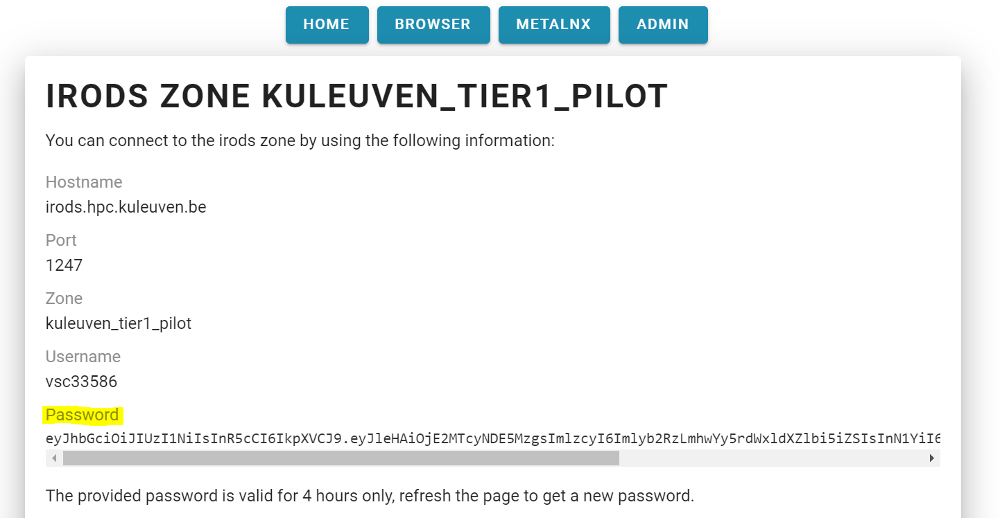
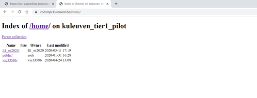

.. _webdav_access_to_irods:

A WebDAV Client Access to iRODS
===============================

WebDAV stands for Web Distributed Authoring and Versioning, which is an extension to HTTP, the protocol that web-browsers and webservers use to communicate with each other.
In other words, WebDAV is a method for remotely managing files over the internet. With WebDAV, we can access files stored in the VSC Tier-1 Data component by using the same interface as we do with our local files.

The module that we use for our iRODS connection is called `Davrods <https://github.com/UtrechtUniversity/davrods>`__. Davrods is an Apache WebDAV interface to iRODS and it provides access to iRODS servers using the WebDAV protocol. It is a bridge between the WebDAV protocol and iRODS.

For an access using Graphical User Interface (GUI) clients to iRODS, we can and will use different tools. However in this page we will see how to use mapping a network drive.

From a web browser side a simple directory index is used as an interface. It's purpose is only to list and to view. It is not intended to download and upload data.

Web Browser-Directory Index
---------------------------

A connection through Davrods is available at https://irods.hpc.kuleuven.be:8443/ address. After you click the link you can log in using your vsc-account and a password, which should be obtained at https://irods.hpc.kuleuven.be/ after you are logged into. 
To get the password you simply log in the mentioned address using your institution account and authorize the application.

Therefore the first step is to acquire password. To do so, simply click the link provided above or copy it and then “paste and search for” on your favorite web browser. 

.. image:: webdav/vsc_authentication_page.PNG

Once you reach the screen above, choose a login provider that is relevant to you. Under the the title of ``IRODS LINUX CLIENT`` on the coming page you will see a very long password in a single quotation and please copy this password correctly.

After that you should go to the log in link https://irods.hpc.kuleuven.be:8443/ and see the screen below.

.. image:: webdav/davrods_access.PNG

Once you enter your user name and the password you saved, you will see the exact same directory structure as you see in your iRODS server.

You can now walk around directories and read the data object on your browser.

Mapping drive-WebDAV
--------------------

To perform simply more actions – drag and drop (install/download), rename, delete –  you can map your WebDAV share as a network drive.

How to access iRODS using WebDAV on a Windows 10 pc:

- Go to File Explorer and select This PC on the left hand pane.
- Select Computer from the top ribbon.
- Click on Map Network Drive.

.. image:: webdav/map1.png

- Choose the drive name you want to use. 
- Type “https://irods.hpc.kuleuven.be:8443/home/” in folder area. This is the path that you can find in your browser directory_index.

.. image:: webdav/map2.png

- Click finish button.

.. image:: webdav/map3.png

- Enter your user name vscXXXXX.
- Paste the password you obtained and saved earlier.
- Click “ok”.

.. image:: webdav/map4.png

- You should be able to see your connection in network locations.

.. image:: webdav/map5.png

Once you’ve connected, the WebDAV directory is mounted in your local pc. After you click on your driver you will see your iRODS collections and data objects. You can now start adding, editing, deleting files in this directory from the comfort of your computer.

