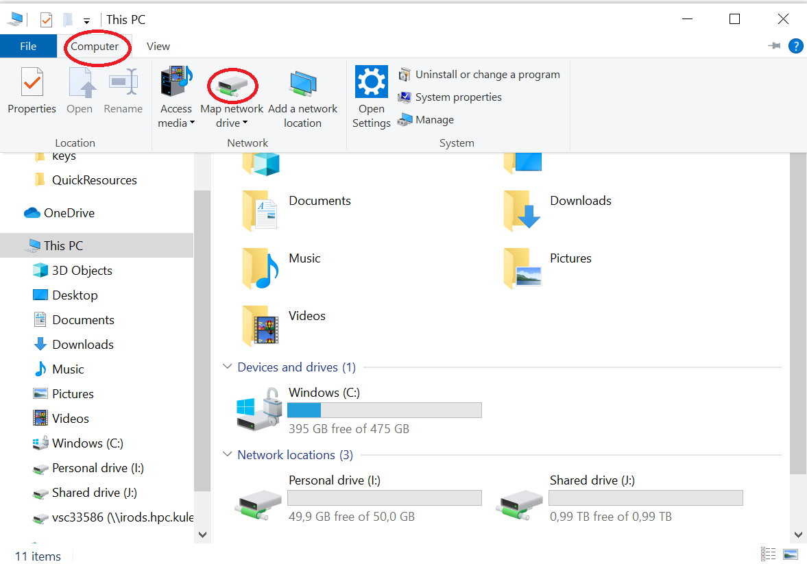
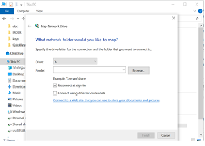
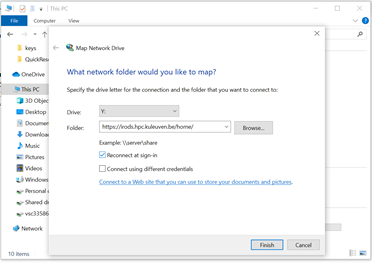
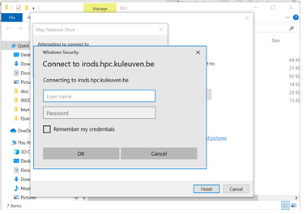
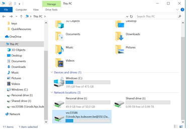

Mapping drive-WebDAV
====================

In order to perform more actions -drag and drop (install/download), rename, delete and modify- you can map your WebDAV share as a network drive.

How to access iRODS using WebDAV on a Windows 10 pc:

- Go to File Explorer and select This PC on the left hand pane.
- Select Computer from the top ribbon.
- Click on Map Network Drive.

.. note:: Since the password you obtained is temporary, you need to reprocess these steps after your password is expired.

- Choose the drive name you want to use. 
- Type “https://irods.hpc.kuleuven.be:8443/home/” in the "Folder" text box. This is the path that you can find in your browser directory_index.

- Click finish button.

- Enter your user name vscXXXXX.
- Paste the password you obtained and saved earlier.
- Click “Ok”.

- You should be able to see your connection in network locations.

Once you're connected, the WebDAV directory is mounted in your local pc. After you click on the WebDAV directory you will see your iRODS collections and data objects. You can now start adding, editing and deleting files in this directory from the comfort of your computer.