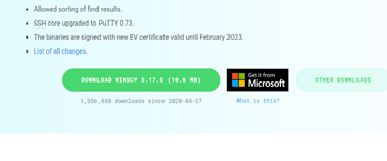
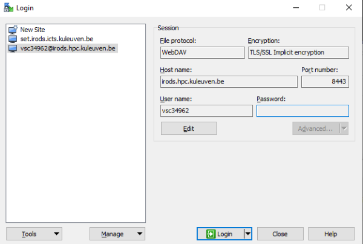
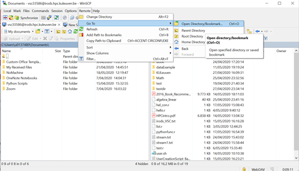

.. _winscp_access_irods.rst:

Using WinSCP to access iRODS
===================================

Another tool to upload/download data to/from iRODS through a Graphical User Interface (GUI) is WinSCP (Windows Secure Copy). WinSCP is an open source free (SFTP client, FTP client, WebDAV client, S3 client and SCP client) for Windows. Its main function is file transfer between a local and a remote computer.

Installing and First Time Configuration of WinSCp
-------------------------------------------------

- Visit the official site at https://winscp.net/eng/index.php.

- Click the download icon.

- Open the WinSCP.exe file and follow the installation procedure at the following link https://winscp.net/eng/docs/guide_install. Complete your install in accordance with your institution's application installation policy.

- After you complete your installation, run the program.
- Click 'New session' to store a login
- Choose the required options and fill the blank fields with the corresponding information as you see on the screen below.

- Write the password down that you get at https://irods.hpc.kuleuven.be/. Do not enter the password in the Password text box. As it is quite long, it will be truncated by WinSCP and it is only valid for 4 hours anyway.

.. note:: Since the password you obtained is temporary, you need to get a new one every time your password has expired.

- The first time you make the connection, you will be prompted for the password and asked to ‘Continue connecting and add host key to the cache’; select ‘Yes’.

- You can choose/set your remote directory for ease of use. 

Upload/Download Data to/from iRODS using WinSCP
-----------------------------------------------

- On the WinSCP screen, the right pane shows our connection to iRODS, and the left pane shows our local directories.

- To upload data from local to iRODS, simply drag a file or a folder on the left pane and drop it in the place we want on the right pane.

- To upload data from iRODS to our local directory, we drag data object(s) or collection(s) from the right pane and drop them in the place we want on the left pane.

- We can use WinSCP on both local and iRODS to create/delete/rename a file or folder.

- It is also possible to edit a file with a GUI editor to easily change content. This is not possible with iCommands. 