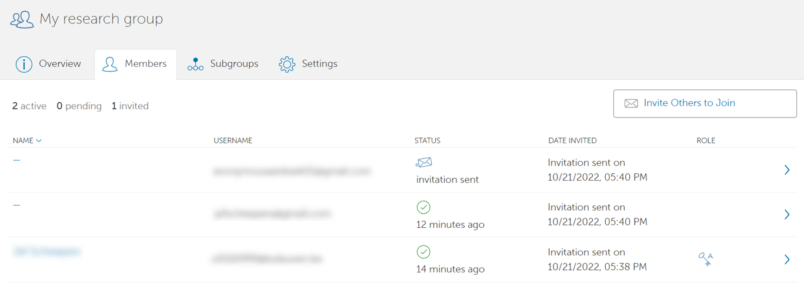

.. include:: css.rst

===============
Managing groups
===============

Globus allows anyone to create groups.
Groups can be used to share data with multiple users at once, without needing to configure everything per user.

By using the 'groups' tab on the left, you can view all groups you are member of.
If a group has a key symbol in the 'Role' column, that means you are administrator of that group. 

.. image:: groups/groups_overview.png

You can inspect any group by clicking on them.

To find out how you can share data with other groups, see our page on :ref:`globus-sharing`.

Creating a new group
--------------------

To create a new group, click on the 'Create new group' button in the upper right corner. 
You will be asked for a group name, description, and whether the group should be publicly visible or not. 

.. image:: groups/create_group.png

After you click on 'Create group', you will be forwarded to the page of your group.

Under the 'settings' tab on this page, you can later edit more settings of your group. 

Managing members of a group
---------------------------

To add new members to your group, go to the page of your group (if you aren't there already) and click on 'invite others'.
You can invite people based on their username or, if they aren't known by Globus yet, an e-mail address. 
The persons you invite will receive an e-mail with a link to your group. 

.. image:: groups/invite_members.png

In the page of your group, under the tab 'Members', you can view all members and people you invited. In the column 'status', you can see whether your invitation has already been accepted.

You can click on the row of anyone in this list to view more detailed information, and to modify their settings.

For users who have not yet accepted your invitation:

- You can resend or cancel their invitation on the bottom of the page.

For users who have already accepted your invitation:

- You can change their status (active or suspended), or remove them from the group.
- You can change their role.  

These are the available roles and the actions they can take:

+---------------+-----------------+-------------------------------+------------------------+---------------------------------+
| Role name     | Access data     | Add/remove/suspend members    | Create subgroups       | Change group settings           |
+===============+=================+===============================+========================+=================================+
| Member        | Yes             | No                            | No                     | No                              |
+---------------+-----------------+-------------------------------+------------------------+---------------------------------+
| Manager       | Yes             | Yes                           | No                     | No                              |
+---------------+-----------------+-------------------------------+------------------------+---------------------------------+
| Administrator | Yes             | Yes                           | Yes                    | Yes                             | 
+---------------+-----------------+-------------------------------+------------------------+---------------------------------+

.. warning:: 
   If you promote someone to administrator, they will also be able to delete your group (see lower).

Each time you make changes to a member's settings, there is a text field where you can add a reason for the changes. 

Leaving or deleting a group
---------------------------

To leave a group you are member of, go to the groups tab, and then to the page of your group. On the right, you should see a button to leave your group.  

To delete a group that you are administrator of, go the page of your group, and then go to settings. There you will find a button 'delete group'.

