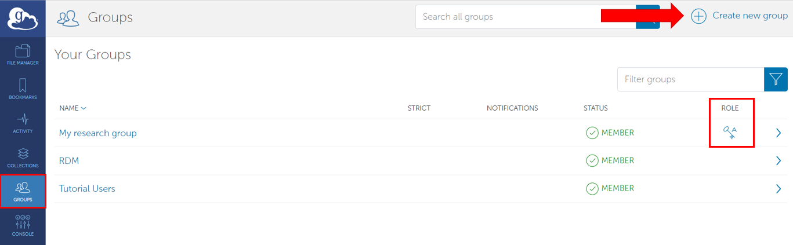
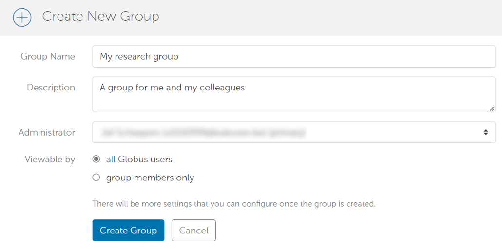
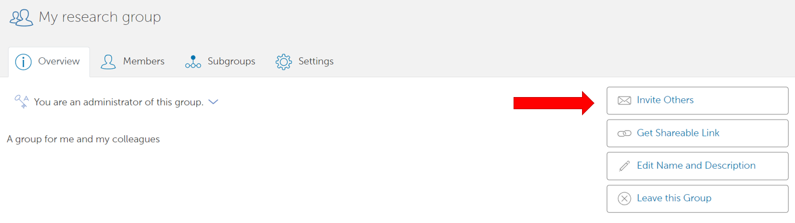

.. include:: css.rst

===============
Managing groups
===============

Globus allows anyone to create groups.
Groups can be used to share data with multiple users at once, without needing to configure everything per user.

By using the 'groups' tab on the left, you can view all groups you are member of.
If a group has a key symbol in the 'Role' column, that means you are administrator of that group. 

You can inspect any group by clicking on them.

To find out how you can share data with other groups, see our page on :ref:`globus-sharing`.

Creating a new group
-------------------

To create a new group, click on the 'Create new group' button in the upper right corner. 
You will be asked for a group name, description, and whether the group should be publicly visible or not. 

After you click on 'Create group', you will be transported to the page of your group.

Managing members of a group
---------------------------

To add new members to your group, go to the page of your group (if you aren't there already) and click on 'invite others'.
You can invite people based on their username or, if they aren't known by Globus yet, an e-mail address. 
The persons you invite will receive an e-mail with a link to your group. 

In the page of your group, under the tab 'Members', you can view all members and people you invited. In the column 'status', you can see whether your invitation has already been accepted.

Deleting a group
----------------

.. todo:
   resend or cancel invitation
   modify/remove members
   delete group
   group roles

