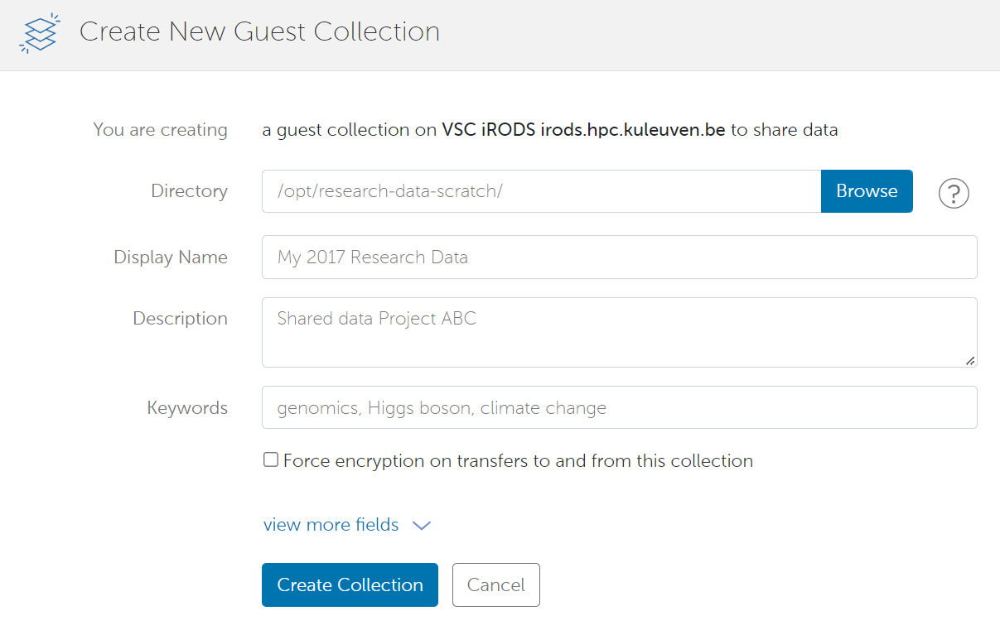
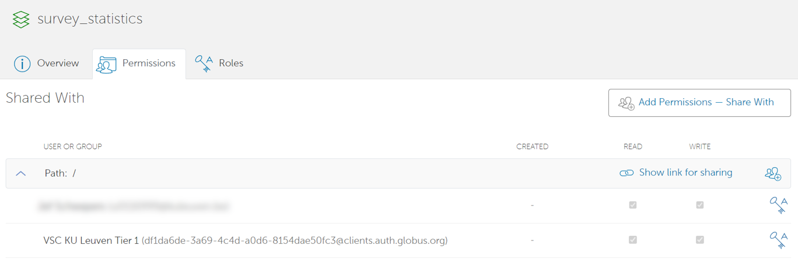
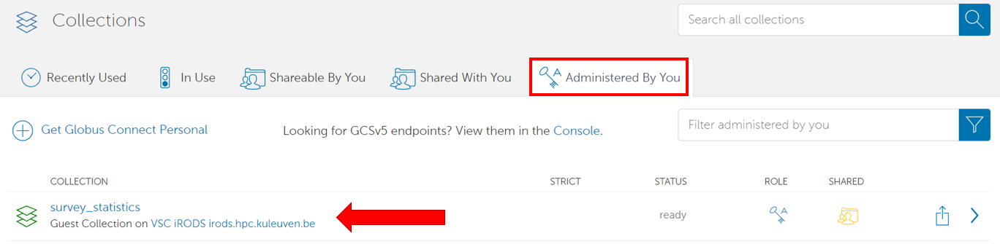
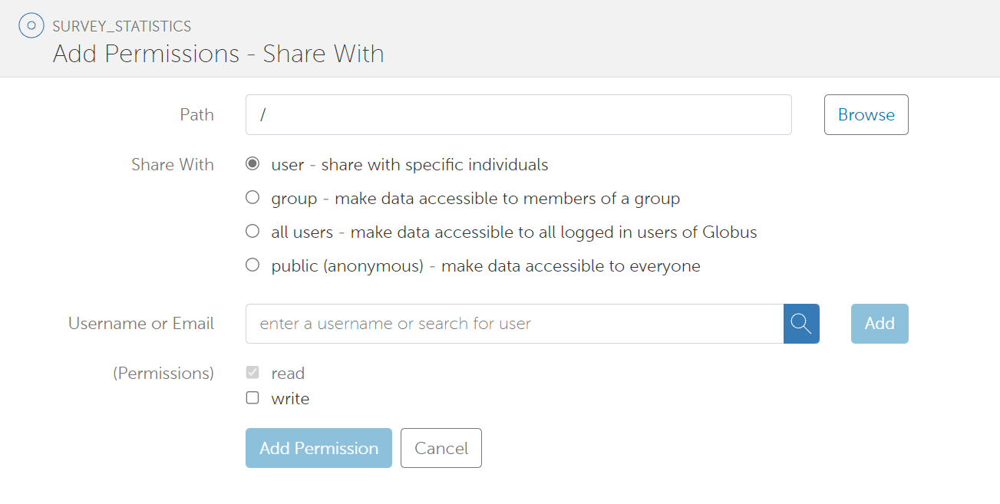
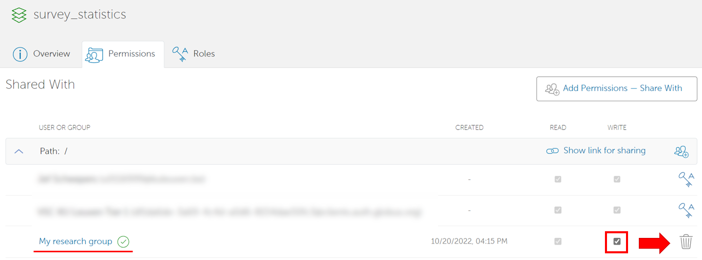
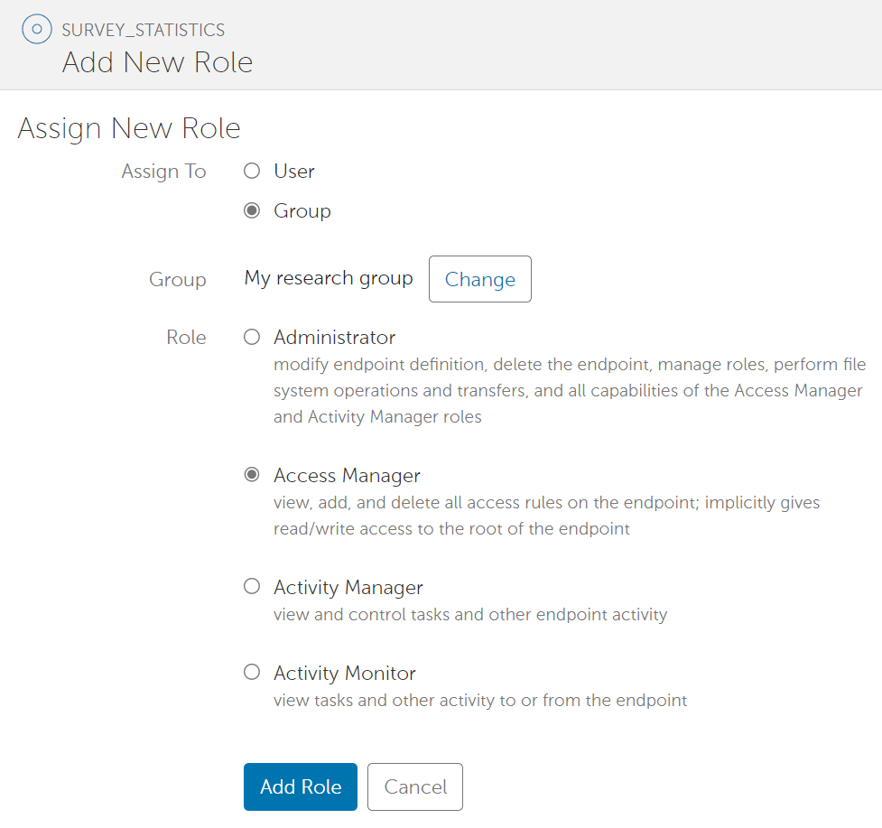
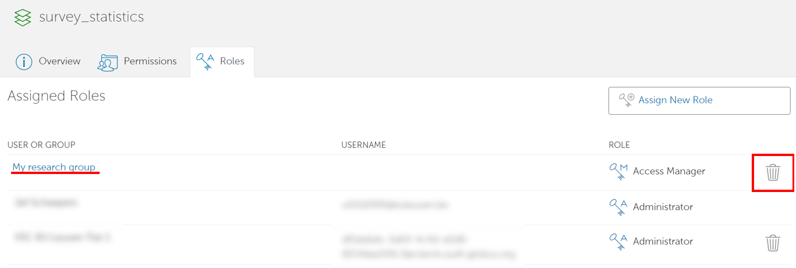
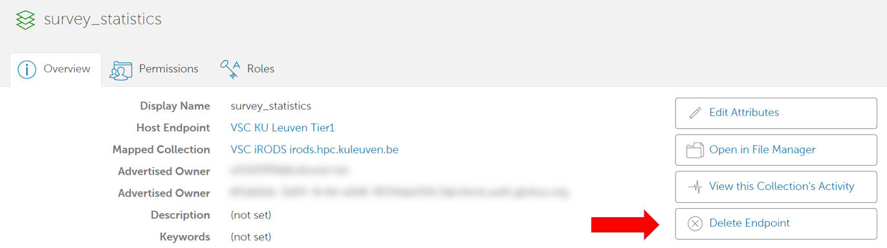

.. include:: css.rst

.. _globus-sharing:

============
Sharing data
============

Globus allows you to share data with others, even if they do not have access to the same endpoints. 
To share data with others, you need to create a **shared collection**, which is a shared folder on an existing collection.
You can then give individual users, groups or even the whole world access to the data in that folder. 

Data sharing policy
-------------------

Because of security reasons, guest collections are not enabled on every collection. 
To check on which collections this is enabled, please check our table of :ref:`globus-available-collections`.

.. warning::
    Even when enabled, sharing data is a serious responsability. 

    Data might not be shareable because of many reasons (confidentiality of the data, copyright, ...)

    Please always make sure you have the right to share any data before doing so. 

How to create a guest collection
--------------------------------
There are two ways to create a guest collection:

- In the file manager, click on the checkbox next to the folder you want to share, and click on 'share'.
- On the left, click on the tab 'collections', search for your collection and click on it, and click on 'create a guest collection' under the subtab 'Collections'.

With both methods, you will arrive at the page 'Create New Guest Collection'. 

In order to create your collection, provide:

- The path to the directory you want to share (already filled in if you came straight from the file manager)
- A name for your shared directory

The page contains other settings and information, but these are optional. 

Setting permissions
-------------------

Once you have created your guest collection, you will be transported to a page to set permissions for it.

Later, you can reach this page as follows:

- Go to the 'collections' tab on your left.
- Go to the subtab 'Administered by you' and click on your guest collection.
- Click on your guest collection's name.
- Go to the subtab 'permissions'

To add new permissions, click on the button 'add permissions'. You will get to the following screen:

First, you will need to select the path within your guest collection to which the permission applies. If you leave this empty, the permission will apply from the root of your guest collection.

Secondly, you will need to select the user or group that gets access. 

If you want to give access to a user, you can either do this by providing a username (if the user has already used Globus) or an e-mail address.
Other options are:

- Providing all users with a Globus login access
- Providing public (anonymous) access

Note that if you give access to a group, you get a search bar to search for publicly available groups. After all, you don't need to be member of a group to share data with them. 

Lastly, you should choose whether you want to give read or write access.

If you give user-level permissions, Globus will by default inform the user via mail about their new permissions. You can leave this setting on, optionally adding a message, or switch it off.

Once you have created a permission, it will show up in the 'permissions' overview of your guest collection.

You can modify permissions by checking or unchecking the 'write' checkbox, and you can delete the permission altogether by clicking on the dustbin icon next to it.

Adding management roles
-----------------------

You can also allow other users to manage your guest collection, by assigning them a role.
To do so, go to the 'roles' subtab and click on 'Assign New Role'.

On this page, choose a role, and the user/group to assign the role to.

There are four roles for guest collections:

- Administrator: can assign roles to others, and can modify or delete the guest collection.
      - If you create a guest collection, you are the administrator by default. 
- Access manager: can create new permissions on the endpoint (from the root down).
- Activity manager: can view and control tasks involving the guest collection.
- Activity monitor: can view tasks involving the guest collection.

Once created, these assignments will appear in the tab 'Roles' of your endpoint.

Click on the dustbin in the row of a role to revoke it. 

Deleting a guest collection
---------------------------

You can only delete a guest collection if you are the administrator. 

To delete a guest collection, go to the 'collections' tab, select the subtab 'Administered by you' and click on your guest collection.

This page contains a button to remove the whole guest collection. 

Accessing shared data
---------------------

If someone has given you access to a guest collection, you can search for the collection in the file manager.

Otherwise, you could also go to the 'collections' tab, and then click on the 'Shared with me' subtab. This contains a list of all collections which are shared with you.
If you click on any of these collections, you will see a button 'Open in File Manager'.
This sends you straight to the file manager to start working with the data. 

