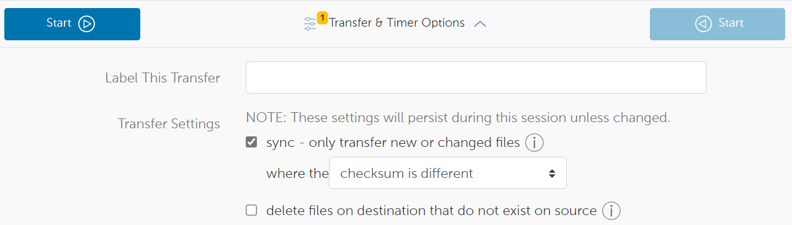
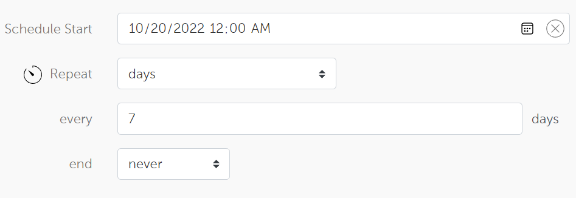
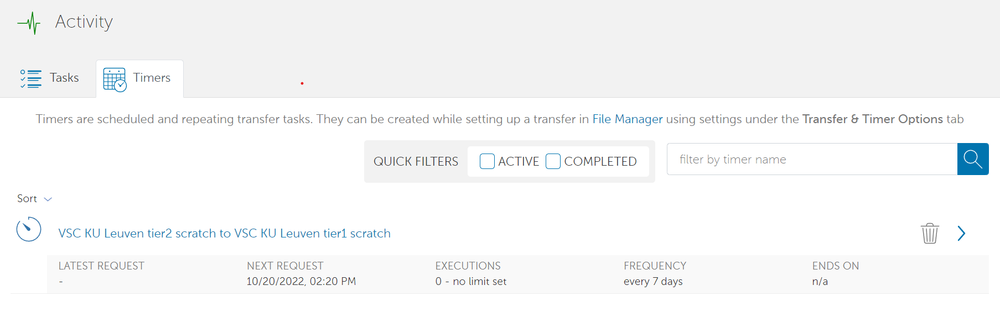

.. include:: css.rst

===============
Globus web interface
===============

This section teaches you how to manage, transfer and share files from the `Globus web interface <https://app.globus.org/>`_.

Managing files
-------------

Once you log in to Globus, you will immediately be transported to the **File Manager**, where you can browse and manage your files in your collections.  

.. image:: using_globus_via_web/file_manager.png

The first time you log in, no collection will be selected. To select a collection, click in the **Collection** text field at the top, and it allows you to search for a collection.
The first time you open a certain collection (e.g. 'VSC KU Leuven tier2 Scratch'), you might need to authenticate:

.. image:: using_globus_via_web/authenticate.png

In some collections, you might arrive immediately at your personal files. In other collections, you still need to go to your own folders.
You can move to other folders in two ways:

- Type the path you want to go to in the 'Path' textbox and press 'enter'.
- Click on the name/icon of a folder to move into it. 

.. image:: using_globus_via_web/file_manager_2.png

If you ever want to go back to the previous level, you can click on the button 'up one folder'. 

Uploading/downloading files via HTTPS
------------------

The Globus web interface allows you to upload and download data from your local pc to a collection over HTTPS.

To upload a collection, click on the 'Upload' icon:

.. image:: using_globus_via_web/https_1.png

Globus might ask you for consent to move files over HTTPS. After being moved back to the file manager, click on the 'Upload' icon again.  
You will be presented with a choice between 'Select Files to Upload' and 'Select Folder to Upload'. Once you click one of these buttons, a wizard will open to help you select the files/folder to upload.

.. image:: using_globus_via_web/https_2.png

To download a file over HTTPS, hover over its name. You should see a checkbox appearing next to the name: click it.  

In the menu on the right, you should see the icon 'Download' lighting up. 
When you click this, the file will be downloaded to the 'Downloads' folder on your PC.

.. note::
   It is only possible to download individual files over HTTPS.  
   If you need to download (nested) folders to your PC, we suggest looking at :ref:`globus-local-endpoints`.

Transferring files between collections
------------------

The main goal of Globus is to transfer data from one collection to another.  

To do this, you first need to open a second panel inside the file manager by clicking the middle button next to 'Panel' in the top right corner. 
Next, you can use the collection search bar on the right side to search for a second collection:

.. image:: using_globus_via_web/dual_pane.png

Your account remembers your panel settings when you close the website, so you don't need to repeat this step every time.

To transfer a file from collection A to collection B:

- Click on the panel of collection A to select it. 
- Click the checkboxes next to the file(s)/folder(s) you would like to transfer.
- Before starting the transfer, verify you are in the correct folder in collection B. This will be the destination of the transfer. 
- Click on the 'start' button above collection A. 

Conveniently, the arrow on the start button indicated the direction of the transfer.

.. image:: using_globus_via_web/transfer.png

Additionally, Globus has a multitude of options for transfers under the dropdown 'Transfer & Timer Options', between the start buttons. 

.. note::
   Each panel has a 'refresh' button, represented by a circular arrow. 
   If you don't see your files yet after a transfer has been completed, you should refresh the collection. 

Transfers between endpoints are 'fire-and-forget': once they are started, you can close Globus, and the transfer will continue.  
You can follow-up on both running and completed transfers in the 'activity' tab on the left side of the page.
By default, Globus will also send you a mail when a transfer has been completed.

.. note::
   If you are transferring data from or to a local endpoint, of course you need to keep the Globus Personal Connect app running.
   However, you can still close the Globus web page. 

Synchronizing folders (repeatedly) between collections 
------------------

When transferring data, you have the option to turn the transfer into a synchronization.
For each file, Globus will check whether the same file is already present in the destination collection. 
Globus will then only transfer files which aren't yet in the destination collection, or which have outdated contents there.

By default, Globus compares checksums between the file on the source and the destination to determine whether a file should be transferred.
However, in the dropdown 'Transfer & Timer Options', you can find alternative options.

To synchronize a file or folder from one collection to another: 

- Click the checkbox next to the file or folder you want to transfer.
- Open the dropdown 'Transfer & Timer Options' and click the checkbox 'sync - only transfer new or changed files'.
- Optionally, change the criteria by which Globus decides to transfer files or not. 
- Click on the 'Start' button above the source collection. 

.. note::
   In some cases, when you want to synchronize data from folder1 in collection A to collection B, you might already have a folder1 in collection B.
   
   Please remember you should transfer to the parent directory of folder1, not to folder1 itself.
   
   If you open folder1 in the panel of collection B, a new folder 'folder1' under your existing folder1 will be created. 

A common use case is when people want to push data from a folder in collection A automatically to a folder in collection B, recurringly.
This way, you can easily create a folder where you can just drop in files, and they get uploaded to another server overnight. 
To schedule this, we can use the timer options of Globus:

- In the panel of collection A, click the checkbox on the folder you would like to synchronize. 
- In the panel collection B, browse to the place where the corresponding folder is or needs to be created.
- In the dropdown 'Transfer & Timer Options', click the checkbox 'sync - only transfer new or changed files'.
- In that same dropdown, scroll down and set 'Schedule Start' to the moment you want the synchronizations to start.
- Underneath, select how often the synchronization should happen. 
   - For example, to schedule this synchronization every week forever, set 'Repeat' to 'days', set 'every X days' to 7 and 'ends' to 'never'.
- Click on the 'Start' button above the source collection. 

You can get an overview of all scheduled transfers and synchronizations on 'activity' tab (on the right side of the page) under the subtab 'timers. 
You can click on any process to get more info, or click on the trashbin icon next to one to cancel the process.

