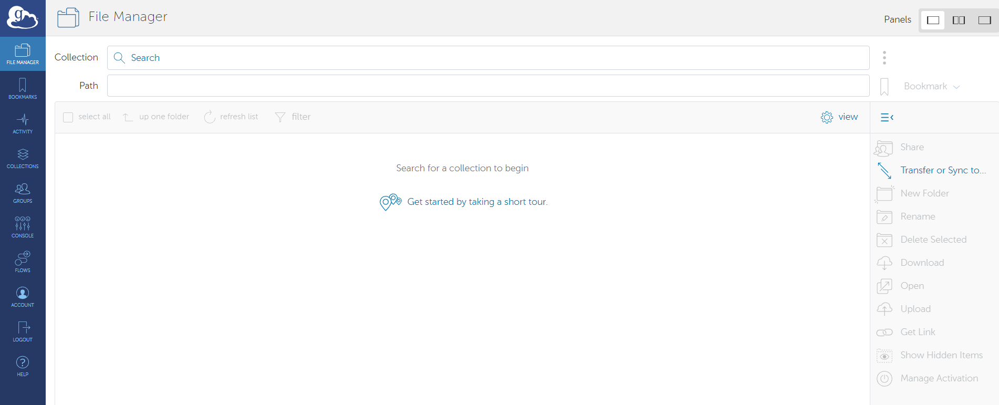
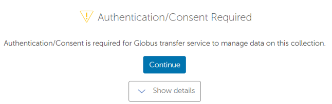
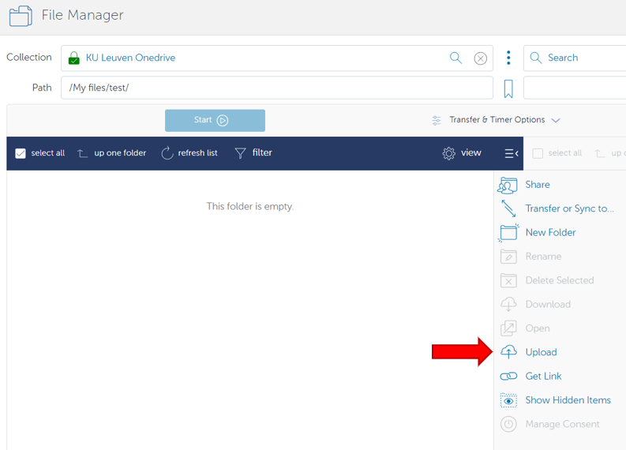
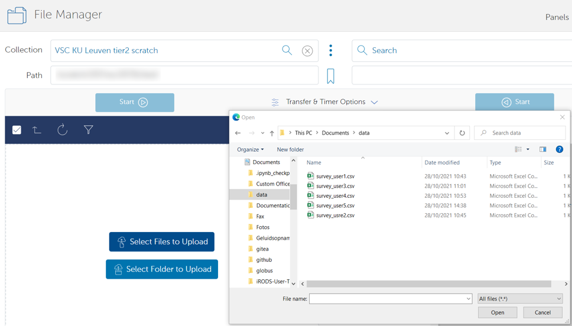
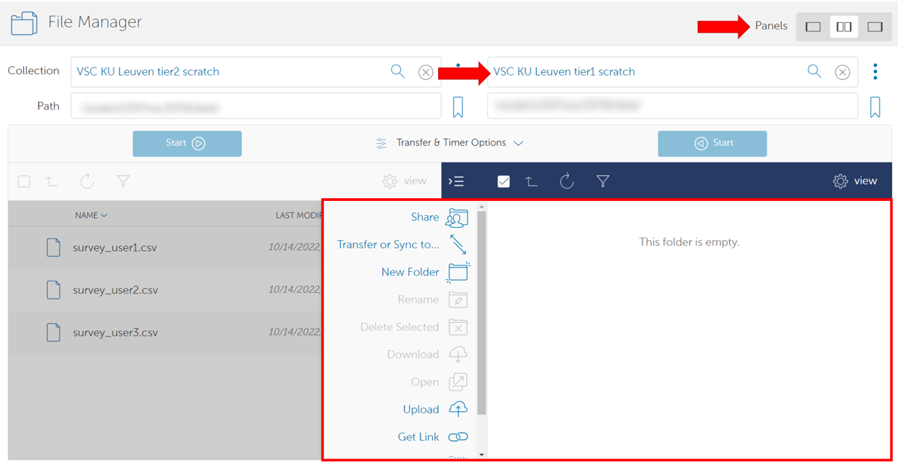
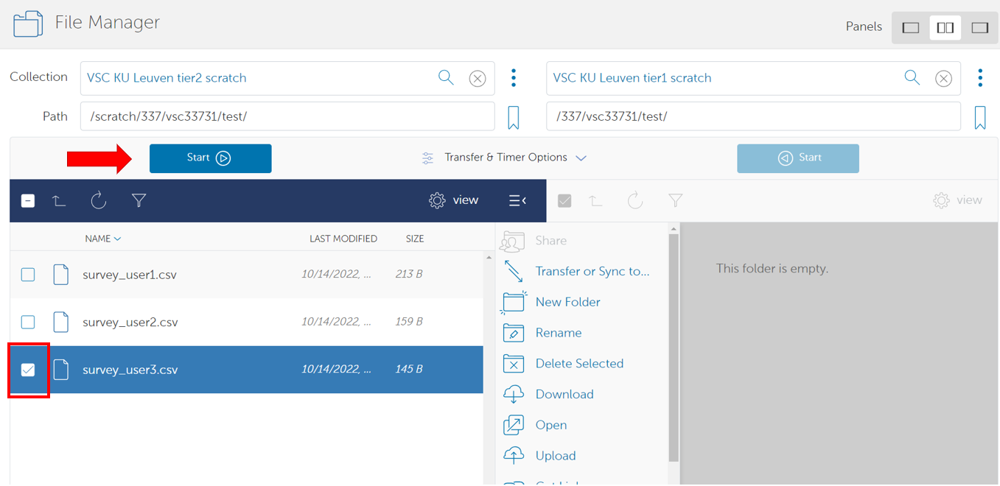

.. include:: css.rst

===============
Globus web interface
===============

This section teaches you how to manage, transfer and share files from the `Globus web interface <https://app.globus.org/>`_.

Managing files
-------------

Once you log in to Globus, you will immediately be transported to the **File Manager**, where you can browse and manage your files in your collections.  

The first time you log in, no collection will be selected. To select a collection, click in the **Collection** text field at the top, and it allows you to search for a collection.
The first time you open a certain collection (e.g. 'VSC KU Leuven tier2 Scratch'), you might need to authenticate:

In some collections, you might arrive immediately at your personal files. In other collections, you still need to go to your own folders.
You can move to other folders in two ways:

- Type the path you want to go to in the 'Path' textbox and press 'enter'.
- Click on the name/icon of a folder to move into it. 

.. image:: using_globus_via_web/file_manager_2.png

If you ever want to go back to the previous level, you can click on the button 'up one folder'. 

Uploading/downloading files via HTTPS
------------------

The Globus web interface allows you to upload and download data from your local pc to a collection over HTTPS.

To upload a collection, click on the 'Upload' icon:

Globus might ask you for consent to move files over HTTPS. After being moved back to the file manager, click on the 'Upload' icon again.  
You will be presented with a choice between 'Select Files to Upload' and 'Select Folder to Upload'. Once you click one of these buttons, a wizard will open to help you select the files/folder to upload.

To download a file over HTTPS, hover over its name. You should see a checkbox appearing next to the name: click it.  

In the menu on the right, you should see the icon 'Download' lighting up. 
When you click this, 

.. note::
   It is only possible to download individual files over HTTPS.  
   If you need to download (nested) folders to your PC, we suggest looking at :ref:`globus-local-endpoints`.

Transferring files between collections
------------------

The main goal of Globus is to transfer data from one collection to another.  

To do this, you first need to open a second panel inside the file manager by clicking the middle button next to 'Panel' in the top right corner. 
Next, you can use the collection search bar on the right side to search for a second collection:

Your account remembers your panel settings when you close the website, so you don't need to repeat this step every time.

To transfer a file from collection A to collection B:

- Click on the panel of collection A to select it. 
- Click the checkboxes next to the file(s)/folder(s) you would like to transfer.
- Before starting the transfer, verify you are in the correct folder in collection B. This will be the destination of the transfer. 
- Click on the 'start' button above collection A. 

Conveniently, the arrow on the start button indicated the direction of the transfer.

Additionally, Globus has a multitude of options for transfers under the dropdown 'Transfer & Timer Options', between the start buttons. 

.. note::
   Each panel has a 'refresh' button, represented by a circular arrow. 
   If you don't see your files yet after a transfer has been completed, you should refresh the collection. 

Transfers between endpoints are 'fire-and-forget': once they are started, you can close Globus, and the transfer will continue.  
You can follow-up on both running and completed transfers in the 'activity' tab on the left side of the page.
By default, Globus will also send you a mail when a transfer has been completed.

.. note::
   If you are transferring data from or to a local endpoint, of course you need to keep the Globus Personal Connect app running.
   However, you can still close the Globus web page. 

