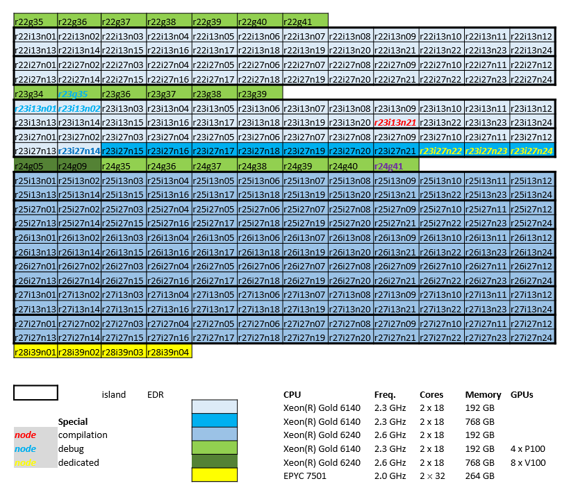

.. _genius hardware:

Genius hardware
===============

.. toctree::
   :hidden:

   memory_bandwidth_and_latency_genius.rst

Genius is one of KU Leuven/UHasselt's Tier-2 clusters, which is in production
since 2018. It has thin nodes, large memory nodes, as well as GPU nodes.

.. note::

   Most of Genius will be :ref:`decommissioned <genius_decommissioning>`
   in early 2026.

Hardware details
----------------

- 144 thin nodes

  - 2 Xeon Gold 6240 CPUs\@2.6 GHz (Cascadelake),
    18 cores each :raw-html:` `
    (1 NUMA domain and 1 L3 cache per CPU)
  - 192 GiB RAM (:ref:`memory bandwidth and latency measurements <memory bandwidth and latency genius cascadelake>`)
  - default memory per core is 5000 MiB
  - 200 GB SSD local disk
  - partition ``batch|batch_long``,
    specific Slurm :ref:`options <submit_genius_batch>` apply

- 12 interactive nodes

  - 2 Xeon Gold 6140 CPUs\@2.3 GHz (Skylake),
    18 cores each :raw-html:` `
    (1 NUMA domain and 1 L3 cache per CPU)
  - 192 GiB RAM (:ref:`memory bandwidth and latency measurements <memory bandwidth and latency genius skylake>`)
  - default memory per core is 2000 MiB
  - 200 GB SSD local disk
  - partition ``interactive``,
    specific Slurm :ref:`options <submit_genius_interactive>` apply

- 10 big memory nodes

  - 2 Xeon Gold 6140 CPUs\@2.3 GHz (Skylake),
    18 cores each :raw-html:` `
    (1 NUMA domain and 1 L3 cache per CPU)
  - 768 GiB RAM
  - default memory per core is 21000 MiB
  - 200 GB SSD local disk
  - partition ``bigmem|bigmem_long``, specific Slurm :ref:`options <submit_genius_bigmem>` apply

- 17 GPU nodes, 76 GPU devices

  - 15 P100 nodes

    - 2 Xeon Gold 6140 CPUs\@2.3 GHz (Skylake),
      18 cores each :raw-html:` `
      (1 NUMA domain and 1 L3 cache per CPU)
    - 192 GiB RAM
    - default memory per core is 5000 MiB
    - 4 NVIDIA P100 SXM2\@1.3 GHz, 16 GiB GDDR, connected with NVLink
    - 200 GB SSD local disk
    - partition ``gpu_p100|gpu_p100_long|gpu_p100_debug``, specific Slurm :ref:`options <submit_genius_gpu>` apply

  - 2 V100 nodes

    - 2 Xeon Gold 6240 CPUs\@2.6 GHz (Cascadelake),
      18 cores each :raw-html:` `
      (1 NUMA domain and 1 L3 cache per CPU)
    - 768 GiB RAM
    - default memory per core is 21000 MiB
    - 8 NVIDIA V100 SXM2\@1.5 GHz, 32 GiB GDDR, connected with NVLink
    - 200 GB SSD local disk
    - partition ``gpu_v100|gpu_v100_long``, specific Slurm :ref:`options <submit_genius_gpu>` apply

The nodes are connected using an Infiniband EDR network (bandwidth 25 Gb/s), the islands
are indicated on the diagram below.

