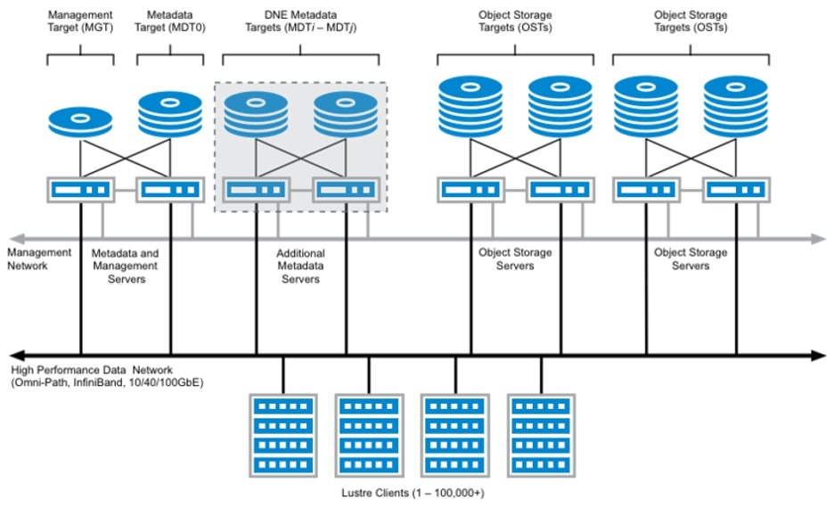

.. _kuluh_parallel_filesystems:

###########################################
Parallel file systems at KU Leuven/UHasselt
###########################################

This page provides in-depth information about the parallel file systems
available on the KU Leuven/UHasselt Tier-2 clusters. After giving some
background information, the current setup is shown and some practical advice
is given on how you can handle data that can be spread over filesystems.

.. _kuluh_pfs_background:

Background information
----------------------

The setup of a filesystem on a local machine is usually quite simple: it
consists of a single disk connected directly (or via a USB port in case of an
external disk) to the motherboard of the machine. It should be clear that there
are several reasons why such a simple setup does not provide the required
functionality on a high-performance compute cluster.

The first issue is that on a cluster, you want to be able to access the same
files from many different machines, specifically all compute nodes and login
nodes. Because this typically involves several hundreds of nodes on our Tier-2
system, a direct connection between each node and the file system is not
feasible. Instead, each node is connected to a *network* to which the file
system is hooked up.

The second issue is that if the file system itself consists of a single server,
this server will quickly become a bottleneck for high-performant input/output
operations. To overcome this, a parallel file system itself typically consists
of multiple servers which can access many disks independently (but of course
in a coordinated fashion). This is illustrated for a `Lustre`_ parallel file
system below; note that it is not necessary to understand the details in this
diagram, it is intended to help appreciate the complexity of a parallel file system
in an HPC context.

   Diagram of a Lustre file system, the Lustre Clients are compute nodes in an
   HPC context. Source: https://www.weka.io/learn/glossary/file-storage/hpc-storage-explained/

.. note::

   Parallel file systems usually allow to distribute files transparently to
   users over multiple servers, providing a high aggregate bandwidth. When it
   comes to reading or writing *large* amounts of data, a parallel file system can
   easily surpass a regular file system in performance. Metadata operations
   (creating, opening, listing) are intrinsically much harder to distribute
   and this is not an area where parallel file systems necessarily excel at.
   As a consequence, you should in general avoid doing a lot of metadata
   operations on a parallel file system. A practical advice is that having a
   lot (let's say millions) of small files is a bad idea. The support team
   will even impose quota on the number of files on some storage for this very
   reason.

Related to the issues discussed above, it is worth noting that both the
parallel file systems and their network are *shared* resources in the sense
that all users on a cluster use these resources concurrently. This is in
contrast to resources such as compute cores, to which only a single user at a
time has exclusive access. As a consequence, it is very important to make sure
you use the parallel file systems properly and your workload does not affect
other users negatively. The next sections will help you in this respect.

.. _kuluh_pfs_setup:

Setup of parallel filesystems
-----------------------------

Since mid 2026, there are two parallel file systems in use on the KU Leuven/
UHasselt Tier-2 clusters Mindwell and wICE (for Genius the wICE information applies):

- The ``Lustre1`` file system

  - based on the `Lustre`_ architecture
  - offers user scratch directories intended to be used on wICE
  - offers group-based storage as "staging" directories, also intended to be
    used on wICE
- The ``GPFS1`` file system

  - based on the `GPFS architecture`_ (also known under the IBM Storage Scale
    brand name)
  - offers user scratch directories intended to be used on Mindwell
  - offers group-based storage as "project1" directories, also intended to be
    used on Mindwell

The diagram below shows these parallel file systems (at the bottom) and the
networks that connect them to the compute nodes (at the top).

.. figure:: kuluh_pfs.svg
   :alt: Parallel file systems at KU Leuven/UHasselt

   Diagram of the parallel file systems on the KU Leuven/UHasselt Tier-2
   clusters and their interconnects

It is not coincidental that the ``Lustre1`` file system is directly below the
wICE cluster and the ``GPFS1`` file system is directly below the Mindwell
cluster. If you study the diagram carefully, you will note that the path
between wICE compute nodes and ``Lustre`` is much shorter (shorter as in, fewer
network switches involved) than the path between wICE compute nodes and
``GPFS1``. Similarly, the path connecting Mindwell compute nodes with ``GPFS1``
is more direct than the path connecting them to ``Lustre1``. Additionally you
need to take into account that not all network connections have the same
performance: specifically, the dotted lines connecting Mindwell spine switches
and Lustre switches do not guarantee good performance.

The main takeaway of this section is that **you must select the most
appropriate parallel file system for the cluster you are working on.** For
user convenience, cross access (from wICE to ``GPFS1`` and from ``Mindwell``
to Lustre1) is technically possible, but not recommended. The next section
will provide some practical guidelines on how to handle this.

.. note::

   At this point it is justified to ask the question why the somewhat
   complicated setup with two parallel file systems was introduced when the
   Mindwell cluster was commissioned around mid 2026. The answer is that
   "extending" the existing ``Lustre1`` storage was not deemed a good long-term
   solution. Even though adding more disks to the backend to increase
   its capacity would be feasible, the previous section demonstrates that much
   more components such as management servers and the networks would need
   to be updated or replaced to be able to handle the load from the new
   cluster. After a tendering procedure, the choice was therefore made to
   purchase a completely new parallel file system (named ``GPFS1``).

.. _kuluh_pfs_practical:

Practical recommendations for managing data on multiple filesystems
-------------------------------------------------------------------

After the more theoretical considerations of the previous sections, this
section provides concrete suggestions on how you handle data that is spread
over multiple (parallel) file systems, while making sure you make proper use
of these file systems.

Separate locations for separate compute tasks
~~~~~~~~~~~~~~~~~~~~~~~~~~~~~~~~~~~~~~~~~~~~~

The first solution simply bypasses the problem: before starting a series of
related compute tasks (for instance, constituting a work package of a project),
you select a single cluster where you will execute all tasks and store all
files on the corresponding parallel file system.

- If you select wICE:

  - store all files in ``$VSC_SCRATCH_LUSTRE1`` or a staging
    directory (a subdirectory of ``$VSC_PROJECT_LUSTRE1``)
- If you select Mindwell:

  - store all files in ``$VSC_SCRATCH_GPFS1`` or a
    project1 directory (a subdirectory of ``$VSC_PROJECT_GPFS1``)

This is a clean approach that is conceptually and practically simple. The main
(or only) disadvantage is that you cannot simply switch between clusters for
related compute tasks. This can be inconvenient because your work will be
blocked if one cluster is under maintenance or fully occupied.

Central location: staging in/staging out
~~~~~~~~~~~~~~~~~~~~~~~~~~~~~~~~~~~~~~~~

This second approach does allow to easily switch between clusters. The basic
idea is that at the start of a job, you transfer the required input files from
a *central location* to the parallel file system on which the job in question is
running. At the end, you transfer back the output files you need to keep to
the central location. In the example below, the central location is a staging
directory called ``stg_00000``, you will need to adapt this to your own case.

.. code-block:: shell

   # Make a work directory on the parallel file system of this cluster,
   # make it unique for this job (optional)
   workdir=${VSC_SCRATCH}/task1/${SLURM_JOB_ID}
   mkdir -p ${workdir}

   # Transfer input files from central location to the work directory,
   # check the rsync documentation for more options
   rsync -a ${VSC_PROJECT_LUSTRE1}/stg_00000/task1/input ${workdir}

   # Run the actual computation in the work directory
   cd $workdir
   <do_work>

   # After the computation, transfer output files that need to be kept back
   rsync -a --include='*.out' --exclude='*' ${workdir} ${VSC_PROJECT_LUSTRE1}/stg_00000/task1/output

   # [Optionally] Remove work directory if no longer needed
   cd $SLURM_SUBMIT_DIR
   rm -r ${workdir}

Some additional hints:

- This example script does not need to be modified when switching to a
  different cluster, the work directory will automatically be located on the
  appropriate parallel file system
- The first step (staging in) and final step (staging out) of this example
  job might access the "wrong" parallel file system. Make sure the time these
  steps take is small compared to the time the computation takes
- The central location does not need to be on a parallel file system, it could
  also be located in a :ref:`Tier-1 data project <tier1_data_service>` for
  example
- Try to be selective in which input and output files are really necessary.
  Some generated output files are only intermediate (they are *scratch* files
  in the true sense) and serve no real purpose after the computation
  finishes

Central location: regular synchronization
~~~~~~~~~~~~~~~~~~~~~~~~~~~~~~~~~~~~~~~~~

In a case where staging in and out files in every job is not feasible or not
desirable, another option is to store all input and output of a computational
task on the parallel file system closest to the cluster on which that specific
computational task will be performed. This can however lead to problems when
you need to post-process data, but some of the required files are on
``$VSC_SCRATCH_LUSTRE1`` while others are on ``$VSC_SCRATCH_GPFS1``. That can
be overcome by synchronizing both locations to a central location and run the
post-processing in there. Such a synchronization is preferably done in a job
requesting a moderate amount of cores and should not be done *too* often, since
it results in cross-cluster parallel file system access. Also take into
account that this results in data duplication, which not only consumes
precious disk space unnecessarily, but also requires careful management from
your side. Only use this method if no other methods suit your workflow and if
you are prepared to carefully manage your data!
