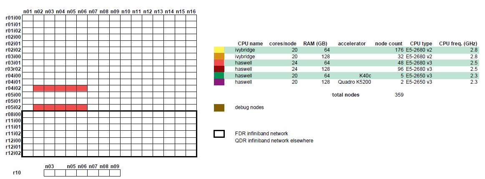

Thinking CentOS 7 hardware
==========================

Thinking is KU Leuven/UHasselt's older Tier-2 cluster. It has thin nodes, large memory nodes, as well as GPGPU nodes.  It is gradually being migrated to CentOS 7, so this section will expand over time.

Login infrastructure
--------------------

Direct login is using SSH is possible to all login infrastructure without restrictions.

- Two ivybridge login nodes for SSH access are available. **Note:** these are ivybridge nodes, so for better performance, build your software on a haswell compute node.

    - login5\-tier2.hpc.kuleuven.be
    - login6\-tier2.hpc.kuleuven.be
	
- One haswell login node for SSH access and :ref:`TurboVNC<TurboVNC start guide>` access.	

    - login7\-tier2.hpc.kuleuven.be
    - login8\-tier2.hpc.kuleuven.be

Hardware details
----------------
- 10 ivybridge nodes

    - 2 Xeon E5-2680 v2 CPUs@2.8 GHz, 10 cores each
    - 64 GB RAM (4) / 128 GB RAM (6)
    - feature ``ivybridge``

- 10 haswell nodes

    - 2 Xeon E5\-2680 v3 CPUs\@2.5 GHz, 12 cores each
    - 128 GB RAM
    - feature ``haswell``

In the older partition of the cluster, nodes are connected via a QDR infiniband interconnect, while the newer partition has a faster FDR interconnect.  See the diagram below.

|Thinking CentOS 7 hardware|

