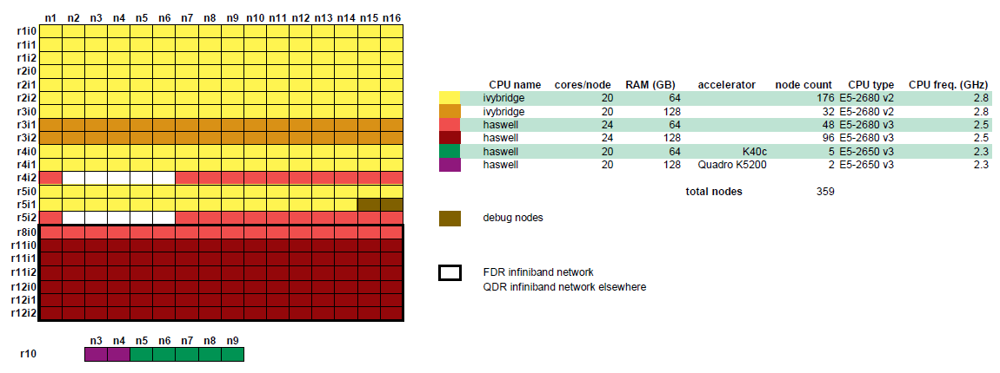

Thinking hardware
===============

Thinking is KU Leuven/UHasselt's older Tier-2 cluster. It has thin nodes, large memory nodes, as well as GPGPU nodes.

Login infrastructure
--------------------

Direct login is using SSH is possible to all login infrastructure without restrictions.

- Two login nodes for SSH access are available.

    - login1.hpc.kuleuven.be
    - login2.hpc.kuleuven.be

Hardware details
----------------

- 176 ivybridge nodes

    - 2 Xeon E5-2680 v2 CPUs\@2.8 GHz, 10 cores each
    - 64 GB RAM

- 32 ivybridge nodes

    - 2 Xeon E5-2680 v2 CPUs\@2.8 GHz, 10 cores each
    - 128 GB RAM

- 48 haswell nodes

    - 2 Xeon E5-2680 v3 CPUs\@2.5 GHz, 12 cores each
    - 64 GB RAM

- 96 haswell nodes

    - 2 Xeon E5-2680 v3 CPUs\@2.5 GHz, 12 cores each
    - 128 GB RAM

- 5 GPGPU nodes

    - 2 Xeon E5-2650 v3 CPUs\@2.3 GHz, 10 cores each
    - 64 GB RAM
    - 2 NVIDIA K40c\@750 MHz, 12 GB GDDR

In the older partition of the cluster, nodes are connected via a QDR infiniband interconnect, while the newer partition has a faster FDR interconnect.  See the diagram below.

|Thinking hardware|

