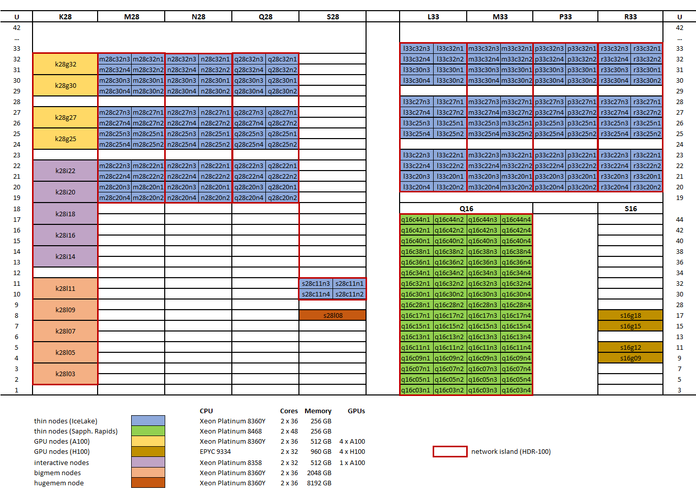

Genius hardware
===============

wICE will be KU Leuven/UHasselt's next Tier-2 cluster. It has thin nodes, large memory nodes, interactive nodes and GPGPU nodes.
This cluster is currently being installed and will be in pilot usage over summer 2022

Hardware details
----------------

- 172 thin nodes 
   
   - 2 Intel Xeon Platinum 8360Y CPUs\@2.4 GHz (Ice lake), 36 cores each
   - 256 GB RAM 
   - 960 GB SSD local disk

- 5 big memory nodes

   - 2 Intel Xeon Platinum 8360Y CPUs\@2.4 GHz (Ice lake), 36 cores each
   - 2048 GB RAM
   - 960 GB SSD local disk
   - partition ``bigmem``

- 4 GPGPU nodes, 16 GPU devices

   - 2 Intel Xeon Platinum 8360Y CPUs\@2.4 GHz (Ice lake), 36 cores each
   - 512 GB RAM
   - 4 NVIDIA A100 SXM4, 80 GB GDDR, connected with NVLink
   - 960 GB SSD local disk
   - partition ``gpu``

- 5 interactive nodes

   - 2 Intel Xeon Gold 8358 CPUs\@2.6 GHz (Ice lake), 32 cores each
   - 512 GB RAM
   - 1 NVIDIA A100, 80 GB GDDR 
   - 960 GB SSD local disk

The nodes are connected using an Infiniband HDR-100 network, the islands are indicated on the diagram below.

|wICE hardware|

