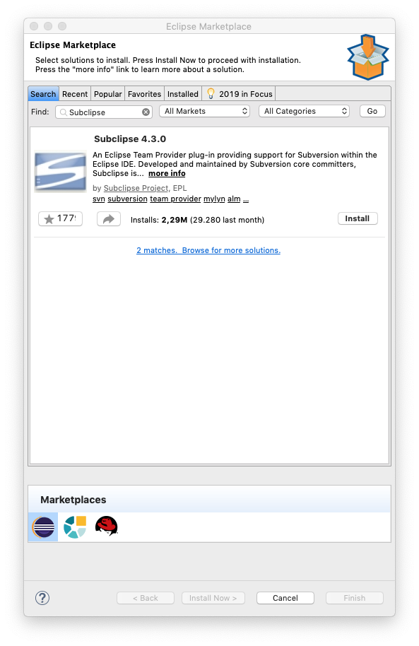
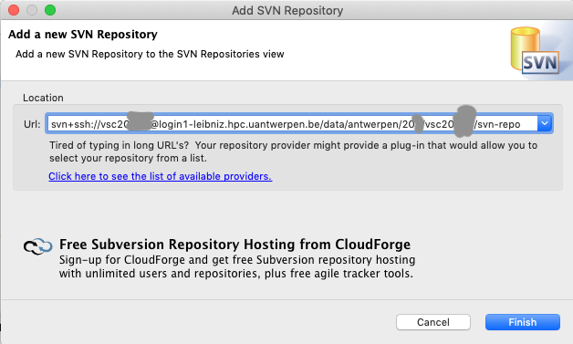

.. _Eclipse VSC subversion:

Eclipse access to a VSC subversion repository
=============================================

Prerequisites
-------------

It is assumed that a recent version of the Eclipse IDE is installed on
the desktop, and that the user is familiar with Eclipse as a development
environment. The installation instructions were tested with release 
2019-06 of Eclipse but may be slightly different for other versions.

Installation & setup
--------------------

Eclipse needs an additional plugin to work with subversion repositories.
We previously recommended the `subversive plugin <https://www.eclipse.org/subversive/>`_ 
for this task, but its development has been dormans since early 2017 
so we expect this plugin may stop working properly at some point.
Currently the recommended plugin for SVN access is 
`Subclipse <https://marketplace.eclipse.org/content/subclipse>`_.

Subclipse is most easily installed through the Eclipse Marketplace.

#. You may need to install the 'Eclipse Marketplace' plugin first. 
   the procedure for this is similar to the procedure for the 
   :ref:`Remote System Explorer <Eclipse as remote editor>`: 
   
   #. Select 'Install New Software...' from Eclipse's 'Help' menu.  
   #. From the 'Work with:' drop down menu, select '<name> -
      http://download.eclipse.org/releases/<name>' (replace "<name>" by
      the name of the release that you are using, e.g., 2019-06). 
      The list of available
      components is now automatically populated.
   #. From the category 'General Purpose Tools', select 'Eclipse 
      Marketplace'.
   #. Click the 'Next >' button to get the installation details.
   #. Click the 'Next >' button again to review the licenses.
   #. Select the 'I accept the terms of the license agreement' radio
      button.
   #. Click the 'Finish' button to start the download and installation
      process.
   #. As soon as the installation is complete, you will be prompted to
      restart Eclipse, do so by clicking the 'Restart Now' button.

#. From the 'Help' menu, open 'Eclipse Marketplace...'
#. In the search box, type 'Sublipse' and then click 'Go' a bit to the right.
   |Subclipse in Marketplace| 
#. Click the 'Install' button in the'Subclipse' entry.
#. Eclipse will now search for other components that are needed to successfully
   install Subclipse and offer a screen similar to
   |Subclipse installation| 
   Click 'Confirm'
#. On the next screen, accept the license agreements and click 'Finish'.
#. You may get a security warning about unsigned components. Click on 
   'Install anyway'.
#. Finally Eclipse will offer to restart. Accept this to enable the 
   Subclipse plugin.
   
A note about SSH keys
~~~~~~~~~~~~~~~~~~~~~

To access SVN repositories through SSH, Eclipse needs a private key in a 
suitable format. Please check out the information in the 'Configuration'
section on our page :ref:`Eclipse as a remote editor <Eclipse as remote editor>` 
on converting PuTTY keys or OpenSSH ssh-keygen generated keys to a suitable format.
   

Checking out a project from a VSC cluster repository
----------------------------------------------------

To start working with code or files in a SVN repository in Eclipse,
two steps are needed:

#. Open the 'SVN Repository Exploring' perspective and link a SVN
   repository
#. Then check out a project in the repository to create a matching
   project in the Eclipse workspace.
   
We'll now go through these steps in some more detail. We assume
a SVN repository is set up as explained in 
:ref:`Subversion <Subversion>` elsewhere on this site.

#. To open the 'SVN Repository Exploring' perspective, got to
   `Window` on the menu bar, select 'Perspective', then 
   'Open Perspective' and then 'Other...'.
#. Select 'SVN Repository Exploring' in the window that appears
   and click the 'Open' button. Two tabs, 'SVN Repositories' and 
   'SVN Annotate' will appear in the left pane.
#. In the 'SVN Repositories' tab, right click with the mouse,
   select 'New' and then 'Repository location'
#. A dialog box 'Add a new SVN Repository' appears with a box to enter the
   repository URL. For a repository on a VSC cluster, this URL will be
   similar to the one shown below (but of course replace with your userid,
   directory and favorite login node):
   
   |Subclipse add repository|
   
   Click on 'Finish'   
#. If Eclipse does not yet know how to access the host that you
   used in the URL in the previous step, it will now ask you to
   'Enter SSH Credentials'. Make sure you use the rigbht 'Username',
   then select 'Use private key authentication' and select the
   'Key file' (this should be your private key). You can then also
   enter the passphrase in the corresponding field and finally click
   'OK'.
   
   |Subclipse enter credentials|
   
#. You may then get another dialog box asking you to enter your username
   and password. Here you actually need to enter your passphrase again.
   
   |Subclipse enter passpharse|
   
#. Now you're ready to check out your project. You will see a screen
   similar to the picture below.
   Right-click on the name of the SVN repository ('simulation' in this
   case), then select 'Checkout...'. This will offer you to create
   a project in your workspace from the files in the SVN repository.
   Select your choice of project and then either click 'Next' if you
   want to use a different location then the default location for your
   project or 'Finish'.

Work cycle
----------

The development cycle from the point of view of version control is
exactly the same as that for a command line subversion client. Once a
project has been checked out or placed under version control, all
actions can be performed by right clicking on the project or specific
files in the 'Project Explorer' view and choosing the appropriate action
from the 'Team' entry in the context menu. 

Note that files and directories displayed in the 'Project Explorer' view
are now decorated to indicate version control status. little star
embedded in the icon of a 
file or directory indicates that it has been modified since the
last update. A new file not yet under version control has a '?' embedded
in its icon.

When a project is committed, subversive opens a dialog to enter an
appropriate comment, and offers to automatically add new files to the
repository. Note that Eclipse also offers to commit its project
settings, e.g., the '.project' file. Whether or not you wish to store
these settings in the repository depends on your setup, but probably you
don't.

.. |Subclipse installation| image:: eclipse_access_to_a_vsc_subversion_repository/subclipse_installation.png

.. |Subclipse enter credentials| image:: eclipse_access_to_a_vsc_subversion_repository/subclipse_enter_ssh_credentials.png
.. |Subclipse enter passpharse| image:: eclipse_access_to_a_vsc_subversion_repository/subclipse_enter_username_password.png
.. |Subclipse checkout| image:: eclipse_access_to_a_vsc_subversion_repository/subclipse_checkout.png

.. include:: links.rst
