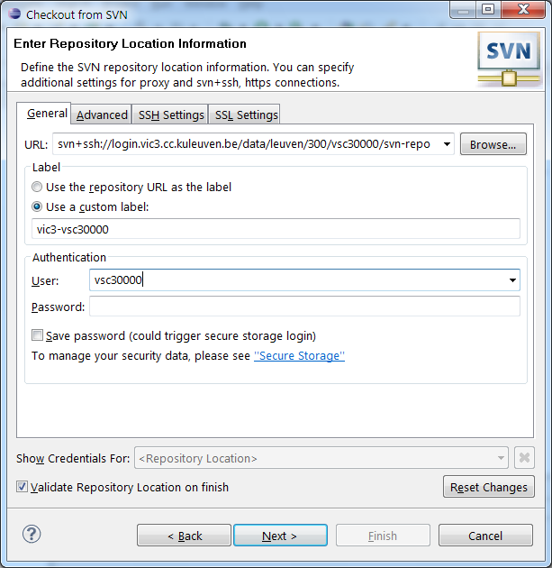
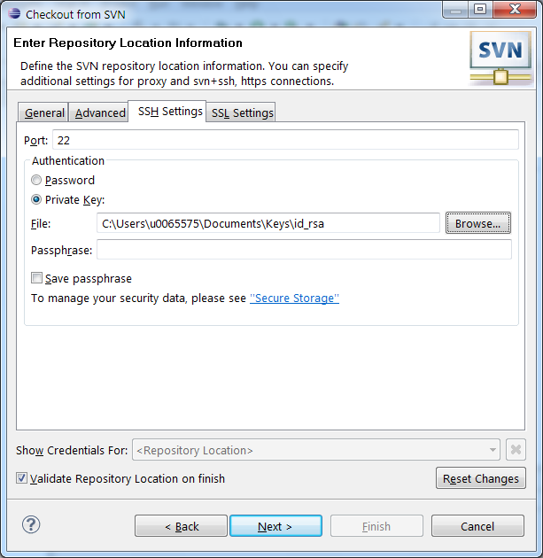
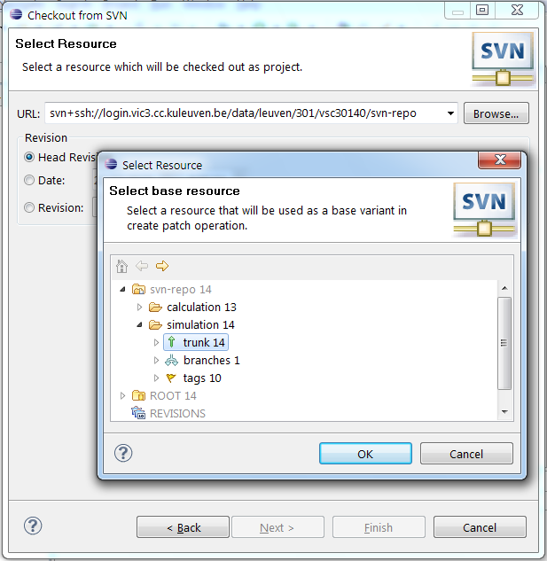
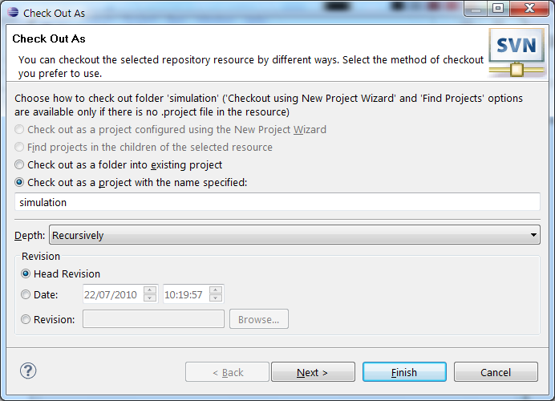

.. _Eclipse VSC subversion:

Eclipse access to a VSC subversion repository
=============================================

Prerequisites
-------------

It is assumed that a recent version of the Eclipse IDE is installed on
the desktop, and that the user is familiar with Eclipse as a development
environment. The installation instructions were tested with the Helios
(2010), 4.4/Luna (2014) and the 4.6/Neon (2016) release of Eclipse but
may be slightly different for other versions.

Installation & setup
--------------------

In order to interact with subversion repositories, some extra plugins
have to be installed in Eclipse.

#. When you start Eclipse, note the code name of the version in the
   startup screen.
#. From the 'Help' menu, select 'Install New Software...'.
#. From the 'Work with' drop down menu, select 'Neon -
   ``http://download.eclipse.org/releases/neon``' (where Neon is the name of
   the release, see the first step). This will populate the components
   list.
#. Expand 'Collaboration' and check the box for 'Subversive SVN Team
   Provider' and click the 'Next >' button.
#. Click 'Next >' in the 'Install Details' dialog.
#. Indicate that you accept the license agreement by selecting the
   appropriate radio button and click 'Finish'.
#. When Eclipse prompts you to restart it, do so by clicking 'Restart
   Now'
#. An additional component is needed (an SVN Team Provider), however, To
   trigger the install, open the Eclipse "Preferences" menu (under
   the "File" menu, or under "Eclipse" on macOS) and go to
   "Team" and then "SVN"
#. Select the tab "SVN connector"
#. Then click on \\"Get Connectors\" to open the 'Subversive Connectors
   Discovery' dialog.
   *You will not see this button if there is already a connector
   installed. If you need a different one, you can still install one via
   "Install new software" in the "Help" menu. Search for
   "SVNKit" for connectors that don't need any additional software on
   the system (our preference), or "JavaHL" for another family that
   connects to the original implementation. Proceed in a similar way as
   below (step 13).*
#. The easiest choice is to use one of the \\"SVN Kit\" connectors as
   they do not require the installation of other software on your
   computer, but you have to chose the appropriate version. The
   subversion project tries to maintain compatibility between server and
   client from different versions as much as possible, so the version
   shouldn't matter too much. However, if on your desktop/laptop you'd
   like to mix between using svn through Eclipse and through another
   tool, you have to be careful that the SVN connector is compatible
   with the other SVN tools on your system. SVN Kit 1.8.12 should work
   with other SVN tools that support version 1.7-1.9 according to the
   documentation (we cannot test all combinations ourselves).

   #. In case you prefer to use the \\"Native JavaHL\" connector
      instead, make sure that you have subversion binaries including the
      Java bindings installed on your system, and pick the matching
      version of the connector. Also see the `JavaHL subclipse Wiki
      page <http://subclipse.tigris.org/wiki/JavaHL>`_ of the
      `tigris.org community <http://www.tigris.org/>`_.

#. Mark the checkbox next to the appropriate version of 'SVN Kit' and
   click 'Next >'.
#. The 'Install' dialog opens, offering to install two components, click
   'Next >'.
#. The 'Install Details' dialog opens, click 'Next >'.
#. Accept the license agreement terms by checking the appropriate radio
   button in the 'Review Licenses' dialog and click 'Finish'.
#. You may receive a warning that unsigned code is about to be
   installed, click 'OK' to continue the installation.
#. Eclipse prompts you to restart to finish the installation, do so by
   clicking 'Restart Now'.

Eclipse is now ready to interact with subversion repositories.

**Microsoft Windows PuTTY users only**
~~~~~~~~~~~~~~~~~~~~~~~~~~~~~~~~~~~~~~

Eclipse's SSH components can not handle private keys generated with
PuTTY, only OpenSSH compliant private keys. However, PuTTY's key
generator 'PuTTYgen' (that was used to generate the public/private key
pair in the first place) can be used to convert the PuTTY private key to
one that can be used by Eclipse. See the section :ref:`converting PuTTY keys
to OpenSSH format <converting PuTTY keys>` for details if necessary.

Checking out a project from a VSC cluster repository
----------------------------------------------------

To check out a project from a VSC cluster repository, one uses the
Eclipse 'Import' feature (don't ask...).

::

   svn+ssh://userid@vsc.login.node/data/leuven/300/vsc30000/svn-repo

|Eclipse SVN checkout|

In the 'User' field, enter your VSC user ID.

-  Switch to the 'SSH' tab of this dialog, and select 'Private key' for
   authentication. Use the 'Browse' button to find the appropriate
   private key file to authenticate on the VSC cluster. Note that this
   should be a private key in OpenSSH format. Also enter the passphrase
   for your private key. If you wish, you can store your passphrase here
   at this point, but this may pose a security risk.

   |Eclipse SVN private key|

-  You will be prompted to select a resource to be checked out, click
   the 'Browse' button and select the project you want to check out.
   Remember that if you use the recommended repository layout, you will
   probably want to check out the project's 'trunk'. Click 'Finish'.

   |Eclipse SVN resource|

-  The 'Check Out As' dialog offers several options, select the
   'Checkout as a project with the name specified' and click 'Finish'

   and click 'Finish' to proceed with the check out.
   
   |Eclipse SVN checkout as|

Note that Eclipse remembers repository URLs, hence checking out another
project from the same repository will skip quite a number of the steps
outlined above.

Work cycle
----------

The development cycle from the point of view of version control is
exactly the same as that for a command line subversion client. Once a
project has been checked out or placed under version control, all
actions can be performed by right clicking on the project or specific
files in the 'Project Explorer' view and choosing the appropriate action
from the 'Team' entry in the context menu. The menu items are fairly
self-explanatory, but you may want to read the section on
:ref:`TortoiseSVN` since Eclipse's version control interface is very akin
to the former.

Note that files and directories displayed in the 'Project Explorer' view
are now decorated to indicate version control status. A '>' preceeding a
file or directory's name indicate that it has been modified since the
last update. A new file not yet under version control has a '?' embedded
in its icon.

When a project is committed, subversive opens a dialog to enter an
appropriate comment, and offers to automatically add new files to the
repository. Note that Eclipse also offers to commit its project
settings, e.g., the '.project' file. Whether or not you wish to store
these settings in the repository depends on your setup, but probably you
don't.

.. include:: links.rst
