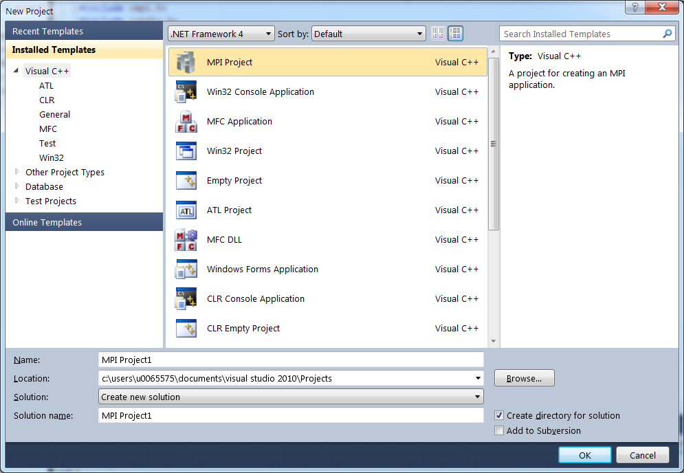
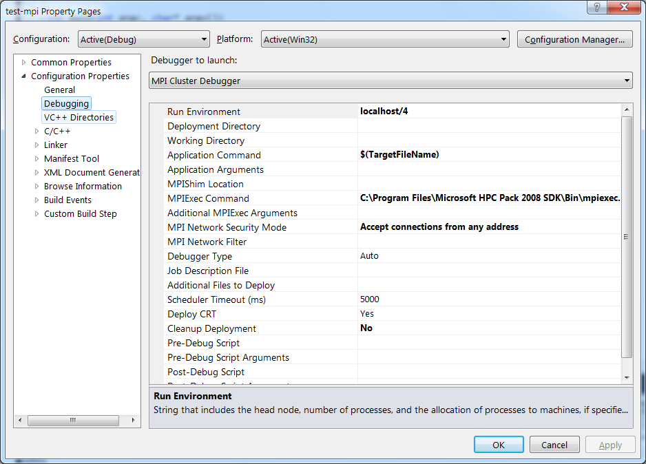
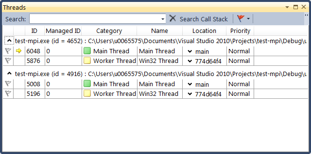

.. _MS Visual Studio:

MS Visual Studio
================

Prerequisites
-------------

It is assumed that Microsoft Visual Studio Professional (at least the
Microsoft Visual C++ component) is installed. Although Microsoft Visual
C++ 2008 should be sufficient, this how-to assumes that Microsoft Visual
C++ 2010 is used. Furthermore, one should be familiar with the basics of
Visual Studio, i.e., how to create a new project, how to edit source
code, how to compile and build an application.

Note for KU Leuven and UHasselt users: Microsoft Visual Studio is
covered by the campus license for Microsoft products of both KU Leuven
and Hasselt University. Hence staff and students can
`download <https://www.dreamspark.com/>`_ and use the software.

Also note that although Microsoft offers a free evaluation version of
its development tools, i.e., Visual Studio Express, this version does
not support parallel programming.

.. _MS Visual Studio OpenMP:

OpenMP
------

Microsoft Visual C++ offers support for developing openMP C/C++ programs
out of the box. However, as of this writing, support is still limited to
the ancient OpenMP 2.0 standard. The project type best suited is a
Windows Console Application. It is best to switch 'Precompiled headers'
off.

Once the project is created, simply write the code, and enable the
openMP compiler option in the project's properties as shown below.

|MS Visual Studio OpenMP|

Compiling, building and running your program can now be done in the
familiar way.

.. _MS Visual Studio MPI:

MPI
---

In order to develop C/C++ programs that use MPI, a few extra things have
to be installed, so this will be covered first.

Installation
~~~~~~~~~~~~

#. The MPI libraries and infrastructure is part of Microsoft's `HPC Pack
   SDK <https://msdn.microsoft.com/en-us/library/cc853440(v=vs.85).aspx>`_.
   Download the either the 32- or 64-bit version, whichever is
   appropriate for your desktop system (most probably the 32-bit
   version, denoted by 'x86'). Installing is merely a matter of
   double-clicking the downloaded installer.
#. Although not strictly required, it is strongly recommended to install
   the `MPI Project
   Template <https://marketplace.visualstudio.com/items?itemName=ClusterDebuggerLauncherCoreTeam.MPIProjectTemplate>`_
   as well. Again, one simply downloads and double-clicks the installer.

Development
~~~~~~~~~~~

To develop an MPI-based application, create an MPI project.

|MS Visual Studio MPI|

It is advisable not to use precompiled headers, so switch this setting
off.

Next, write your code. Once you are ready to debug or run your code,
make the following adjustments to the project's properties in the
'Debugging' section.

|MS Visual Studio run environment|

A few settings should be verified, and if necessary, modified:

#. Make sure that the 'Debugger to lauch' is indeed the 'MPI Cluster
   Debugger'.
#. The 'Run environment' is 'localhost/1' by default. Since this implies
   that only one MPI process will be started, it is not very exciting,
   so change it to, e.g., 'localhost/4' in order to have some parallel
   processes (4 in this example). Don not make this number too large,
   since the code will execute on your desktop machine.
#. The 'MPIExec Command' should be pointed to 'mpiexec' that is found in
   the 'Bin' directory of the HPC Pack 2008 SDK installation directory.

Debugging now proceeds as usual. One can switch between processes by
selecting the main thread of the appropriate process by selecting the
appropriate main thread in the Threads view.

|MS Visual Studio debugging|

Useful links
------------

-  A `tutorial on debugging
   <https://www.codeproject.com/Articles/79508/Mastering-Debugging-in-Visual-Studio-A-Beginn>`_
   in Microsoft Visual C++

.. |MS Visual Studio OpenMP| image:: ms_visual_studio/ms_visual_studio_openmp.png

